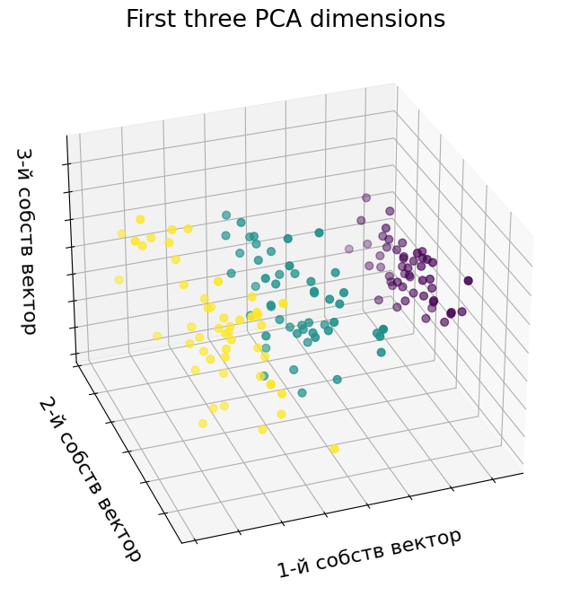
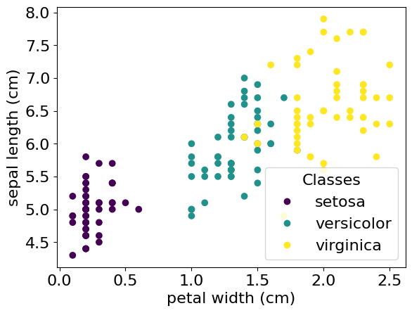

# Лекція 01.03. Датасети


## ПРИКЛАД 1. **Sklearn**  IRIS

### DATASET [IRIS](https://scikit-learn.org/stable/auto_examples/datasets/plot_iris_dataset.html) | [Iris flower data set](https://en.wikipedia.org/wiki/Iris_flower_data_set)


```python
import numpy as np
import tensorflow as tf
```


```python
from sklearn import datasets
```


```python
%matplotlib inline
import matplotlib.pyplot as plt
from matplotlib.colors import ListedColormap
plt.rcParams['font.size'] = 16
```

IRIS dataset має 150 зразків (векторів), 4 ознаки (sepal length, sepal width, petal length, and petal width - довжина чашолистка, ширина чашолистка, довжина пелюстки та ширина пелюстки) для кожного зразка. Визначає три класи ірісів.


```python
# Завантаження
irisDataset     = datasets.load_iris()
```


```python
# Формат датасету
print('IRIS shape', irisDataset.data.shape)
# 100 - зразок ірісу
print(irisDataset.data[50,:], irisDataset.target_names[irisDataset.target[50]])
```

    IRIS shape (150, 4)
    [7.  3.2 4.7 1.4] versicolor


### Візуалізація IRIS


```python
import mpl_toolkits.mplot3d  # noqa: F401
from sklearn.decomposition import PCA

fig = plt.figure(1, figsize=(8, 8))
ax = fig.add_subplot(111, projection="3d", elev=-150, azim=110)

X_reduced = PCA(n_components=3).fit_transform(irisDataset.data)
ax.scatter(
    X_reduced[:, 0],
    X_reduced[:, 1],
    X_reduced[:, 2],
    c=irisDataset.target,
    s=40,
)

ax.set_title("First three PCA dimensions")
ax.set_xlabel("1-й собств вектор")
ax.xaxis.set_ticklabels([])
ax.set_ylabel("2-й собств вектор")
ax.yaxis.set_ticklabels([])
ax.set_zlabel("3-й собств вектор")
ax.zaxis.set_ticklabels([])

plt.show()
```





### Візуалізація: клас - 2 ознаки


```python
numFeatures  = 2
_, ax = plt.subplots()
scatter = ax.scatter(irisDataset.data[:, 3], irisDataset.data[:,0], c=irisDataset.target )
ax.set(xlabel=irisDataset.feature_names[3], ylabel=irisDataset.feature_names[0])
_ = ax.legend(
    scatter.legend_elements()[0], irisDataset.target_names, loc="lower right", title="Classes"
)
```



