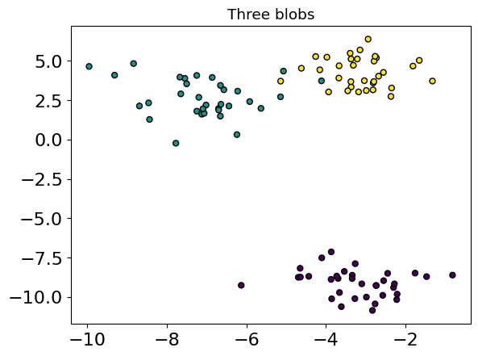
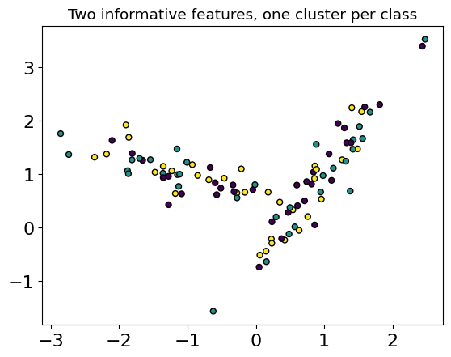
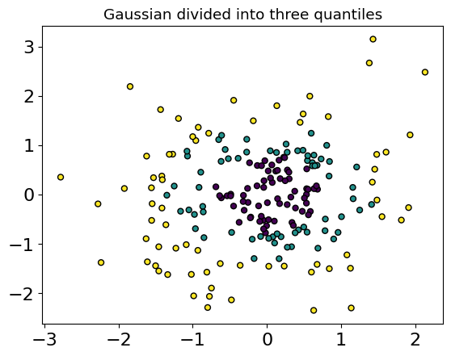
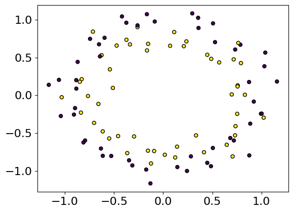
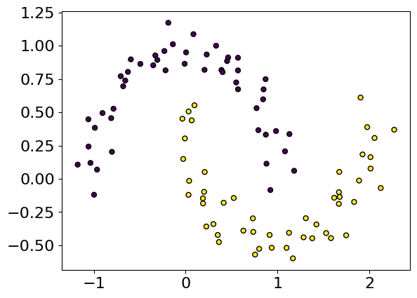

# Лекція 01.03. Датасети


## ПРИКЛАД 3. **Sklearn** Генерування датасетів

### DATASET [Generated datasets](https://scikit-learn.org/stable/datasets/sample_generators.html)

**scikit-learn** включає різні генератори випадкових вибірок, які можна використовувати для створення штучних наборів даних контрольованого розміру та складності.


```python
import numpy as np
import tensorflow as tf
```


```python
from sklearn import datasets
from sklearn.datasets import make_blobs, make_classification, make_gaussian_quantiles
```


```python
%matplotlib inline
import matplotlib.pyplot as plt
from matplotlib.colors import ListedColormap
plt.rcParams['font.size'] = 16
```


```python
plt.figure(figsize=(8, 8))
plt.subplots_adjust(bottom=0.05, top=0.9, left=0.05, right=0.95)
```


    <Figure size 800x800 with 0 Axes>


### Одна мітка

- ***make_blobs і make_classification*** створюють багатокласові набори даних шляхом виділення кожному класу одного або кількох нормально розподілених кластерів точок.

- ***make_blobs*** забезпечує більший контроль щодо центрів і стандартних відхилень кожного кластера та використовується для демонстрації кластеризації.

- ***make_classification*** спеціалізується на введенні шуму за допомогою: корельованих, надлишкових і неінформативних ознак; кілька гаусових кластерів на клас; і лінійні перетворення простору ознак.

- ***make_gaussian_quantiles*** ділить один гаусівський кластер на класи майже однакового розміру, розділені концентричними гіперсферами. make_hastie_10_2 створює подібну бінарну 10-вимірну задачу.

[sklearn.datasets.make_blobs](https://scikit-learn.org/stable/modules/generated/sklearn.datasets.make_blobs.html#sklearn.datasets.make_blobs)

Параметри звернення
- n_samples=100,
- n_features=2,
- centers=None,
- cluster_std=1.0,
- center_box=(-10.0, 10.0),
- shuffle=True,
- random_state=None,
- return_centers=False


```python
plt.title("Three blobs", fontsize="small")
X1, Y1, centers = make_blobs(n_features=2, centers=3, return_centers=True)
plt.scatter(X1[:, 0], X1[:, 1], marker="o", c=Y1, s=25, edgecolor="k")
plt.show()
```





```python
print('BLOB shape', X1.shape, Y1.shape)
for sample in range (10):
  print('Sample', sample, X1[sample,:], Y1[sample])
print('BLOB centers', centers)
```

    BLOB shape (100, 2) (100,)
    Sample 0 [-2.55637418 -8.96895201] 0
    Sample 1 [-3.39480049  5.48364576] 2
    Sample 2 [ -2.2268299  -10.17199892] 0
    Sample 3 [-6.6961827   1.96817958] 1
    Sample 4 [-3.37084341  3.34232086] 2
    Sample 5 [-3.37707976  3.67964995] 2
    Sample 6 [-7.76736607 -0.23380936] 1
    Sample 7 [-5.63209629  1.98083878] 1
    Sample 8 [-7.54162918  3.88738485] 1
    Sample 9 [-4.69630164 -8.75542697] 0
    BLOB centers [[-3.29393594 -8.96550314]
     [-7.38936247  2.84251982]
     [-3.41793804  4.10520575]]


### [sklearn.datasets.make_classification](https://scikit-learn.org/stable/modules/generated/sklearn.datasets.make_classification.html)

Створює випадкову задачу класифікації n-класу.

Спочатку створює кластери точок з нормальним розподілом (std=1) навколо вершин n_інформативно-вимірного гіперкуба зі сторонами довжиною 2*class_sep і призначає рівну кількість кластерів кожному класу. Це вводить взаємозалежність між цими функціями та додає різні типи додаткового шуму до даних.


```python
plt.title("Two informative features, one cluster per class", fontsize="small")
X2, Y2 = make_classification(
    n_features=2, n_redundant=0, n_informative=2, n_clusters_per_class=1
    )
plt.scatter(X2[:, 0], X2[:, 1], marker="o", c=Y1, s=25, edgecolor="k")
plt.show()
```





```python
print('CLASS shape', X2.shape, Y2.shape)
for sample in range (10):
  print('Sample', sample, X2[sample,:], Y2[sample])
```

    CLASS shape (100, 2) (100,)
    Sample 0 [ 0.04829858 -0.74189691] 0
    Sample 1 [0.94865194 0.66432104] 0
    Sample 2 [-1.35853999  1.01529008] 0
    Sample 3 [-0.27673871  0.64609008] 1
    Sample 4 [-1.87750709  1.06354555] 1
    Sample 5 [1.54801365 2.17007859] 0
    Sample 6 [ 0.48554759 -0.12226898] 0
    Sample 7 [1.07048554 1.37767675] 0
    Sample 8 [1.38109397 0.68194265] 1
    Sample 9 [-0.46302808  0.92292264] 1


[sklearn.datasets.make_gaussian_quantiles](https://scikit-learn.org/stable/modules/generated/sklearn.datasets.make_gaussian_quantiles.html#sklearn.datasets.make_gaussian_quantiles)

Створює ізотропну гауссову функцію та позначає вибірки квантилем.
Набір даних створюється шляхом використання багатовимірного стандартного нормального розподілу та визначення класів, розділених вкладеними концентричними багатовимірними сферами, щоб приблизно однакова кількість вибірок була в кожному класі (квантилі розподілу).


```python
plt.title("Gaussian divided into three quantiles", fontsize="small")
X3, Y3 = make_gaussian_quantiles(n_samples = 200, n_features=2, n_classes=3)
plt.scatter(X3[:, 0], X3[:, 1], marker="o", c=Y3, s=25, edgecolor="k")
plt.show()
```





```python
print('GAUS shape', X3.shape, Y3.shape)
for sample in range (10):
  print('Sample', sample, X3[sample,:], Y3[sample])
```

    GAUS shape (200, 2) (200,)
    Sample 0 [-1.05174765 -0.31404399] 1
    Sample 1 [-0.65014089  1.11181495] 1
    Sample 2 [-0.13368254  0.1743606 ] 0
    Sample 3 [ 0.58478781 -0.34551176] 0
    Sample 4 [ 0.09939898 -0.5411253 ] 0
    Sample 5 [ 0.47618309 -0.34257533] 0
    Sample 6 [ 0.53184241 -0.17687173] 0
    Sample 7 [ 0.16408688 -1.30401811] 1
    Sample 8 [ 1.13561376 -2.30388938] 2
    Sample 9 [0.68166629 0.10507702] 0


[sklearn.datasets.make_circles](https://scikit-learn.org/stable/modules/generated/sklearn.datasets.make_circles.html#sklearn.datasets.make_circles)


```python
from sklearn.datasets import make_circles
X4, Y4 = make_circles(random_state=42, noise=.1)
plt.scatter(X4[:, 0], X4[:, 1], marker="o", c=Y4, s=25, edgecolor="k")
plt.show()
```





[sklearn.datasets.make_moons](https://scikit-learn.org/stable/modules/generated/sklearn.datasets.make_moons.html#sklearn.datasets.make_moons)


```python
from sklearn.datasets import make_moons
```


```python
X5, Y5 = make_moons(random_state=42, noise=.1)
plt.scatter(X5[:, 0], X5[:, 1], marker="o", c=Y5, s=25, edgecolor="k")
plt.show()
```





```python

```
