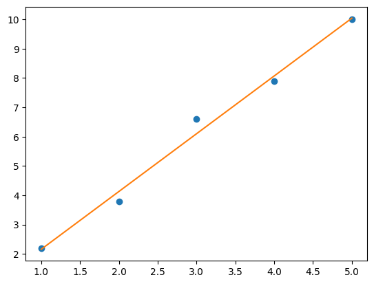
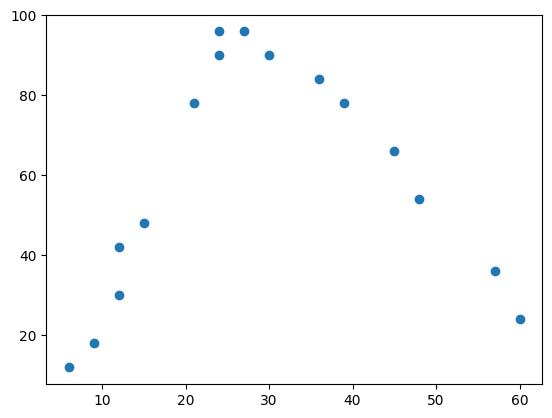
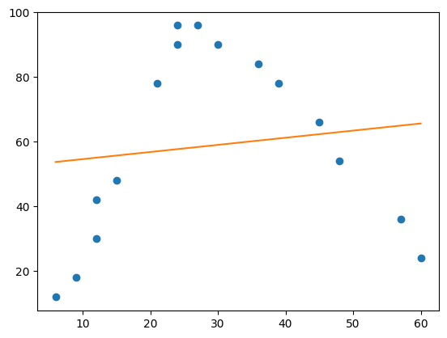
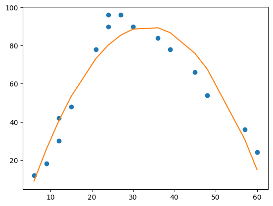
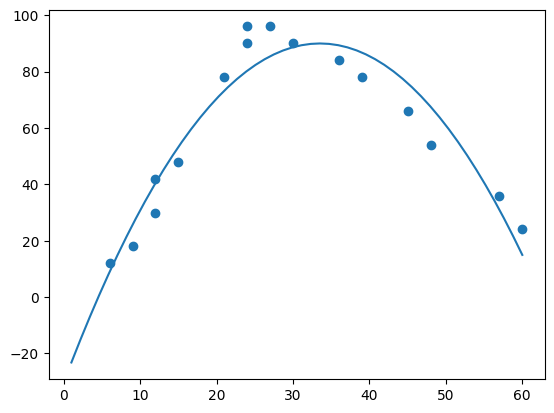

# Модуль 2. Лекція 01. Лінійна регресія з використанням Numpy

Бібліотека Numpy | Функція [Polyfit](https://numpy.org/doc/stable/reference/generated/numpy.polyfit.html)

**numpy.polyfit(x, y, deg, rcond=None, full=False, w=None, cov=False)**

Вишукує поліном $\vec p(x) = p_0*x^{deg} + ... + p_{deg}$ ступеня $deg$ до точок $(x, y)$.

Повертає вектор коефіцієнтів $\vec p$, порядку $deg$, який мінімізує квадрат помилки.


Параметри:

- $x$ : масив форми (M,) $x$-координат $M$ точок вибірки $(x_i, y_i)$.

- $y$ : масив форми  (M,) або (M, K) $y$-координат точок вибірки.

- $deg$ : cтепінь полінома підгонки


```python
%matplotlib inline
```


```python
import numpy as np
import matplotlib.pyplot as plt
```


```python
# Дані
x = np.array([1, 2, 3, 4, 5])
y = np.array([2.2, 3.8, 6.6, 7.9, 10])

# Модель регрессіі
deg = 1
model = np.polyfit(x, y, deg)

# Коефіцієнти поліному першого порядку
print('Коэфіцієнти регресії', model)

# Передбачувані значення
y_pred = np.polyval(model, x)

# Відображення даних та регресії
plt.plot(x, y, 'o')
plt.plot(x, y_pred)
plt.show()
```

    Коэфіцієнти регресії [1.97 0.19]



    


## Більш складні дані


```python
x_ = [6, 9, 12, 12, 15, 21, 24, 24, 27, 30, 36, 39, 45, 48, 57, 60]
y_= [12, 18, 30, 42, 48, 78, 90, 96, 96, 90, 84, 78, 66, 54, 36, 24]
plt.scatter(x_, y_)
```


    <matplotlib.collections.PathCollection at 0x7bac99229f60>


​    

​    


```python
# Модель регрессіі
deg = 1
model1 = np.polyfit(x_, y_, deg)

# Коефіцієнти поліному першого порядку
print('Коэфіцієнти регресії', model1)

# Передбачувані значення
y_pred1 = np.polyval(model1, x_)

# Відображення даних та регресії
plt.plot(x_, y_, 'o')
plt.plot(x_, y_pred1)
plt.show()
```

    Коэфіцієнти регресії [ 0.2204336  52.46864858]



    


```python
# Модель регрессіі
deg = 2
model2 = np.polyfit(x_, y_, deg)

# Коефіцієнти поліному другого порядку
print('Коэфіцієнти регресії', model2)

# Передбачувані значення
y_pred2 = np.polyval(model2, x_)

# Відображення даних та регресії
plt.plot(x_, y_, 'o')
plt.plot(x_, y_pred2)
plt.show()
```

    Коэфіцієнти регресії [ -0.10698872   7.17306139 -30.25286764]



    


### Використвуємо клас поліномів [numpy.poly1d](https://numpy.org/doc/stable/reference/generated/numpy.poly1d.html)


```python
#Модель: поліном другого порядку
model2_= np.poly1d(np.polyfit(x_, y_, 2))
```


```python
#add fitted polynomial line to scatterplot
polyline = np.linspace(1, 60, 50)
plt.scatter(x_, y_)
plt.plot(polyline, model2_(polyline))
plt.show()
```


​    

​    


```python
print(model)
```

            2
    -0.107 x + 7.173 x - 30.25

Порівняйте коефіцієнти поліному з попереднім рішенням

