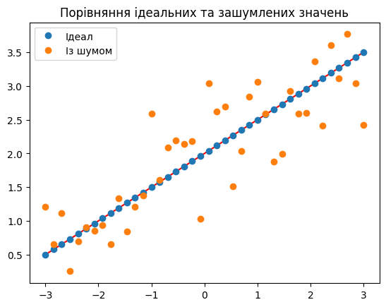
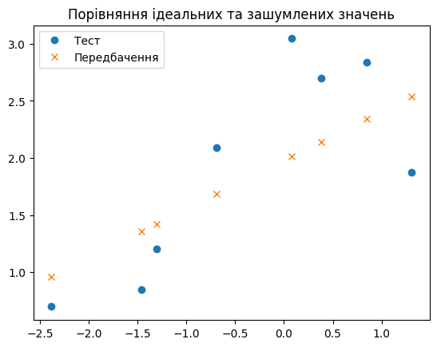
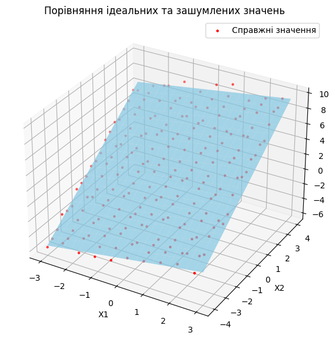
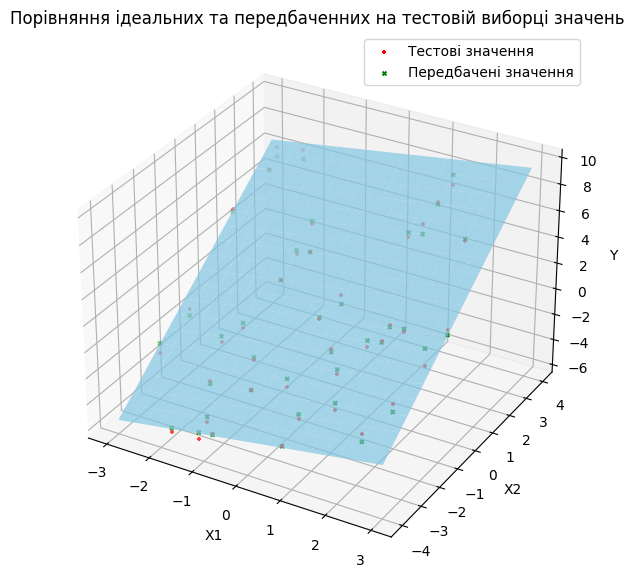
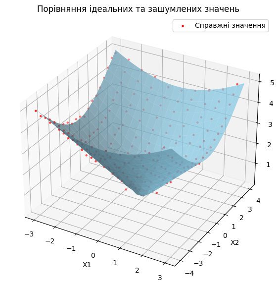
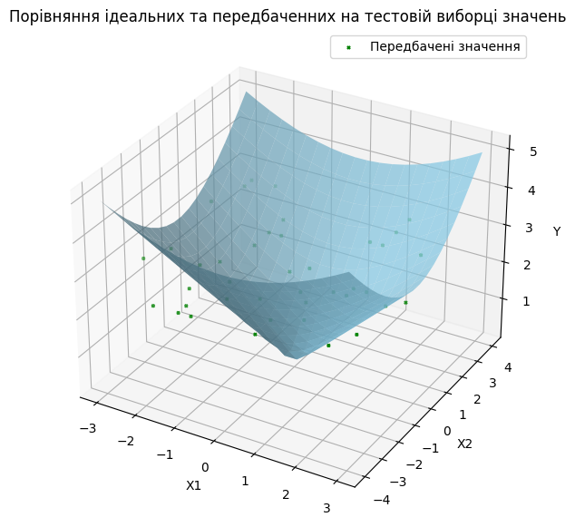

# Модуль 2. Лекція 03. Лінійна регресія з використанням SciKit-Learn

Бібліотека scikit-learn | модуль linear_model | класс [LinearRegression](https://scikit-learn.org/stable/modules/generated/sklearn.linear_model.LinearRegression.html) | метод [fit]()


### Клас
```
class sklearn.linear_model.LinearRegression(*, fit_intercept=True, copy_X=True, n_jobs=None, positive=False)
```
Звичайна лінійна регресія методом найменших квадратів.

LinearRegression підходить до лінійної моделі з коефіцієнтами $w = (w_1, …, w_p)$, щоб мінімізувати залишкову суму квадратів між спостережуваними цілями в наборі даних і цілями, передбаченими лінійною апроксимацією.

Має важливі атрибути:

- **coef\_** :  масив форми $(n\_features, )$ або $(n\_targets, n\_features)$ - Оцінені коефіцієнти для задачі лінійної регресії.

- **intercept\_** : масив форми $(n\_targets,$) - незалежний терм у лінійній моделі.

#### Метод FIT : пристасування моделі
```
fit(X, y, sample_weight=None)
```

Визначає коефіцієнти лінійної моделі

Параметри:
- $X$ : масив форми $(n\_samples, n\_features)$  - зразки (тренувальні дані).

- $y$ : масив форми $(n\_samples)$ або $(n\_samples, N\_features$) - цільові дані (мітки).

- $sample\_weight$ : масив шейпу $(n\_samples,)$ -  
індивідуальні ваги для кожного зразку.

Повертає знайдений естіматор

## Основна частина


```python
%matplotlib inline
```


```python
import numpy as np
from sklearn.linear_model import LinearRegression
from sklearn.model_selection import train_test_split
from sklearn.metrics import mean_squared_error
import matplotlib.pyplot as plt
```

## Приклад 1. Парна лінійна регресія


```python
# Межа незалежної змінної
minx, maxx = (-3., 3.)
# Кількість точок
nx = 40

x = np.linspace(minx, maxx, nx)
X = np.vstack(x.flatten())
# Транспонуємо матрицю, щоб отримати вектор-стовпець
print("X шейп ", np.shape(X))
```

    X шейп  (40, 1)
    


```python
# Визначені коефіцієнти лінійної залежностиі
a = 0.5
b = 2

# Ідеальна лінійна залежніст
y_ideal = a * x + b

# Додаємо нормальний шум
mean = 0  # среднє  значення
std_dev = 0.5  # стандартне відхилення
noise = np.random.normal(mean, std_dev, size=y_ideal.shape)

# вихідні дані з нормально розподіленим шумом
y_noise = y_ideal  + noise
print("Y шейп ", np.shape(y_noise))

```

    Y шейп  (40,)
    


```python
# Побудова графіка
fig = plt.figure()
ax = fig.add_subplot(1, 1, 1)
ax.set_title("Порівняння ідеальних та зашумлених значень")
ax.plot(x, y_ideal,  color ='red')
plt.plot(x, y_ideal, 'o', label = 'Ідеал')
plt.plot(x, y_noise, 'o', label = 'Із шумом')
ax.legend()
plt.show()

```


    

    


```python
# Поділяємо на навчальну та тестову виборки
X_train, X_test, y_train, y_test = train_test_split(X, y_noise, test_size=0.2, random_state=0)

# Стврення та навчання моделі
model = LinearRegression()
model.fit(X_train, y_train)

# Передбачення на тестовій виборкі
y_pred = model.predict(X_test)

# Оцінка моделі
mse = mean_squared_error(y_test, y_pred)
print(f"Середнєквадратична похибка: {mse}")
print(f"Перетин: {model.intercept_}")
print(f"Коефіцієнти: {model.coef_}")
```

    Середнєквадратична похибка: 0.3253737948628903
    Перетин: 1.9786379790276336
    Коефіцієнти: [0.4267323]
    

Порівняйте результат із a = 0.5, b = 2

Порівняння ідеальних та передбаченних на тествій виборці значень


```python
# Побудова графіка
fig = plt.figure()
ax = fig.add_subplot(1, 1, 1)
ax.set_title("Порівняння тестових та передбачених значень")
plt.plot(X_test, y_test, 'o', label = 'Тест')
plt.plot(X_test, y_pred, 'x', label = 'Передбачення')
ax.legend()
plt.show()

```


    

    


## Приклад 2. Множинна лінійна регресія


```python
# Межи змінних
minx1, maxx1 = (-3., 3.)
minx2, maxx2 = (-4., 4.)
# Кількість точок
nx1, nx2 = (20, 20)

x1 = np.linspace(minx1, maxx1,nx1)
x2 = np.linspace(minx2, maxx2,nx2)

# Створюємо дві матриці з усіма можливими комбінаціями x1 та x2
# Кожна матриця має розмірність nx1 * nx2. Це сітка координат по одному з вимірів
X1, X2 = np.meshgrid(x1, x2)
# Перетворюємо матриці в вектори, щоб отримати всі можливі комбінації
# та об'єднуємо їх в одну матрицю
X = np.vstack((X1.flatten(), X2.flatten()))
# Транспонуємо матрицю, щоб отримати вектор-стовпець з усіма можливими комбінаціями
X = np.transpose(X)
print("X шейп ", np.shape(X))
```

    X шейп  (400, 2)
    


```python
# Створюємо вихідні дані з нормально розподіленим шумом
all_x1 = X[:, 0]
all_x2 = X[:, 1]

# Визначені коефіцієнти лінійної залежностиі
a1 = 0.5
a2 = 1.5
b = 2

# Ідеальна лінійна залежніст
y_ideal = a1 * all_x1 + a2 * all_x2 + b

# Додаємо нормальний шум
mean = 0  # среднє  значення
std_dev = 0.5  # стандартне відхилення
noise = np.random.normal(mean, std_dev, size=y_ideal.shape)

# вихідні дані з нормально розподіленим шумом
y_noise = y_ideal  + noise
print("Y шейп ", np.shape(y_noise))

```

    Y шейп  (400,)
    


```python
# Побудова 3D графіка
fig = plt.figure(figsize=(10, 7))
ax = fig.add_subplot(111, projection="3d")

# Ідальні значення як поверхня (ЛІНІЙНА ЗАЛЕЖНІСТЬ)
y_ideal_surface = y_ideal.reshape(X1.shape)
# Виводимо як зелену поверхню
ax.plot_surface(X1, X2, y_ideal_surface, color="skyblue", alpha=0.7, edgecolor='none')

indexes = range(0, len(X), 2)
# Реальні (зашумлені) значення відображаємо як червоні точки
ax.scatter(X[indexes, 0], X[indexes, 1], y_noise[indexes], color="red", label="Справжні значення", marker="o", s=5)

ax.set_title("Порівняння ідеальних та зашумлених значень")
ax.set_xlabel("X1")
ax.set_ylabel("X2")
ax.set_zlabel("Y")
plt.legend()
plt.show()
```


    

    


```python
# Поділяємо на навчальну та тестову виборки
X_train, X_test, y_train, y_test = train_test_split(X, y_noise, test_size=0.2, random_state=0)

# Стврення та навчання моделі
model = LinearRegression()
model.fit(X_train, y_train)

# Передбачення на тестовій виборкі
y_pred = model.predict(X_test)

# Оцінка моделі
mse = mean_squared_error(y_test, y_pred)
print(f"Середнєквадратична похибка: {mse}")
print(f"Перетин: {model.intercept_}")
print(f"Коефіцієнти: {model.coef_}")
```

    Середнєквадратична похибка: 0.23274807591776164
    Перетин: 2.0340652881974894
    Коефіцієнти: [0.52058496 1.48103424]
    

Порівняння ідеальних та передбаченних на тестовій виборці значень


```python
# Побудова 3D графіка
fig = plt.figure(figsize=(10, 7))
ax = fig.add_subplot(111, projection="3d")

# Ідальні значення як поверхня (ЛІНІЙНА ЗАЛЕЖНІСТЬ)
y_ideal_surface = y_ideal.reshape(X1.shape)
# Виводимо як зелену поверхню
ax.plot_surface(X1, X2, y_ideal_surface, color="skyblue", alpha=0.7, edgecolor='none')

indexes = range(0, len(X_test), 2)
# Реальні (зашумлені) значення відображаємо як червоні точки
ax.scatter(X_test[indexes, 0], X_test[indexes, 1], y_test[indexes], color="red", label="Тестові значення", marker="+", s=8)
ax.scatter(X_test[indexes, 0], X_test[indexes, 1], y_pred[indexes], color="green", label="Передбачені значення", marker="x", s=8)

ax.set_title("Порівняння ідеальних та передбаченних на тестовій виборці значень")
ax.set_xlabel("X1")
ax.set_ylabel("X2")
ax.set_zlabel("Y")
plt.legend()
plt.show()
```


    

    


## Приклад 2.2. Множинна лінійна регресія (більш складні дані)


```python
# Нелінйна (квадратична) залежність
Y_ideal = np.sqrt(all_x1**2 + all_x2**2)
#print(Y)
#plt.plot(X1v, X2v, marker='o', color='k', linestyle='none')
#plt.show()
```


```python
# Додаємо нормальний шум
mean = 0  # среднє  значення
std_dev = 0.1  # стандартне відхилення
noise = np.random.normal(mean, std_dev, size=y_ideal.shape)


# вихідні дані з нормально розподіленим шумом
Y_noise = Y_ideal  + noise
print("Y шейп ", np.shape(y_noise))
```

    Y шейп  (400,)
    


```python
# Побудова 3D графіка
fig = plt.figure(figsize=(10, 7))
ax = fig.add_subplot(111, projection="3d")

# Ідальні значення як поверхня (ЛІНІЙНА ЗАЛЕЖНІСТЬ)
Y_ideal_surface = Y_ideal.reshape(X1.shape)
# Виводимо як зелену поверхню
ax.plot_surface(X1, X2, Y_ideal_surface, color="skyblue", alpha=0.7, edgecolor='none')

indexes = range(0, len(X), 2)
# Реальні (зашумлені) значення відображаємо як червоні точки
ax.scatter(X[indexes, 0], X[indexes, 1], Y_noise[indexes], color="red", label="Справжні значення", marker="o", s=5)

ax.set_title("Порівняння ідеальних та зашумлених значень")
ax.set_xlabel("X1")
ax.set_ylabel("X2")
ax.set_zlabel("Y")
plt.legend()
plt.show()
```


    

    


```python
# Поділяємо на навчальну та тестову виборки
X_train, X_test, Y_train, Y_test = train_test_split(X, Y_noise, test_size=0.2, random_state=0)

# Стврення та навчання моделі
model2 = LinearRegression()
model2.fit(X_train, Y_train)

# Передбачення на тестовій виборкі
Y_pred = model2.predict(X_test)

# Оцінка моделі
mse = mean_squared_error(Y_test, Y_pred)
print(f"Середнєквадратична похибка: {mse}")
print(f"Перетин: {model2.intercept_}")
print(f"Коефіцієнти: {model2.coef_}")
```

    Середнєквадратична похибка: 1.1770890074110678
    Перетин: 2.8111814337524472
    Коефіцієнти: [0.02515233 0.02319792]
    

!!! Надзвичай велика похибка

Порівняння ідеальних та передбаченних на тестовій виборці значень


```python
# Побудова 3D графіка
fig = plt.figure(figsize=(10, 7))
ax = fig.add_subplot(111, projection="3d")

# Ідальні значення як поверхня (параболоїд)
Y_ideal_surface = Y_ideal.reshape(X1.shape)
# Виводимо як зелену поверхню
ax.plot_surface(X1, X2, Y_ideal_surface, color="skyblue", alpha=0.7, edgecolor='none')

indexes = range(0, len(X_test), 2)
# Реальні (зашумлені) значення відображаємо як червоні точки
ax.scatter(X_test[indexes, 0], X_test[indexes, 1], Y_pred[indexes], color="green", label="Передбачені значення", marker="x", s=5)

ax.set_title("Порівняння ідеальних та передбаченних на тестовій виборці значень")
ax.set_xlabel("X1")
ax.set_ylabel("X2")
ax.set_zlabel("Y")
plt.legend()
plt.show()
```


    

    

