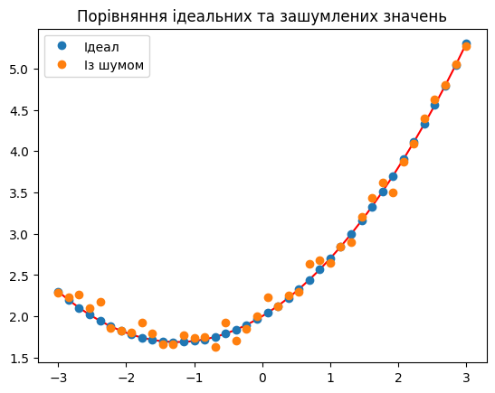
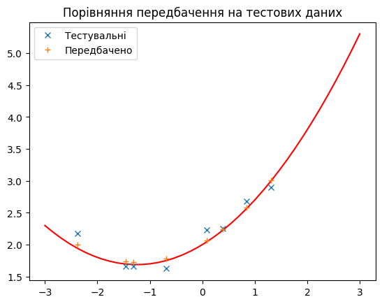
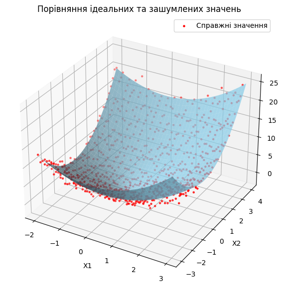
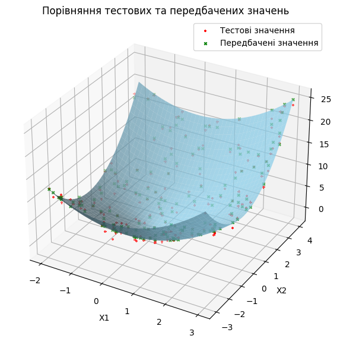

# Модуль 2. Лекція 04. Множинна поліноміальна регресія з використанням SciKit-Learn"

Бібліотека scikit-learn | модуль [**preprocessing**](https://scikit-learn.org/stable/api/sklearn.preprocessing.html) | класс [PolynomialFeatures](https://scikit-learn.org/stable/modules/generated/sklearn.preprocessing.PolynomialFeatures.html#polynomialfeatures)

### КЛАС PolynomialFeatures - створення поліномів і ознак взаємодії.

```
class sklearn.preprocessing.PolynomialFeatures(degree=2, *, interaction_only=False, include_bias=True, order='C')
```

Створює нову матрицю ознак, що складається з усіх поліноміальних комбінацій ознак зі ступенем, меншим або рівним зазначеному ступеню. Наприклад, якщо вхідна вибірка є двовимірною та має форму $[a, b]$, поліноміальні ознаки ступеня 2 є $[1, a, b, a^2, ab, b^2]$.


Параметри:

- **degree** : ціле або кортеж $(min\_degree, max\_degree)$, за замовчуванням=2. Якщо задано єдине int, воно вказує максимальний ступінь ознак полінома. Якщо передається кортеж $(min\_degree, max\_degree)$, то $min\_degree$ є мінімальним, а $max\_degree$ — максимальним ступенем полінома згенерованих ознак. Зверніть увагу, що $min\_degree=0$ і $min\_degree=1$ еквівалентні, оскільки виведення члена нульового ступеня визначається $include\_bias$.

- **interakcion\_only** : bool, за замовчуванням = $False$. Якщо $True$, створюються лише функції взаємодії: функції, які є продуктами щонайбільше різних вхідних функцій, тобто терміни зі степенем 2 або вище тієї самої вхідної функції виключаються:

included: $x[0], x[1], x[0]*x[1]$, etc.

excluded: $x[0]^2, x[0]^2*x[1]$, etc.

- **include_bias** : bool, за умовчанням = $True$. Якщо $True$, тоді включає стовпець зміщення, тобто функцію, у якій усі степені полінома дорівнюють нулю (тобто стовпець з одиницями – діє як термін перехоплення в лінійній моделі).

- **order{‘C’, ‘F’}**, за замовчуванням = ’C’. Визначає послідовність вихідного масиву. Порядок «F» обчислюється швидше, але може сповільнити наступні оцінювачі.

Атрибути:

- **powers\_** масив шейпу $(n\_output\_features\_, n\_features\_in\_)$
Експонента для кожного з вхідних даних у вихідних даних.

- **n_features_in_int** :
Кількість ознак, які використовується під час передбачення.


### МЕТОД Fit_transform

```
fit_transform(X, y=None, **fit_params)

```

Підбирає трансформацію до $X$ і $y$ за допомогою додаткових параметрів $fit_params$ і повертає трансформовану версію $X$.

Парметри
- **X** : розріджена матриця шейпу $(n\_samples, n\_features)$ - вхідні дані.

- **y** : масив шейпу $(n\_samples,)$ або $(n\_samples, n\_outputs)$, за замовчуванням=немає. Цільові значення.

- ****fit\_params** : словник (додатковий параметр)
Повертає
- **X_new**: масив шейпу $(n\_samples, n\_features\_new)$ - перетворений  масив


### Приклад


```python
import numpy as np
from sklearn.preprocessing import PolynomialFeatures
X = np.arange(6).reshape(3, 2)
print(X)
```

    [[0 1]
     [2 3]
     [4 5]]
    [[0 0]
     [1 0]
     [0 1]
     [2 0]
     [1 1]
     [0 2]]
    [[0 0]
     [1 0]
     [0 1]
     [1 1]]


```python
poly = PolynomialFeatures(2)
poly.fit_transform(X)
print(poly.powers_)
```

    [[0 0]
     [1 0]
     [0 1]
     [2 0]
     [1 1]
     [0 2]]


```python
poly = PolynomialFeatures(2, interaction_only=True)
poly.fit_transform(X)
print(poly.powers_)
```

    [[0 0]
     [1 0]
     [0 1]
     [1 1]]


## Основна частина


```python
%matplotlib inline
```


```python
import numpy as np
from sklearn.preprocessing import PolynomialFeatures
from sklearn.linear_model import LinearRegression
from sklearn.model_selection import train_test_split
from sklearn.metrics import mean_squared_error, r2_score
import matplotlib.pyplot as plt
```

## Приклад 1. Один незалежний аргумент $x$, поліном другого порядку
$y=w_0+w_1x+w_2x^2$

Використовуємо лінійну регресію, вважаючи, що $x$  та  $x^2$ незалежні змінні. Нариклад,  $x1=x$ та  $x2=x^2$


### Приклад 1.1. Найпростіший приклад


```python
# Завантажуємо дані
x = np.array([1, 2, 3, 4, 5])
print(x.shape)
X= x.reshape(-1,1)
print(X.shape)
y = np.array([1, 4, 9, 16, 25])

# Перетворюємо дані до поліноміальних ознак другого порядку
poly_features = PolynomialFeatures(degree=2, include_bias=False)
X_poly = poly_features.fit_transform(X)
print(X_poly.shape, X_poly)
# Навчаємо модель лінійної регресії
model = LinearRegression()
model.fit(X_poly, y)

# Прогнозуємо  значення для нових даних
new_x = 7
new_X = np.array([[new_x]])
new_X_poly = poly_features.fit_transform(new_X)
y_pred = model.predict(new_X_poly)

print(f"Прогнозуємо значення X = {new_x} : {y_pred[0]}")
```

    (5,)
    (5, 1)
    (5, 2) [[ 1.  1.]
     [ 2.  4.]
     [ 3.  9.]
     [ 4. 16.]
     [ 5. 25.]]
    Прогнозуємо значення X = 7 : 49.00000000000001


### Приклад 1.2.


```python
# Межа незалежної змінної
minx, maxx = (-3., 3.)
# Кількість точок
nx = 40

x = np.linspace(minx, maxx, nx)
print(x.shape)
X= x.reshape(-1,1)
print(X.shape)
```

    (40,)
    (40, 1)


```python
# Ідеальна параболічна залежніст
w0 = 2
w1 = 0.5
w2 = 0.2

y_ideal =  w0 + w1*x + w2*x*x

# Додаємо нормальний шум
mean = 0.  # среднє  значення
std_dev = .1  # стандартне відхилення
noise = np.random.normal(mean, std_dev, size=y_ideal.shape)

# вихідні дані з нормально розподіленим шумом
y_noise = y_ideal  + noise
print("Y шейп ", np.shape(y_noise))
```

    Y шейп  (40,)


```python
# Побудова графіка
fig = plt.figure()
ax = fig.add_subplot(1, 1, 1)
ax.set_title("Порівняння ідеальних та зашумлених значень")
ax.plot(x, y_ideal,  color ='red')
plt.plot(x, y_ideal, 'o', label = 'Ідеал')
plt.plot(x, y_noise, 'o', label = 'Із шумом')
ax.legend()
plt.show()
```


​    

​    


```python
# Поділяємо на навчальну та тестову виборки
X_train, X_test, y_train, y_test = train_test_split(X, y_noise, test_size=0.2, random_state=0)
print('Тренувальні шейпи', X_train.shape, y_train.shape)
print('Тестувальні шейпи', X_test.shape, y_test.shape)

# Перетворюємо дані до поліноміальних ознак другого порядку
poly_features = PolynomialFeatures(degree=2, include_bias=False)
X_poly = poly_features.fit_transform(X_train)
print('Шейп поліному', X_poly.shape)

# Навчання модель лінійної регресії
model = LinearRegression()
model.fit(X_poly, y_train)

new_X_poly = poly_features.fit_transform(X_test)
y_pred = model.predict(new_X_poly)
print('Шейп тестувального поліному', new_X_poly.shape)
print('Шейп передбачення', y_pred.shape)
# Оцінка моделі
mse = mean_squared_error(y_test, y_pred)
print(f"Середнєквадратична похибка: {mse}")

```

    Тренувальні шейпи (32, 1) (32,)
    Тестувальні шейпи (8, 1) (8,)
    Шейп поліному (32, 2)
    Шейп тестувального поліному (8, 2)
    Шейп передбачення (8,)
    Середнєквадратична похибка: 0.014293907749455782


```python
# Побудова графіка
fig = plt.figure()
ax = fig.add_subplot(1, 1, 1)
ax.set_title("Порівняння передбачення на тестових даних")
ax.plot(x, y_ideal,  color ='red')
plt.plot(X_test[:,0], y_test, 'x', label = 'Тестувальні')
plt.plot(X_test[:,0], y_pred, '+', label = 'Передбачено')
ax.legend()
plt.show()
```


​    

​    


## Приклад 2. Множинна (парна) поліноміальна регресія. Два незалежні аргументи $x_1, x_2$, поліном другого порядку

$z=w_0+w_1x_1+w_2x_2+w_3x_1^2+w_4x_1x_2+w_5x_2^2$


```python
# Межи змінних
minx1, maxx1 = (-2., 3.)
minx2, maxx2 = (-3., 4.)
# Кількість точок
nx1, nx2 = (40, 40)

x1 = np.linspace(minx1, maxx1,nx1)
x2 = np.linspace(minx2, maxx2,nx2)

# Створюємо дві матриці з усіма можливими комбінаціями x1 та x2
# Кожна матриця має розмірність nx1 * nx2. Це сітка координат по одному з вимірів
X1, X2 = np.meshgrid(x1, x2)
# Перетворюємо матриці в вектори, щоб отримати всі можливі комбінації
# та об'єднуємо їх в одну матрицю
X = np.vstack((X1.flatten(), X2.flatten()))
# Транспонуємо матрицю, щоб отримати вектор-стовпець з усіма можливими комбінаціями
X = np.transpose(X)
print("X шейп ", np.shape(X))
```

    X шейп  (1600, 2)


```python
# Створюємо вихідні дані з нормально розподіленим шумом
all_x1 = X[:, 0]
all_x2 = X[:, 1]
# Нелінйна  залежність (ідуальний параболоід)
Y_ideal = all_x1**2 + all_x2**2
```


```python
# Додаємо нормальний шум
mean = 0  # среднє  значення
std_dev = 1.0  # стандартне відхилення
noise = np.random.normal(mean, std_dev, size=Y_ideal.shape)

# вихідні дані з нормально розподіленим шумом
Y_noise = Y_ideal  + noise
print("Y шейп ", np.shape(Y_noise))
```

    Y шейп  (1600,)


```python
# Побудова 3D графіка
fig = plt.figure(figsize=(10, 7))
ax = fig.add_subplot(111, projection="3d")

# Ідальні значення як поверхня (ЛІНІЙНА ЗАЛЕЖНІСТЬ)
Y_ideal_surface = Y_ideal.reshape(X1.shape)
# Виводимо як зелену поверхню
ax.plot_surface(X1, X2, Y_ideal_surface, color="skyblue", alpha=0.7, edgecolor='none')

indexes = range(0, len(X), 2)
# Реальні (зашумлені) значення відображаємо як червоні точки
ax.scatter(X[indexes, 0], X[indexes, 1], Y_noise[indexes], color="red", label="Справжні значення", marker="o", s=5)

ax.set_title("Порівняння ідеальних та зашумлених значень")
ax.set_xlabel("X1")
ax.set_ylabel("X2")
ax.set_zlabel("Y")
plt.legend()
plt.show()
```


​    

​    


```python
X = np.vstack((X1.flatten(), X2.flatten()))
# Транспонуємо матрицю, щоб отримати вектор-стовпець з усіма можливими комбінаціями
X = np.transpose(X)
print("X шейп ", np.shape(X))
```

    X шейп  (1600, 2)


```python
# Поділяємо на навчальну та тестову виборки
X_train, X_test, y_train, y_test = train_test_split(X, Y_noise, test_size=0.2, random_state=0)
print('Тренувальні шейпи', X_train.shape, y_train.shape)
print('Тестувальні шейпи', X_test.shape, y_test.shape)

```

    Тренувальні шейпи (1280, 2) (1280,)
    Тестувальні шейпи (320, 2) (320,)


```python
# Перетворюємо дані до поліноміальних ознак другого порядку
poly_features = PolynomialFeatures(degree=2, include_bias=False)
X_poly = poly_features.fit_transform(X_train)
print('Шейп тренувального поліному', X_poly.shape)

# Навчання модель лінійної регресії
model = LinearRegression()
model.fit(X_poly, y_train)

new_X_poly = poly_features.fit_transform(X_test)
print('Шейп тестувального поліному', new_X_poly.shape)
y_pred = model.predict(new_X_poly)
print('Шейп передбачення', y_pred.shape)

# Оцінка моделі
mse = mean_squared_error(y_test, y_pred)
print(f"Середнєквадратична похибка: {mse}")
```

    Шейп тренувального поліному (1280, 5)
    Шейп тестувального поліному (320, 5)
    Шейп передбачення (320,)
    Середнєквадратична похибка: 1.0055840913539473


```python
# Побудова 3D графіка
fig = plt.figure(figsize=(10, 7))
ax = fig.add_subplot(111, projection="3d")

# Ідальні значення як поверхня (ЛІНІЙНА ЗАЛЕЖНІСТЬ)
Y_ideal_surface = Y_ideal.reshape(X1.shape)
# Виводимо як зелену поверхню
ax.plot_surface(X1, X2, Y_ideal_surface, color="skyblue", alpha=0.7, edgecolor='none')

indexes = range(0, len(X_test), 2)
# Порівняння тестових та передбачених значень
ax.scatter(X_test[indexes, 0], X_test[indexes, 1], y_test[indexes], color="red", label="Тестові значення", marker="+", s=10)
ax.scatter(X_test[indexes, 0], X_test[indexes, 1], y_pred[indexes], color="green", label="Передбачені значення", marker="x", s=10)

ax.set_title("Порівняння тестових та передбачених значень")
ax.set_xlabel("X1")
ax.set_ylabel("X2")
ax.set_zlabel("Y")
plt.legend()
plt.show()
```


​    

​    


```python

```
