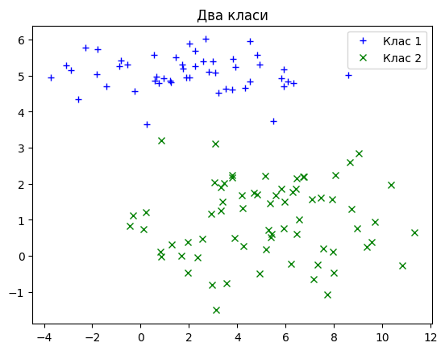
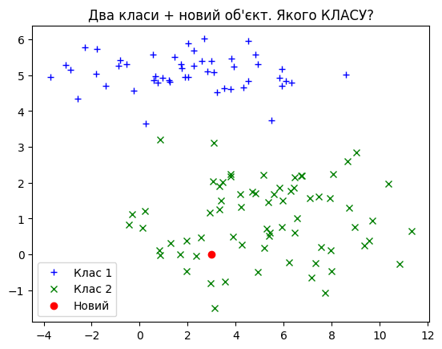
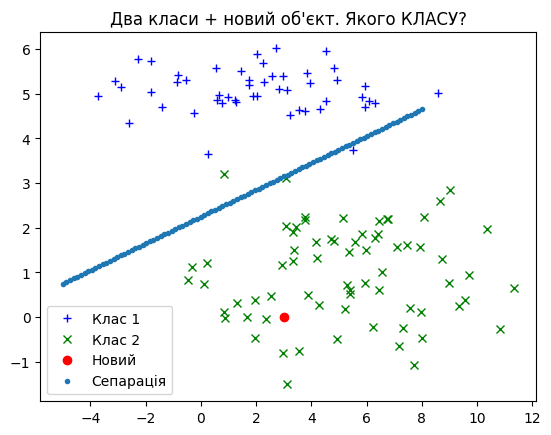
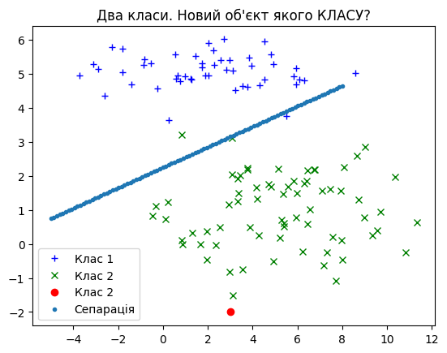
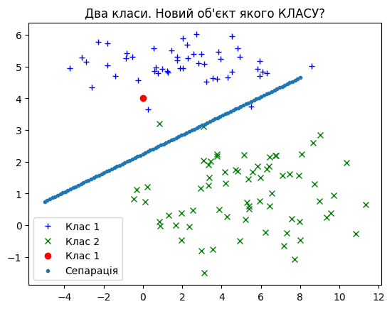
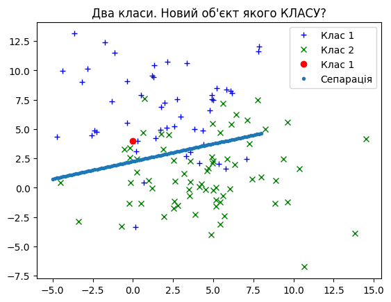

# Модуль 2. Лекція 05. Бінарна класифікація. Лінійна сепарація

### Найпростіший приклад. Два класи (labels), дві ознаки (features)

Завантаження бібліотек


```python
import numpy as np
import matplotlib.pyplot as plt
colors = plt.rcParams['axes.prop_cycle'].by_key()['color']
```

Генеруємо випадкові ознаки обєктів двох класів.

Кожен обєкт має 2 ознаки (x,  y), що нормально розподілені навколо центру кластеру.


```python
# Координати центру першого кластеру
Class_1_Center = np.array([2.0, 5.0])
# Координати центру другого кластеру
Class_2_Center = np.array([5.0, 1.0])

#СЕПАРАБЕЛЬНІ
# Середнє квадратичне відхилення для першого класу
Class_1_x_std = 3.0
Class_1_y_std = 0.5
# Середнє квадратичне відхилення для другого класу
Class_2_x_std = 3.0
Class_2_y_std = 1.0

```

Формування "хмари" обєктів першого класу


```python
Num_points_Class_1 = 50
Class_1_Data =  np.zeros((2,Num_points_Class_1), dtype=np.float32)
Class_1_Data[0,:] = np.random.default_rng().normal(Class_1_Center[0], Class_1_x_std, Num_points_Class_1)
Class_1_Data[1,:] = np.random.default_rng().normal(Class_1_Center[1], Class_1_y_std, Num_points_Class_1)
# print(np.min(Class_1_Data[0,:]),np.max(Class_1_Data[0,:]) )
```

Формування "хмари" обєктів другого  класу


```python
Num_points_Class_2 = 70
Class_2_Data =  np.zeros((2,Num_points_Class_2), dtype=np.float32)
Class_2_Data[0,:] = np.random.default_rng().normal(Class_2_Center[0], Class_2_x_std, Num_points_Class_2)
Class_2_Data[1,:] = np.random.default_rng().normal(Class_2_Center[1], Class_2_y_std, Num_points_Class_2)
# print(np.min(Class_2_Data[0,:]),np.max(Class_2_Data[0,:]) )
```

Графік даних


```python
fig = plt.figure()
ax = fig.add_subplot(1, 1, 1)
ax.set_title("Два класи")
plt.plot(Class_1_Data[0,:], Class_1_Data[1,:], '+', color = 'blue', label = 'Клас 1')
plt.plot(Class_2_Data[0,:], Class_2_Data[1,:], 'x', color = 'green', label = 'Клас 2')
ax.legend()
plt.show()
```


​    

​    


Новий (невідомого) класу обєкт


```python
# координати нового обєкту
x_new = 3.0
y_new = 0.0

fig = plt.figure()
ax = fig.add_subplot(1, 1, 1)
ax.set_title("Два класи + новий об'єкт. Якого КЛАСУ?")
plt.plot(Class_1_Data[0,:], Class_1_Data[1,:], '+', color = 'blue', label = 'Клас 1')
plt.plot(Class_2_Data[0,:], Class_2_Data[1,:], 'x', color = 'green', label = 'Клас 2')
plt.plot(x_new, y_new, 'o', color = 'red', label="Новий")
plt.legend()
plt.show()
```


​    

​    


## Лінійна сепарація класів

Маємо два набори $C_1$ , $C_2$ обєктів (точок) в 2-вимірному евклідовому просторі. Кожний обєкт $O$ задана своїми координтами $x, y$.
Два класи є лінійно відокремленими, якщо існує дійсні числа $w_1, w_2, k$, такі що кожна точка, що належить $C_1$, задовольняє $w_1x+w_2y >k$, а кожна точка, що належить $C_2$,  задовольняє  $w_1x+w_2y<k$.

Аналогічно, два набори лінійно відокремлюються точно, коли їхні відповідні опуклі оболонки - це неперетинні множини.


```python

```


```python
# Визначення прямої сепарації
# Кефіцієнти загального рівняння прямої сепарації
w1 = 0.9
w2 = 3.0
k = 0.4
# Кефіцієнти явного рівняння прямої сепарації
line_a = w1/w2
line_b = w1/k
# print(line_a,line_b)

NUM_EXAMPLES = 100

x_line = np.linspace(-5,8, NUM_EXAMPLES)

# Функція прямої для відображення
def f(x):
  return x * line_a + line_b
# Обчислення функції
y_line = f(x_line)

```


```python
fig = plt.figure()
ax = fig.add_subplot(1, 1, 1)
ax.set_title("Два класи + новий об'єкт. Якого КЛАСУ?")
plt.plot(Class_1_Data[0,:], Class_1_Data[1,:], '+', color = 'blue', label = 'Клас 1')
plt.plot(Class_2_Data[0,:], Class_2_Data[1,:], 'x', color = 'green', label = 'Клас 2')
plt.plot(x_new, y_new, 'o', color = 'red', label="Новий")
plt.plot(x_line, y_line, '.', label="Сепарація")
plt.legend()
plt.show()
```


​    

​    


Функція сепарації


```python
def sep(x,y):
  if w1*x_new+w2*y_new < 0:
    clast = "Клас 2"
  else:
    clast = "Клас 1"
  return clast
```


```python
# Новий обєкт 1
x_new = 3.0
y_new = -2.0
print(sep(x_new,y_new))
```

    Клас 2


```python
fig = plt.figure()
ax = fig.add_subplot(1, 1, 1)
ax.set_title("Два класи. Новий об'єкт якого КЛАСУ?")
plt.plot(Class_1_Data[0,:], Class_1_Data[1,:], '+', color = 'blue', label = 'Клас 1')
plt.plot(Class_2_Data[0,:], Class_2_Data[1,:], 'x', color = 'green', label = 'Клас 2')
plt.plot(x_new, y_new, 'o', color = 'red', label=sep(x_new,y_new))
plt.plot(x_line, y_line, '.', label="Сепарація")
plt.legend()
plt.show()
```


​    

​    


```python
# Новий обєкт 2
x_new = 0.0
y_new = 4.0
print(sep(x_new,y_new))
```

    Клас 1


```python
fig = plt.figure()
ax = fig.add_subplot(1, 1, 1)
ax.set_title("Два класи. Новий об'єкт якого КЛАСУ?")
plt.plot(Class_1_Data[0,:], Class_1_Data[1,:], '+', color = 'blue', label = 'Клас 1')
plt.plot(Class_2_Data[0,:], Class_2_Data[1,:], 'x', color = 'green', label = 'Клас 2')
plt.plot(x_new, y_new, 'o', color = 'red', label=sep(x_new,y_new))
plt.plot(x_line, y_line, '.', label="Сепарація")
plt.legend()
plt.show()
```


​    

​    


```python
#НЕ СЕПАРАБЕЛЬНІ
# Середнє квадратичне відхилення для першого класу
Class_1_x_std = 3.0
Class_1_y_std = 3.5
# Середнє квадратичне відхилення для другого класу
Class_2_x_std = 3.5
Class_2_y_std = 3.0

```


```python
Num_points_Class_1 = 50
Class_1_Data =  np.zeros((2,Num_points_Class_1), dtype=np.float32)
Class_1_Data[0,:] = np.random.default_rng().normal(Class_1_Center[0], Class_1_x_std, Num_points_Class_1)
Class_1_Data[1,:] = np.random.default_rng().normal(Class_1_Center[1], Class_1_y_std, Num_points_Class_1)

Num_points_Class_2 = 70
Class_2_Data =  np.zeros((2,Num_points_Class_2), dtype=np.float32)
Class_2_Data[0,:] = np.random.default_rng().normal(Class_2_Center[0], Class_2_x_std, Num_points_Class_2)
Class_2_Data[1,:] = np.random.default_rng().normal(Class_2_Center[1], Class_2_y_std, Num_points_Class_2)
```


```python
fig = plt.figure()
ax = fig.add_subplot(1, 1, 1)
ax.set_title("Два класи. Новий об'єкт якого КЛАСУ?")
plt.plot(Class_1_Data[0,:], Class_1_Data[1,:], '+', color = 'blue', label = 'Клас 1')
plt.plot(Class_2_Data[0,:], Class_2_Data[1,:], 'x', color = 'green', label = 'Клас 2')
plt.plot(x_new, y_new, 'o', color = 'red', label=sep(x_new,y_new))
plt.plot(x_line, y_line, '.', label="Сепарація")
plt.legend()
plt.show()
```


​    

​    


