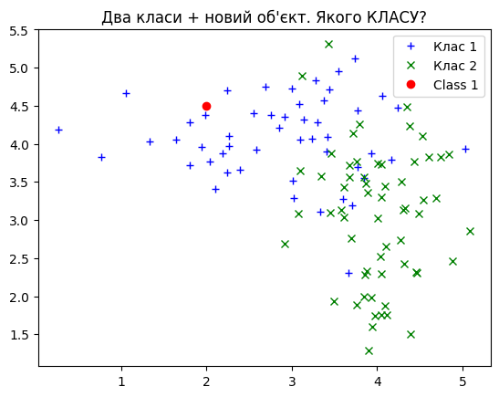

# Модуль 2. Лекція 06. Логістична регресія з використанням Scikit-learn

Бібліотека scikit-learn | модуль linear_model | класс [LogisticRegression](https://scikit-learn.org/stable/modules/generated/sklearn.linear_model.LogisticRegression.html) | метод [fit]()

### Класифіктор логістичної регресії (він же **logit**)
```
class sklearn.linear_model.LogisticRegression(penalty='l2', *, dual=False, tol=0.0001, C=1.0, fit_intercept=True, intercept_scaling=1, class_weight=None, random_state=None, solver='lbfgs', max_iter=100, multi_class='deprecated', verbose=0, warm_start=False, n_jobs=None, l1_ratio=None)

```

У випадку з кількома класами алгоритм навчання використовує схему «один проти залишку» (OvR), якщо для параметра «multi_class» встановлено значення «ovr», і використовує крос-ентропію, якщо для параметра «multi_class» встановлено значення «multinomial».

Важливий параметр
- **solver**{‘lbfgs’, ‘liblinear’, ‘newton-cg’, ‘newton-cholesky’, ‘sag’, ‘saga’}, default=’lbfgs’

Визначає алгоритм, що викорстовується  в задачі оптимізації. Типовим є «lbfgs». Рекомендовано:

- Для невеликих наборів даних «liblinear» є хорошим вибором, тоді як «sag» і «saga» швидше для великих;

- Для багатокласових задач тільки ‘newton-cg’, ‘sag’, ‘saga’ та ‘lbfgs’ обробляють мультиноміальні втрати;

- «liblinear» і «newton-cholesky» можуть обробляти лише двійкову класифікацію за замовчуванням. Щоб застосувати схему «один проти решти» для багатокласового налаштування, його можна обернути за допомогою OneVsRestClassifier.

- «Newton-cholesky» є хорошим вибором для n_samples >> n_features, особливо з одноразово закодованими категоріальними ознаками з рідкісними категоріями. Майте на увазі, що використання пам’яті цим розв’язувачем має квадратичну залежність від n_features, оскільки він явно обчислює матрицю Гессе.


Метод **Fit**

```
fit(X, y, sample_weight=None)
```
Пристосування моделі відповідно до даних навчання.

Параметри:
- **X** : масив форми $(n\_samples, n\_features)$ - навчальний вектор, де $n\_samples$ — це кількість зразків, а $n\_features$ — кількість ознак.

- **y** : масив форми $(n\_samples,)$ - цільовий вектор (вектор міток) відносно $X$.

- **sample_weight** масив форми $(n\_samples,) default=None$ - масив ваг, призначених окремим зразкам. Якщо не надано, кожному зразку надається одинична вага.


```python
import numpy as np
import matplotlib.pyplot as plt
import seaborn as sns
import warnings
from sklearn.linear_model import LogisticRegression
from sklearn.model_selection import train_test_split
from sklearn.metrics import accuracy_score, confusion_matrix, classification_report
```


```python
colors = ['#fe7c73', '#2471A3']
```


```python
# Parameters
num_points = 200
mean_1 = -3
mean_2 = 3
#variance_1 = 1
#variance_2 = 1

variance_1 = 3
variance_2 = 5

distribution_1 = np.random.normal(mean_1, np.sqrt(variance_1), num_points)
distribution_2 = np.random.normal(mean_2, np.sqrt(variance_2), num_points)
yA = np.full(num_points, 0)
yB = np.full(num_points, 1)
```


```python
fig, ax = plt.subplots(figsize = (12, 4))

sns.stripplot(x = distribution_2, y = yB, ax = ax, label='Клас 1 (хворий)', alpha=0.5, orient="h", color = colors[1])
sns.stripplot(x = distribution_1, y = yA, ax = ax, label='Клас 0 (здоровий)', alpha=0.5, orient="h", color = colors[0])

# Add labels and legend
ax.set_xlabel('x', weight = "bold", fontsize = 15)
# ax.set_title('Binary Classification in 1D', weight = "bold", fontsize = 20, pad = 15)
plt.legend(fontsize = 15)

# Show plot
plt.show()
```


​    

​    


```python
# Generate synthetic data for binary classification
#np.random.seed(42)
#X = np.random.randn(100, 2)
#y = (X[:, 0] + X[:, 1] > 0).astype(int)
#print(X.shape)
#print(y.shape)
```

### Створення датасету


```python
# Зверніть увагу на шейпи
x_conc = np.concatenate((distribution_1, distribution_2))
X = np.reshape(x_conc, (-1, 1))
y = np.concatenate((yA, yB))
print(X.shape)
print(y.shape)
```

    (400, 1)
    (400,)


```python
# Стврення тренувального та тествального набору даних
X_train, X_test, y_train, y_test = train_test_split(X, y, test_size=0.2, random_state=42)
```

###  Створення та навчання моделі


```python
logistic_reg.get_params()
```


    {'C': 1.0,
     'class_weight': None,
     'dual': False,
     'fit_intercept': True,
     'intercept_scaling': 1,
     'l1_ratio': None,
     'max_iter': 100,
     'multi_class': 'auto',
     'n_jobs': None,
     'penalty': 'l2',
     'random_state': None,
     'solver': 'lbfgs',
     'tol': 0.0001,
     'verbose': 0,
     'warm_start': False}


### Передбачення


```python
# Прогнозування на тестовому наборі
y_pred = logistic_reg.predict(X_test)

# Обчислення точність та матрицю плутатнини
accuracy = accuracy_score(y_test, y_pred)
conf_matrix = confusion_matrix(y_test, y_pred)
```


```python
print("Confusion Matrix / матриця плутанини:")
print(conf_matrix)
print("Accuracy / точність:", accuracy)
# print("\nClassification Report:")
# print(classification_report(y_test, y_pred))
```

    Confusion Matrix / матриця плутанини:
    [[42  2]
     [ 3 33]]
    Accuracy / точність: 0.9375


Приклад визначення: здоровий VS хворий


```python
x_val = .7
X_val = np.full((1,1), x_val)
print(X_val.shape)

y_val = logistic_reg.predict(X_val)
result = "Здоровий" if y_val == 0  else "Хворий"
print(x_val, y_val, result )

```

    (1, 1)
    0.7 [1] Хворий


### Приклад логістичного регресору для 3-х класів. Датасет IRIS.

Дивись [Logistic Regression 3-class Classifier](https://scikit-learn.org/stable/auto_examples/linear_model/plot_iris_logistic.html#sphx-glr-auto-examples-linear-model-plot-iris-logistic-py)


```python
import matplotlib.pyplot as plt
from sklearn import datasets
from sklearn.inspection import DecisionBoundaryDisplay
from sklearn.linear_model import LogisticRegression

# import some data to play with
iris = datasets.load_iris()
X = iris.data[:, :2]  # we only take the first two features.
Y = iris.target

# Create an instance of Logistic Regression Classifier and fit the data.
logreg = LogisticRegression(C=1e5)
logreg.fit(X, Y)

_, ax = plt.subplots(figsize=(4, 3))
DecisionBoundaryDisplay.from_estimator(
    logreg,
    X,
    cmap=plt.cm.Paired,
    ax=ax,
    response_method="predict",
    plot_method="pcolormesh",
    shading="auto",
    xlabel="Sepal length",
    ylabel="Sepal width",
    eps=0.5,
)

# Plot also the training points
plt.scatter(X[:, 0], X[:, 1], c=Y, edgecolors="k", cmap=plt.cm.Paired)

plt.xticks(())
plt.yticks(())
plt.show()
```


​    

​    


```python

```
