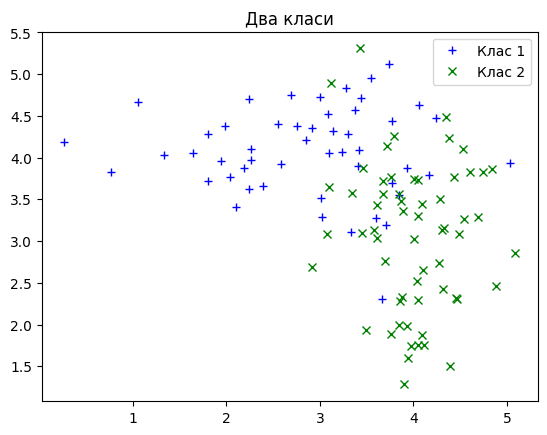
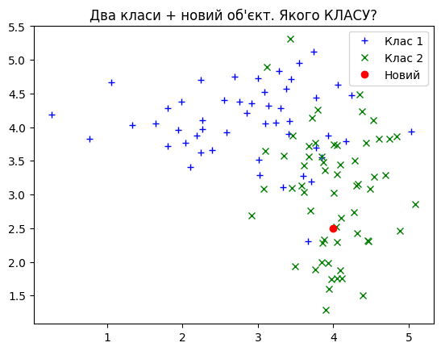

# Модуль 2. Лекція 07. Метод k найближчіх сусідів (kNN).

Найпростіший приклад


```python
import matplotlib.pyplot as plt
colors = plt.rcParams['axes.prop_cycle'].by_key()['color']
import numpy as np
```

Генеруємо випадкові ознаки обєктів двох класів. Кожен обєкт має 2 ознаки (x,  y).
Нормальный розподіл


```python
# Середні значення для перешого класу
Class_1_Center = np.array([3.0, 4.0])
# Середні значення для другого класу
Class_2_Center = np.array([4.0, 3.0])

# Середнє квадратичне відхилення для перщого класу
Class_1_x_std = 1.0
Class_1_y_std = .5
# Середнє квадратичне відхилення для другого класу
Class_2_x_std = .5
Class_2_y_std = 1.0

```


```python
# Точки першого класу
Num_points_Class_1 = 50
Class_1_Data =  np.zeros((2,Num_points_Class_1), dtype=np.float32)
Class_1_Data[0,:] = np.random.default_rng().normal(Class_1_Center[0], Class_1_x_std, Num_points_Class_1)
Class_1_Data[1,:] = np.random.default_rng().normal(Class_1_Center[1], Class_1_y_std, Num_points_Class_1)
print(np.min(Class_1_Data[0,:]),np.max(Class_1_Data[0,:]) )
```

    0.26676393 5.0358706
    


```python
# Точки другого класу
Num_points_Class_2 = 60
Class_2_Data =  np.zeros((2,Num_points_Class_2), dtype=np.float32)
Class_2_Data[0,:] = np.random.default_rng().normal(Class_2_Center[0], Class_2_x_std, Num_points_Class_2)
Class_2_Data[1,:] = np.random.default_rng().normal(Class_2_Center[1], Class_2_y_std, Num_points_Class_2)
```

Графік даних


```python
fig = plt.figure()
ax = fig.add_subplot(1, 1, 1)
ax.set_title("Два класи")
plt.plot(Class_1_Data[0,:], Class_1_Data[1,:], '+', color = 'blue', label = 'Клас 1')
plt.plot(Class_2_Data[0,:], Class_2_Data[1,:], 'x', color = 'green', label = 'Клас 2')
ax.legend()
plt.show()
```


    

    


```python
# Довільна нова точка. Ло якого класу віднести ?
x_new = 4.0
y_new = 2.5


fig = plt.figure()
ax = fig.add_subplot(1, 1, 1)
ax.set_title("Два класи + новий об'єкт. Якого КЛАСУ?")
plt.plot(Class_1_Data[0,:], Class_1_Data[1,:], '+', color = 'blue', label = 'Клас 1')
plt.plot(Class_2_Data[0,:], Class_2_Data[1,:], 'x', color = 'green', label = 'Клас 2')
plt.plot(x_new, y_new, 'o', color = 'red', label="Новий")
plt.legend()
plt.show()
```


    

    


Формування загального масиву обєктів з мітками класів


```python
Num_points = Num_points_Class_1 + Num_points_Class_2
Points =  np.zeros((3,Num_points), dtype=np.float32)
Points[:2,:Num_points_Class_1] = Class_1_Data
Points[2,:Num_points_Class_1] = 1.0
Points[:2,Num_points_Class_1:] = Class_2_Data
Points[2,Num_points_Class_1:] = 2.0
#  print(Num_points,Points)

```

Обчислення відстані:


```python
# Відстань L2 (Евклід)
def distance (x,y):
   return np.sqrt(np.dot(x-y, x-y))
```


```python
# Наприклад, відстань
Points[:2,0]
```


    array([3.0111122, 3.51595  ], dtype=float32)


```python
#x_new = 4.0
#y_new = 2.5

x_new = 2.0
y_new = 4.5


new_point = [x_new, y_new]
```


```python
# Відстань до нової точки
dist =  np.zeros((2,Num_points), dtype=np.float32)
for i in range(Num_points):
  dist[0,i] = distance(new_point,Points[:2,i] )
dist[1,:] = Points[2,:]
print(dist)
```

    [[1.4109225  2.0139842  1.1012162  1.841888   1.4026812  1.4580573
      1.3076032  1.3170595  2.025182   0.8235395  0.11823666 0.65644497
      1.946489   0.31830877 1.7671955  2.081627   1.3183595  0.54529107
      0.7289301  1.9315245  0.8023884  0.8971782  0.7339497  1.1831001
      0.29334354 0.57093644 2.1528554  0.5927627  0.9618568  2.237063
      0.92655694 3.0889652  0.47180977 1.5319785  1.1577632  1.7621065
      1.3774852  1.588257   2.7482567  0.91113365 2.277703   0.7669603
      1.4738072  1.6055146  0.80861616 1.0912318  1.03009    2.0683274
      0.5569509  0.92686015 1.3831097  3.3606298  3.0143032  2.3909156
      2.1270323  2.6926289  3.8367653  2.543531   1.5904678  3.286895
      3.295399   3.4955502  2.6844468  2.0173774  2.8795154  1.9176587
      2.4911056  2.9125032  2.0727205  1.7830994  2.6801732  3.1728184
      2.4895685  2.8654807  2.0266702  1.7588122  2.4274573  2.855887
      2.9686854  3.389811   1.6353813  1.8476605  2.822047   3.7356882
      2.1433086  2.1752229  2.374912   3.526491   1.8112236  2.089808
      3.4606028  3.42215    2.1885362  1.9051766  2.8943772  1.9360884
      1.6423906  2.202779   2.5581732  2.3396332  3.1099412  3.1497912
      2.7950497  3.1066408  2.8207006  2.8400548  3.4973109  2.9512897
      2.346372   1.1824126 ]
     [1.         1.         1.         1.         1.         1.
      1.         1.         1.         1.         1.         1.
      1.         1.         1.         1.         1.         1.
      1.         1.         1.         1.         1.         1.
      1.         1.         1.         1.         1.         1.
      1.         1.         1.         1.         1.         1.
      1.         1.         1.         1.         1.         1.
      1.         1.         1.         1.         1.         1.
      1.         1.         2.         2.         2.         2.
      2.         2.         2.         2.         2.         2.
      2.         2.         2.         2.         2.         2.
      2.         2.         2.         2.         2.         2.
      2.         2.         2.         2.         2.         2.
      2.         2.         2.         2.         2.         2.
      2.         2.         2.         2.         2.         2.
      2.         2.         2.         2.         2.         2.
      2.         2.         2.         2.         2.         2.
      2.         2.         2.         2.         2.         2.
      2.         2.        ]]
    

Сортування та вітбір K сусідів


```python
dist_sort = dist[:, dist[0].argsort()]
print(dist_sort)
```

    [[0.11823666 0.29334354 0.31830877 0.47180977 0.54529107 0.5569509
      0.57093644 0.5927627  0.65644497 0.7289301  0.7339497  0.7669603
      0.8023884  0.80861616 0.8235395  0.8971782  0.91113365 0.92655694
      0.92686015 0.9618568  1.03009    1.0912318  1.1012162  1.1577632
      1.1824126  1.1831001  1.3076032  1.3170595  1.3183595  1.3774852
      1.3831097  1.4026812  1.4109225  1.4580573  1.4738072  1.5319785
      1.588257   1.5904678  1.6055146  1.6353813  1.6423906  1.7588122
      1.7621065  1.7671955  1.7830994  1.8112236  1.841888   1.8476605
      1.9051766  1.9176587  1.9315245  1.9360884  1.946489   2.0139842
      2.0173774  2.025182   2.0266702  2.0683274  2.0727205  2.081627
      2.089808   2.1270323  2.1433086  2.1528554  2.1752229  2.1885362
      2.202779   2.237063   2.277703   2.3396332  2.346372   2.374912
      2.3909156  2.4274573  2.4895685  2.4911056  2.543531   2.5581732
      2.6801732  2.6844468  2.6926289  2.7482567  2.7950497  2.8207006
      2.822047   2.8400548  2.855887   2.8654807  2.8795154  2.8943772
      2.9125032  2.9512897  2.9686854  3.0143032  3.0889652  3.1066408
      3.1099412  3.1497912  3.1728184  3.286895   3.295399   3.3606298
      3.389811   3.42215    3.4606028  3.4955502  3.4973109  3.526491
      3.7356882  3.8367653 ]
     [1.         1.         1.         1.         1.         1.
      1.         1.         1.         1.         1.         1.
      1.         1.         1.         1.         1.         1.
      1.         1.         1.         1.         1.         1.
      2.         1.         1.         1.         1.         1.
      2.         1.         1.         1.         1.         1.
      1.         2.         1.         2.         2.         2.
      1.         1.         2.         2.         1.         2.
      2.         2.         1.         2.         1.         1.
      2.         1.         2.         1.         2.         1.
      2.         2.         2.         1.         2.         2.
      2.         1.         1.         2.         2.         2.
      2.         2.         2.         2.         2.         2.
      2.         2.         2.         1.         2.         2.
      2.         2.         2.         2.         2.         2.
      2.         2.         2.         2.         1.         2.
      2.         2.         2.         2.         2.         2.
      2.         2.         2.         2.         2.         2.
      2.         2.        ]]
    


```python
k = 9 # Кількість найближчих
class_1 = 0
class_2 = 0
for i in range(k):
  if dist_sort[1,i] > 1.5:
    class_2 += 1
  else:
    class_1 += 1

Answer = 'Class 1'
if class_2 > class_1 : Answer = 'Class 2'
print('Vote', class_1, class_2, 'Відноситься до ', Answer)
```

    Vote 9 0 Відноситься до  Class 1
    


```python
fig = plt.figure()
ax = fig.add_subplot(1, 1, 1)
ax.set_title("Два класи + новий об'єкт. Якого КЛАСУ?")
plt.plot(Class_1_Data[0,:], Class_1_Data[1,:], '+', color = 'blue', label = 'Клас 1')
plt.plot(Class_2_Data[0,:], Class_2_Data[1,:], 'x', color = 'green', label = 'Клас 2')
plt.plot(x_new, y_new, 'o', color = 'red', label=Answer)
plt.legend()
plt.show()
```


    

    


```python

```
