# Модуль 2. Лекція 07. Метод k найближчіх сусідів (kNN).

Приклад попереднього аналізу датасету, вибору значущих признаків, використання зниження кількості ознак та використання kNN  для класіфікації хвороби

Based on:
1.   [Breast Cancer Classification. Part1](https://medium.com/@hazallgultekin/part1-breast-cancer-classification-ffa904b76afe)
2.   [Breast Cancer Classification. Part2](https://medium.com/@hazallgultekin/part2-breast-cancer-classification-e397d399e180)


###### Завантаження бібліотек роботи з даними та візуалізації


```python
import pandas as pd #for analyze
import numpy  as np #for vector
import seaborn as sns #for visualization
import matplotlib.pyplot as plt #for visualization
from matplotlib.colors import ListedColormap
```

###### Завантаження бібліотек sklearn


```python
# ML library
from sklearn.preprocessing import StandardScaler #for standartization
from sklearn.model_selection import train_test_split, GridSearchCV #verisetini train ve test olarak ayırır, KNN ile ilgili best parametreleri seçerken kullanırız
from sklearn.metrics import accuracy_score, confusion_matrix #%30 başarılı gibi, score sonucunda nerede hata var nerede yok bunu tespit eder
from sklearn.neighbors import KNeighborsClassifier, NeighborhoodComponentsAnalysis, LocalOutlierFactor
from sklearn.decomposition import PCA
```

###### Підключення до гугл драйву


```python
from google.colab import drive
drive.mount("/content/gdrive")
```

    Mounted at /content/gdrive


#### DATASET ОПИС [Exploratory Data Analysis Of Breast Cancer Dataset](https://medium.com/@tutorialcreation81/exploratory-data-analysis-of-breast-cancer-dataset-8c4cd7712f6f)

Гнобхідно завантажити з [Breast Cancer Wisconsin (Diagnostic)](https://www.kaggle.com/datasets/uciml/breast-cancer-wisconsin-data) до свого Google Drive


###### Path to dataset


```python
datasetpath = '/content/gdrive/MyDrive/Colab_Notebooks/DATA_SETS/data.csv'
```

Завантаження p Google Drive


```python
# close warning library
import warnings
warnings.filterwarnings("ignore")
# зчитування датасету
data = pd.read_csv(datasetpath)
```


```python
data.info()
```

    <class 'pandas.core.frame.DataFrame'>
    RangeIndex: 569 entries, 0 to 568
    Data columns (total 33 columns):
     #   Column                   Non-Null Count  Dtype  
    ---  ------                   --------------  -----  
     0   id                       569 non-null    int64  
     1   diagnosis                569 non-null    object 
     2   radius_mean              569 non-null    float64
     3   texture_mean             569 non-null    float64
     4   perimeter_mean           569 non-null    float64
     5   area_mean                569 non-null    float64
     6   smoothness_mean          569 non-null    float64
     7   compactness_mean         569 non-null    float64
     8   concavity_mean           569 non-null    float64
     9   concave points_mean      569 non-null    float64
     10  symmetry_mean            569 non-null    float64
     11  fractal_dimension_mean   569 non-null    float64
     12  radius_se                569 non-null    float64
     13  texture_se               569 non-null    float64
     14  perimeter_se             569 non-null    float64
     15  area_se                  569 non-null    float64
     16  smoothness_se            569 non-null    float64
     17  compactness_se           569 non-null    float64
     18  concavity_se             569 non-null    float64
     19  concave points_se        569 non-null    float64
     20  symmetry_se              569 non-null    float64
     21  fractal_dimension_se     569 non-null    float64
     22  radius_worst             569 non-null    float64
     23  texture_worst            569 non-null    float64
     24  perimeter_worst          569 non-null    float64
     25  area_worst               569 non-null    float64
     26  smoothness_worst         569 non-null    float64
     27  compactness_worst        569 non-null    float64
     28  concavity_worst          569 non-null    float64
     29  concave points_worst     569 non-null    float64
     30  symmetry_worst           569 non-null    float64
     31  fractal_dimension_worst  569 non-null    float64
     32  Unnamed: 32              0 non-null      float64
    dtypes: float64(31), int64(1), object(1)
    memory usage: 146.8+ KB


```python
print(data.head())
```

             id diagnosis  radius_mean  texture_mean  perimeter_mean  area_mean  \
    0    842302         M        17.99         10.38          122.80     1001.0   
    1    842517         M        20.57         17.77          132.90     1326.0   
    2  84300903         M        19.69         21.25          130.00     1203.0   
    3  84348301         M        11.42         20.38           77.58      386.1   
    4  84358402         M        20.29         14.34          135.10     1297.0   
    
       smoothness_mean  compactness_mean  concavity_mean  concave points_mean  \
    0          0.11840           0.27760          0.3001              0.14710   
    1          0.08474           0.07864          0.0869              0.07017   
    2          0.10960           0.15990          0.1974              0.12790   
    3          0.14250           0.28390          0.2414              0.10520   
    4          0.10030           0.13280          0.1980              0.10430   
    
       ...  texture_worst  perimeter_worst  area_worst  smoothness_worst  \
    0  ...          17.33           184.60      2019.0            0.1622   
    1  ...          23.41           158.80      1956.0            0.1238   
    2  ...          25.53           152.50      1709.0            0.1444   
    3  ...          26.50            98.87       567.7            0.2098   
    4  ...          16.67           152.20      1575.0            0.1374   
    
       compactness_worst  concavity_worst  concave points_worst  symmetry_worst  \
    0             0.6656           0.7119                0.2654          0.4601   
    1             0.1866           0.2416                0.1860          0.2750   
    2             0.4245           0.4504                0.2430          0.3613   
    3             0.8663           0.6869                0.2575          0.6638   
    4             0.2050           0.4000                0.1625          0.2364   
    
       fractal_dimension_worst  Unnamed: 32  
    0                  0.11890          NaN  
    1                  0.08902          NaN  
    2                  0.08758          NaN  
    3                  0.17300          NaN  
    4                  0.07678          NaN  
    
    [5 rows x 33 columns]


##### Якщо є невизначені поля, відкидаємо


```python
# Return new object with labels in requested axis removed.
data.drop(['Unnamed: 32', 'id'], inplace = True, axis = 1)
```

##### Зміна імя поля 'diagnosis' на 'target'


```python
data = data.rename(columns = {'diagnosis':'target'})
```


```python
data.info()
```

    <class 'pandas.core.frame.DataFrame'>
    RangeIndex: 569 entries, 0 to 568
    Data columns (total 31 columns):
     #   Column                   Non-Null Count  Dtype  
    ---  ------                   --------------  -----  
     0   target                   569 non-null    object 
     1   radius_mean              569 non-null    float64
     2   texture_mean             569 non-null    float64
     3   perimeter_mean           569 non-null    float64
     4   area_mean                569 non-null    float64
     5   smoothness_mean          569 non-null    float64
     6   compactness_mean         569 non-null    float64
     7   concavity_mean           569 non-null    float64
     8   concave points_mean      569 non-null    float64
     9   symmetry_mean            569 non-null    float64
     10  fractal_dimension_mean   569 non-null    float64
     11  radius_se                569 non-null    float64
     12  texture_se               569 non-null    float64
     13  perimeter_se             569 non-null    float64
     14  area_se                  569 non-null    float64
     15  smoothness_se            569 non-null    float64
     16  compactness_se           569 non-null    float64
     17  concavity_se             569 non-null    float64
     18  concave points_se        569 non-null    float64
     19  symmetry_se              569 non-null    float64
     20  fractal_dimension_se     569 non-null    float64
     21  radius_worst             569 non-null    float64
     22  texture_worst            569 non-null    float64
     23  perimeter_worst          569 non-null    float64
     24  area_worst               569 non-null    float64
     25  smoothness_worst         569 non-null    float64
     26  compactness_worst        569 non-null    float64
     27  concavity_worst          569 non-null    float64
     28  concave points_worst     569 non-null    float64
     29  symmetry_worst           569 non-null    float64
     30  fractal_dimension_worst  569 non-null    float64
    dtypes: float64(30), object(1)
    memory usage: 137.9+ KB


```python
print(data.head())
```

      target  radius_mean  texture_mean  perimeter_mean  area_mean  \
    0      M        17.99         10.38          122.80     1001.0   
    1      M        20.57         17.77          132.90     1326.0   
    2      M        19.69         21.25          130.00     1203.0   
    3      M        11.42         20.38           77.58      386.1   
    4      M        20.29         14.34          135.10     1297.0   
    
       smoothness_mean  compactness_mean  concavity_mean  concave points_mean  \
    0          0.11840           0.27760          0.3001              0.14710   
    1          0.08474           0.07864          0.0869              0.07017   
    2          0.10960           0.15990          0.1974              0.12790   
    3          0.14250           0.28390          0.2414              0.10520   
    4          0.10030           0.13280          0.1980              0.10430   
    
       symmetry_mean  ...  radius_worst  texture_worst  perimeter_worst  \
    0         0.2419  ...         25.38          17.33           184.60   
    1         0.1812  ...         24.99          23.41           158.80   
    2         0.2069  ...         23.57          25.53           152.50   
    3         0.2597  ...         14.91          26.50            98.87   
    4         0.1809  ...         22.54          16.67           152.20   
    
       area_worst  smoothness_worst  compactness_worst  concavity_worst  \
    0      2019.0            0.1622             0.6656           0.7119   
    1      1956.0            0.1238             0.1866           0.2416   
    2      1709.0            0.1444             0.4245           0.4504   
    3       567.7            0.2098             0.8663           0.6869   
    4      1575.0            0.1374             0.2050           0.4000   
    
       concave points_worst  symmetry_worst  fractal_dimension_worst  
    0                0.2654          0.4601                  0.11890  
    1                0.1860          0.2750                  0.08902  
    2                0.2430          0.3613                  0.08758  
    3                0.2575          0.6638                  0.17300  
    4                0.1625          0.2364                  0.07678  
    
    [5 rows x 31 columns]


##### В полі **target** змінюємо M на 1, інакше на 0.


```python
data["target"] = [1 if i.strip() == 'M' else 0 for i in data.target]
```

#####  Опис завантажених даних


```python
# Tells how many rows and columns there are
print("Формат датасету", data.shape)

# Tells the data length.
print('Кількість прикладів', len(data))

# Fetch the first 5 rows.
print('Перші 5 векторів ознак')
print(data.head())

# Prints information about the DataFrame. It includes the number of columns,
# column labels, column data types, memory usage, range index, and number of cells in each column (non-empty values).
# data.info()
```

    Формат датасету (569, 31)
    Кількість прикладів 569
    Перші 5 векторів ознак
       target  radius_mean  texture_mean  perimeter_mean  area_mean  \
    0       1        17.99         10.38          122.80     1001.0   
    1       1        20.57         17.77          132.90     1326.0   
    2       1        19.69         21.25          130.00     1203.0   
    3       1        11.42         20.38           77.58      386.1   
    4       1        20.29         14.34          135.10     1297.0   
    
       smoothness_mean  compactness_mean  concavity_mean  concave points_mean  \
    0          0.11840           0.27760          0.3001              0.14710   
    1          0.08474           0.07864          0.0869              0.07017   
    2          0.10960           0.15990          0.1974              0.12790   
    3          0.14250           0.28390          0.2414              0.10520   
    4          0.10030           0.13280          0.1980              0.10430   
    
       symmetry_mean  ...  radius_worst  texture_worst  perimeter_worst  \
    0         0.2419  ...         25.38          17.33           184.60   
    1         0.1812  ...         24.99          23.41           158.80   
    2         0.2069  ...         23.57          25.53           152.50   
    3         0.2597  ...         14.91          26.50            98.87   
    4         0.1809  ...         22.54          16.67           152.20   
    
       area_worst  smoothness_worst  compactness_worst  concavity_worst  \
    0      2019.0            0.1622             0.6656           0.7119   
    1      1956.0            0.1238             0.1866           0.2416   
    2      1709.0            0.1444             0.4245           0.4504   
    3       567.7            0.2098             0.8663           0.6869   
    4      1575.0            0.1374             0.2050           0.4000   
    
       concave points_worst  symmetry_worst  fractal_dimension_worst  
    0                0.2654          0.4601                  0.11890  
    1                0.1860          0.2750                  0.08902  
    2                0.2430          0.3613                  0.08758  
    3                0.2575          0.6638                  0.17300  
    4                0.1625          0.2364                  0.07678  
    
    [5 rows x 31 columns]


##### Кореляція

 — статистичний показник, який вимірює зв’язок між двома змінними, і його значення можуть коливатися від -1 до 1. Позитивне значення вказує на позитивний зв’язок, а від’ємне — на негативний.
Візуалізація кореляцій між стовпцями у кадрі даних і групування цих кореляцій на карті кластеризації.
Такий тип візуалізації корисний для кращого розуміння зв’язків і групувань між змінними в наборі даних.


```python
# Calculates a summary of statistics for DataFrame columns. This function returns mean, std and IQR values.
describe  = data.describe()
corr_matrix = data.corr()
corr_matrix
```


  <div id="df-a374eb63-3814-41ef-8546-13619b55a344" class="colab-df-container">
    <div>
<style scoped>
    .dataframe tbody tr th:only-of-type {
        vertical-align: middle;
    }

    .dataframe tbody tr th {
        vertical-align: top;
    }
    
    .dataframe thead th {
        text-align: right;
    }
</style>
<table border="1" class="dataframe">
  <thead>
    <tr style="text-align: right;">
      <th></th>
      <th>target</th>
      <th>radius_mean</th>
      <th>texture_mean</th>
      <th>perimeter_mean</th>
      <th>area_mean</th>
      <th>smoothness_mean</th>
      <th>compactness_mean</th>
      <th>concavity_mean</th>
      <th>concave points_mean</th>
      <th>symmetry_mean</th>
      <th>...</th>
      <th>radius_worst</th>
      <th>texture_worst</th>
      <th>perimeter_worst</th>
      <th>area_worst</th>
      <th>smoothness_worst</th>
      <th>compactness_worst</th>
      <th>concavity_worst</th>
      <th>concave points_worst</th>
      <th>symmetry_worst</th>
      <th>fractal_dimension_worst</th>
    </tr>
  </thead>
  <tbody>
    <tr>
      <th>target</th>
      <td>1.000000</td>
      <td>0.730029</td>
      <td>0.415185</td>
      <td>0.742636</td>
      <td>0.708984</td>
      <td>0.358560</td>
      <td>0.596534</td>
      <td>0.696360</td>
      <td>0.776614</td>
      <td>0.330499</td>
      <td>...</td>
      <td>0.776454</td>
      <td>0.456903</td>
      <td>0.782914</td>
      <td>0.733825</td>
      <td>0.421465</td>
      <td>0.590998</td>
      <td>0.659610</td>
      <td>0.793566</td>
      <td>0.416294</td>
      <td>0.323872</td>
    </tr>
    <tr>
      <th>radius_mean</th>
      <td>0.730029</td>
      <td>1.000000</td>
      <td>0.323782</td>
      <td>0.997855</td>
      <td>0.987357</td>
      <td>0.170581</td>
      <td>0.506124</td>
      <td>0.676764</td>
      <td>0.822529</td>
      <td>0.147741</td>
      <td>...</td>
      <td>0.969539</td>
      <td>0.297008</td>
      <td>0.965137</td>
      <td>0.941082</td>
      <td>0.119616</td>
      <td>0.413463</td>
      <td>0.526911</td>
      <td>0.744214</td>
      <td>0.163953</td>
      <td>0.007066</td>
    </tr>
    <tr>
      <th>texture_mean</th>
      <td>0.415185</td>
      <td>0.323782</td>
      <td>1.000000</td>
      <td>0.329533</td>
      <td>0.321086</td>
      <td>-0.023389</td>
      <td>0.236702</td>
      <td>0.302418</td>
      <td>0.293464</td>
      <td>0.071401</td>
      <td>...</td>
      <td>0.352573</td>
      <td>0.912045</td>
      <td>0.358040</td>
      <td>0.343546</td>
      <td>0.077503</td>
      <td>0.277830</td>
      <td>0.301025</td>
      <td>0.295316</td>
      <td>0.105008</td>
      <td>0.119205</td>
    </tr>
    <tr>
      <th>perimeter_mean</th>
      <td>0.742636</td>
      <td>0.997855</td>
      <td>0.329533</td>
      <td>1.000000</td>
      <td>0.986507</td>
      <td>0.207278</td>
      <td>0.556936</td>
      <td>0.716136</td>
      <td>0.850977</td>
      <td>0.183027</td>
      <td>...</td>
      <td>0.969476</td>
      <td>0.303038</td>
      <td>0.970387</td>
      <td>0.941550</td>
      <td>0.150549</td>
      <td>0.455774</td>
      <td>0.563879</td>
      <td>0.771241</td>
      <td>0.189115</td>
      <td>0.051019</td>
    </tr>
    <tr>
      <th>area_mean</th>
      <td>0.708984</td>
      <td>0.987357</td>
      <td>0.321086</td>
      <td>0.986507</td>
      <td>1.000000</td>
      <td>0.177028</td>
      <td>0.498502</td>
      <td>0.685983</td>
      <td>0.823269</td>
      <td>0.151293</td>
      <td>...</td>
      <td>0.962746</td>
      <td>0.287489</td>
      <td>0.959120</td>
      <td>0.959213</td>
      <td>0.123523</td>
      <td>0.390410</td>
      <td>0.512606</td>
      <td>0.722017</td>
      <td>0.143570</td>
      <td>0.003738</td>
    </tr>
    <tr>
      <th>smoothness_mean</th>
      <td>0.358560</td>
      <td>0.170581</td>
      <td>-0.023389</td>
      <td>0.207278</td>
      <td>0.177028</td>
      <td>1.000000</td>
      <td>0.659123</td>
      <td>0.521984</td>
      <td>0.553695</td>
      <td>0.557775</td>
      <td>...</td>
      <td>0.213120</td>
      <td>0.036072</td>
      <td>0.238853</td>
      <td>0.206718</td>
      <td>0.805324</td>
      <td>0.472468</td>
      <td>0.434926</td>
      <td>0.503053</td>
      <td>0.394309</td>
      <td>0.499316</td>
    </tr>
    <tr>
      <th>compactness_mean</th>
      <td>0.596534</td>
      <td>0.506124</td>
      <td>0.236702</td>
      <td>0.556936</td>
      <td>0.498502</td>
      <td>0.659123</td>
      <td>1.000000</td>
      <td>0.883121</td>
      <td>0.831135</td>
      <td>0.602641</td>
      <td>...</td>
      <td>0.535315</td>
      <td>0.248133</td>
      <td>0.590210</td>
      <td>0.509604</td>
      <td>0.565541</td>
      <td>0.865809</td>
      <td>0.816275</td>
      <td>0.815573</td>
      <td>0.510223</td>
      <td>0.687382</td>
    </tr>
    <tr>
      <th>concavity_mean</th>
      <td>0.696360</td>
      <td>0.676764</td>
      <td>0.302418</td>
      <td>0.716136</td>
      <td>0.685983</td>
      <td>0.521984</td>
      <td>0.883121</td>
      <td>1.000000</td>
      <td>0.921391</td>
      <td>0.500667</td>
      <td>...</td>
      <td>0.688236</td>
      <td>0.299879</td>
      <td>0.729565</td>
      <td>0.675987</td>
      <td>0.448822</td>
      <td>0.754968</td>
      <td>0.884103</td>
      <td>0.861323</td>
      <td>0.409464</td>
      <td>0.514930</td>
    </tr>
    <tr>
      <th>concave points_mean</th>
      <td>0.776614</td>
      <td>0.822529</td>
      <td>0.293464</td>
      <td>0.850977</td>
      <td>0.823269</td>
      <td>0.553695</td>
      <td>0.831135</td>
      <td>0.921391</td>
      <td>1.000000</td>
      <td>0.462497</td>
      <td>...</td>
      <td>0.830318</td>
      <td>0.292752</td>
      <td>0.855923</td>
      <td>0.809630</td>
      <td>0.452753</td>
      <td>0.667454</td>
      <td>0.752399</td>
      <td>0.910155</td>
      <td>0.375744</td>
      <td>0.368661</td>
    </tr>
    <tr>
      <th>symmetry_mean</th>
      <td>0.330499</td>
      <td>0.147741</td>
      <td>0.071401</td>
      <td>0.183027</td>
      <td>0.151293</td>
      <td>0.557775</td>
      <td>0.602641</td>
      <td>0.500667</td>
      <td>0.462497</td>
      <td>1.000000</td>
      <td>...</td>
      <td>0.185728</td>
      <td>0.090651</td>
      <td>0.219169</td>
      <td>0.177193</td>
      <td>0.426675</td>
      <td>0.473200</td>
      <td>0.433721</td>
      <td>0.430297</td>
      <td>0.699826</td>
      <td>0.438413</td>
    </tr>
    <tr>
      <th>fractal_dimension_mean</th>
      <td>-0.012838</td>
      <td>-0.311631</td>
      <td>-0.076437</td>
      <td>-0.261477</td>
      <td>-0.283110</td>
      <td>0.584792</td>
      <td>0.565369</td>
      <td>0.336783</td>
      <td>0.166917</td>
      <td>0.479921</td>
      <td>...</td>
      <td>-0.253691</td>
      <td>-0.051269</td>
      <td>-0.205151</td>
      <td>-0.231854</td>
      <td>0.504942</td>
      <td>0.458798</td>
      <td>0.346234</td>
      <td>0.175325</td>
      <td>0.334019</td>
      <td>0.767297</td>
    </tr>
    <tr>
      <th>radius_se</th>
      <td>0.567134</td>
      <td>0.679090</td>
      <td>0.275869</td>
      <td>0.691765</td>
      <td>0.732562</td>
      <td>0.301467</td>
      <td>0.497473</td>
      <td>0.631925</td>
      <td>0.698050</td>
      <td>0.303379</td>
      <td>...</td>
      <td>0.715065</td>
      <td>0.194799</td>
      <td>0.719684</td>
      <td>0.751548</td>
      <td>0.141919</td>
      <td>0.287103</td>
      <td>0.380585</td>
      <td>0.531062</td>
      <td>0.094543</td>
      <td>0.049559</td>
    </tr>
    <tr>
      <th>texture_se</th>
      <td>-0.008303</td>
      <td>-0.097317</td>
      <td>0.386358</td>
      <td>-0.086761</td>
      <td>-0.066280</td>
      <td>0.068406</td>
      <td>0.046205</td>
      <td>0.076218</td>
      <td>0.021480</td>
      <td>0.128053</td>
      <td>...</td>
      <td>-0.111690</td>
      <td>0.409003</td>
      <td>-0.102242</td>
      <td>-0.083195</td>
      <td>-0.073658</td>
      <td>-0.092439</td>
      <td>-0.068956</td>
      <td>-0.119638</td>
      <td>-0.128215</td>
      <td>-0.045655</td>
    </tr>
    <tr>
      <th>perimeter_se</th>
      <td>0.556141</td>
      <td>0.674172</td>
      <td>0.281673</td>
      <td>0.693135</td>
      <td>0.726628</td>
      <td>0.296092</td>
      <td>0.548905</td>
      <td>0.660391</td>
      <td>0.710650</td>
      <td>0.313893</td>
      <td>...</td>
      <td>0.697201</td>
      <td>0.200371</td>
      <td>0.721031</td>
      <td>0.730713</td>
      <td>0.130054</td>
      <td>0.341919</td>
      <td>0.418899</td>
      <td>0.554897</td>
      <td>0.109930</td>
      <td>0.085433</td>
    </tr>
    <tr>
      <th>area_se</th>
      <td>0.548236</td>
      <td>0.735864</td>
      <td>0.259845</td>
      <td>0.744983</td>
      <td>0.800086</td>
      <td>0.246552</td>
      <td>0.455653</td>
      <td>0.617427</td>
      <td>0.690299</td>
      <td>0.223970</td>
      <td>...</td>
      <td>0.757373</td>
      <td>0.196497</td>
      <td>0.761213</td>
      <td>0.811408</td>
      <td>0.125389</td>
      <td>0.283257</td>
      <td>0.385100</td>
      <td>0.538166</td>
      <td>0.074126</td>
      <td>0.017539</td>
    </tr>
    <tr>
      <th>smoothness_se</th>
      <td>-0.067016</td>
      <td>-0.222600</td>
      <td>0.006614</td>
      <td>-0.202694</td>
      <td>-0.166777</td>
      <td>0.332375</td>
      <td>0.135299</td>
      <td>0.098564</td>
      <td>0.027653</td>
      <td>0.187321</td>
      <td>...</td>
      <td>-0.230691</td>
      <td>-0.074743</td>
      <td>-0.217304</td>
      <td>-0.182195</td>
      <td>0.314457</td>
      <td>-0.055558</td>
      <td>-0.058298</td>
      <td>-0.102007</td>
      <td>-0.107342</td>
      <td>0.101480</td>
    </tr>
    <tr>
      <th>compactness_se</th>
      <td>0.292999</td>
      <td>0.206000</td>
      <td>0.191975</td>
      <td>0.250744</td>
      <td>0.212583</td>
      <td>0.318943</td>
      <td>0.738722</td>
      <td>0.670279</td>
      <td>0.490424</td>
      <td>0.421659</td>
      <td>...</td>
      <td>0.204607</td>
      <td>0.143003</td>
      <td>0.260516</td>
      <td>0.199371</td>
      <td>0.227394</td>
      <td>0.678780</td>
      <td>0.639147</td>
      <td>0.483208</td>
      <td>0.277878</td>
      <td>0.590973</td>
    </tr>
    <tr>
      <th>concavity_se</th>
      <td>0.253730</td>
      <td>0.194204</td>
      <td>0.143293</td>
      <td>0.228082</td>
      <td>0.207660</td>
      <td>0.248396</td>
      <td>0.570517</td>
      <td>0.691270</td>
      <td>0.439167</td>
      <td>0.342627</td>
      <td>...</td>
      <td>0.186904</td>
      <td>0.100241</td>
      <td>0.226680</td>
      <td>0.188353</td>
      <td>0.168481</td>
      <td>0.484858</td>
      <td>0.662564</td>
      <td>0.440472</td>
      <td>0.197788</td>
      <td>0.439329</td>
    </tr>
    <tr>
      <th>concave points_se</th>
      <td>0.408042</td>
      <td>0.376169</td>
      <td>0.163851</td>
      <td>0.407217</td>
      <td>0.372320</td>
      <td>0.380676</td>
      <td>0.642262</td>
      <td>0.683260</td>
      <td>0.615634</td>
      <td>0.393298</td>
      <td>...</td>
      <td>0.358127</td>
      <td>0.086741</td>
      <td>0.394999</td>
      <td>0.342271</td>
      <td>0.215351</td>
      <td>0.452888</td>
      <td>0.549592</td>
      <td>0.602450</td>
      <td>0.143116</td>
      <td>0.310655</td>
    </tr>
    <tr>
      <th>symmetry_se</th>
      <td>-0.006522</td>
      <td>-0.104321</td>
      <td>0.009127</td>
      <td>-0.081629</td>
      <td>-0.072497</td>
      <td>0.200774</td>
      <td>0.229977</td>
      <td>0.178009</td>
      <td>0.095351</td>
      <td>0.449137</td>
      <td>...</td>
      <td>-0.128121</td>
      <td>-0.077473</td>
      <td>-0.103753</td>
      <td>-0.110343</td>
      <td>-0.012662</td>
      <td>0.060255</td>
      <td>0.037119</td>
      <td>-0.030413</td>
      <td>0.389402</td>
      <td>0.078079</td>
    </tr>
    <tr>
      <th>fractal_dimension_se</th>
      <td>0.077972</td>
      <td>-0.042641</td>
      <td>0.054458</td>
      <td>-0.005523</td>
      <td>-0.019887</td>
      <td>0.283607</td>
      <td>0.507318</td>
      <td>0.449301</td>
      <td>0.257584</td>
      <td>0.331786</td>
      <td>...</td>
      <td>-0.037488</td>
      <td>-0.003195</td>
      <td>-0.001000</td>
      <td>-0.022736</td>
      <td>0.170568</td>
      <td>0.390159</td>
      <td>0.379975</td>
      <td>0.215204</td>
      <td>0.111094</td>
      <td>0.591328</td>
    </tr>
    <tr>
      <th>radius_worst</th>
      <td>0.776454</td>
      <td>0.969539</td>
      <td>0.352573</td>
      <td>0.969476</td>
      <td>0.962746</td>
      <td>0.213120</td>
      <td>0.535315</td>
      <td>0.688236</td>
      <td>0.830318</td>
      <td>0.185728</td>
      <td>...</td>
      <td>1.000000</td>
      <td>0.359921</td>
      <td>0.993708</td>
      <td>0.984015</td>
      <td>0.216574</td>
      <td>0.475820</td>
      <td>0.573975</td>
      <td>0.787424</td>
      <td>0.243529</td>
      <td>0.093492</td>
    </tr>
    <tr>
      <th>texture_worst</th>
      <td>0.456903</td>
      <td>0.297008</td>
      <td>0.912045</td>
      <td>0.303038</td>
      <td>0.287489</td>
      <td>0.036072</td>
      <td>0.248133</td>
      <td>0.299879</td>
      <td>0.292752</td>
      <td>0.090651</td>
      <td>...</td>
      <td>0.359921</td>
      <td>1.000000</td>
      <td>0.365098</td>
      <td>0.345842</td>
      <td>0.225429</td>
      <td>0.360832</td>
      <td>0.368366</td>
      <td>0.359755</td>
      <td>0.233027</td>
      <td>0.219122</td>
    </tr>
    <tr>
      <th>perimeter_worst</th>
      <td>0.782914</td>
      <td>0.965137</td>
      <td>0.358040</td>
      <td>0.970387</td>
      <td>0.959120</td>
      <td>0.238853</td>
      <td>0.590210</td>
      <td>0.729565</td>
      <td>0.855923</td>
      <td>0.219169</td>
      <td>...</td>
      <td>0.993708</td>
      <td>0.365098</td>
      <td>1.000000</td>
      <td>0.977578</td>
      <td>0.236775</td>
      <td>0.529408</td>
      <td>0.618344</td>
      <td>0.816322</td>
      <td>0.269493</td>
      <td>0.138957</td>
    </tr>
    <tr>
      <th>area_worst</th>
      <td>0.733825</td>
      <td>0.941082</td>
      <td>0.343546</td>
      <td>0.941550</td>
      <td>0.959213</td>
      <td>0.206718</td>
      <td>0.509604</td>
      <td>0.675987</td>
      <td>0.809630</td>
      <td>0.177193</td>
      <td>...</td>
      <td>0.984015</td>
      <td>0.345842</td>
      <td>0.977578</td>
      <td>1.000000</td>
      <td>0.209145</td>
      <td>0.438296</td>
      <td>0.543331</td>
      <td>0.747419</td>
      <td>0.209146</td>
      <td>0.079647</td>
    </tr>
    <tr>
      <th>smoothness_worst</th>
      <td>0.421465</td>
      <td>0.119616</td>
      <td>0.077503</td>
      <td>0.150549</td>
      <td>0.123523</td>
      <td>0.805324</td>
      <td>0.565541</td>
      <td>0.448822</td>
      <td>0.452753</td>
      <td>0.426675</td>
      <td>...</td>
      <td>0.216574</td>
      <td>0.225429</td>
      <td>0.236775</td>
      <td>0.209145</td>
      <td>1.000000</td>
      <td>0.568187</td>
      <td>0.518523</td>
      <td>0.547691</td>
      <td>0.493838</td>
      <td>0.617624</td>
    </tr>
    <tr>
      <th>compactness_worst</th>
      <td>0.590998</td>
      <td>0.413463</td>
      <td>0.277830</td>
      <td>0.455774</td>
      <td>0.390410</td>
      <td>0.472468</td>
      <td>0.865809</td>
      <td>0.754968</td>
      <td>0.667454</td>
      <td>0.473200</td>
      <td>...</td>
      <td>0.475820</td>
      <td>0.360832</td>
      <td>0.529408</td>
      <td>0.438296</td>
      <td>0.568187</td>
      <td>1.000000</td>
      <td>0.892261</td>
      <td>0.801080</td>
      <td>0.614441</td>
      <td>0.810455</td>
    </tr>
    <tr>
      <th>concavity_worst</th>
      <td>0.659610</td>
      <td>0.526911</td>
      <td>0.301025</td>
      <td>0.563879</td>
      <td>0.512606</td>
      <td>0.434926</td>
      <td>0.816275</td>
      <td>0.884103</td>
      <td>0.752399</td>
      <td>0.433721</td>
      <td>...</td>
      <td>0.573975</td>
      <td>0.368366</td>
      <td>0.618344</td>
      <td>0.543331</td>
      <td>0.518523</td>
      <td>0.892261</td>
      <td>1.000000</td>
      <td>0.855434</td>
      <td>0.532520</td>
      <td>0.686511</td>
    </tr>
    <tr>
      <th>concave points_worst</th>
      <td>0.793566</td>
      <td>0.744214</td>
      <td>0.295316</td>
      <td>0.771241</td>
      <td>0.722017</td>
      <td>0.503053</td>
      <td>0.815573</td>
      <td>0.861323</td>
      <td>0.910155</td>
      <td>0.430297</td>
      <td>...</td>
      <td>0.787424</td>
      <td>0.359755</td>
      <td>0.816322</td>
      <td>0.747419</td>
      <td>0.547691</td>
      <td>0.801080</td>
      <td>0.855434</td>
      <td>1.000000</td>
      <td>0.502528</td>
      <td>0.511114</td>
    </tr>
    <tr>
      <th>symmetry_worst</th>
      <td>0.416294</td>
      <td>0.163953</td>
      <td>0.105008</td>
      <td>0.189115</td>
      <td>0.143570</td>
      <td>0.394309</td>
      <td>0.510223</td>
      <td>0.409464</td>
      <td>0.375744</td>
      <td>0.699826</td>
      <td>...</td>
      <td>0.243529</td>
      <td>0.233027</td>
      <td>0.269493</td>
      <td>0.209146</td>
      <td>0.493838</td>
      <td>0.614441</td>
      <td>0.532520</td>
      <td>0.502528</td>
      <td>1.000000</td>
      <td>0.537848</td>
    </tr>
    <tr>
      <th>fractal_dimension_worst</th>
      <td>0.323872</td>
      <td>0.007066</td>
      <td>0.119205</td>
      <td>0.051019</td>
      <td>0.003738</td>
      <td>0.499316</td>
      <td>0.687382</td>
      <td>0.514930</td>
      <td>0.368661</td>
      <td>0.438413</td>
      <td>...</td>
      <td>0.093492</td>
      <td>0.219122</td>
      <td>0.138957</td>
      <td>0.079647</td>
      <td>0.617624</td>
      <td>0.810455</td>
      <td>0.686511</td>
      <td>0.511114</td>
      <td>0.537848</td>
      <td>1.000000</td>
    </tr>
  </tbody>
</table>
<p>31 rows × 31 columns</p>
```python
sns.clustermap(corr_matrix, annot = True, fmt = ".1f")
plt.title("Корреляція між признаками")
plt.show()
```


​    
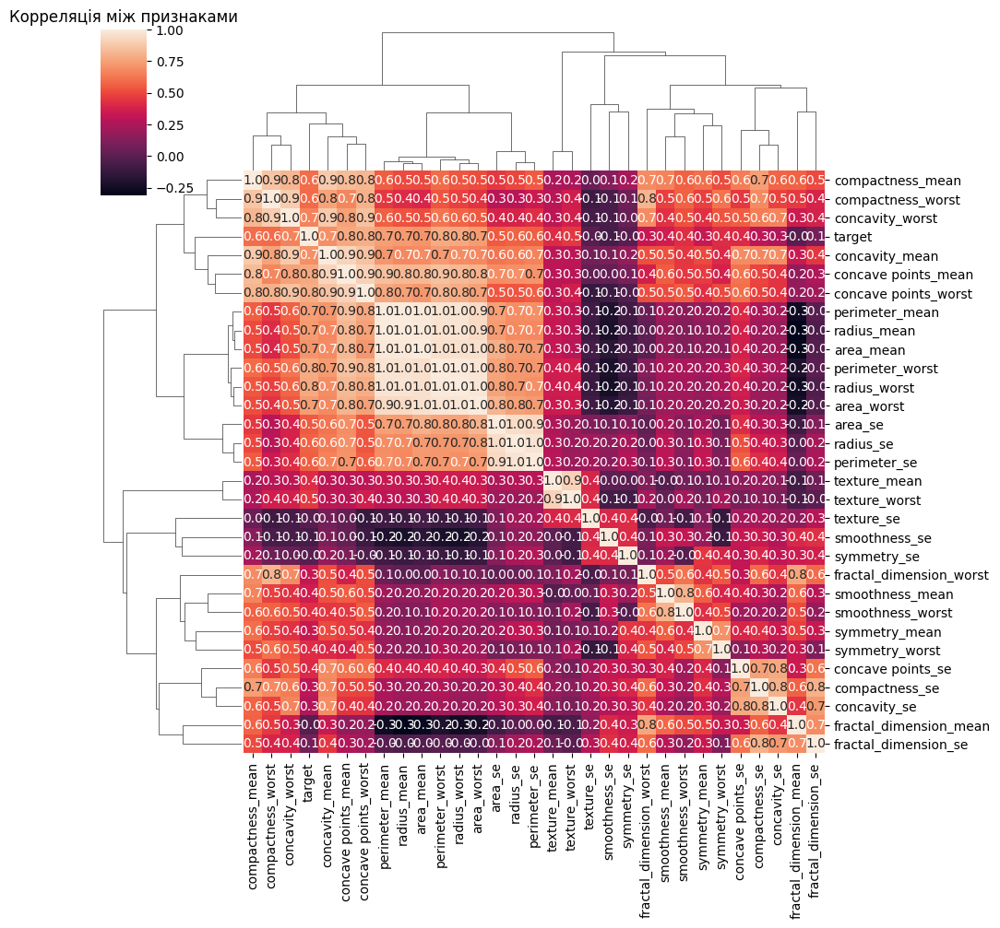
​    


##### Відбір значущих признаків, кореляція більш 0.75


```python
threshold = 0.75
filtre = np.abs(corr_matrix["target"]) > threshold
corr_features = corr_matrix.columns[filtre].tolist()
sns.clustermap(data[corr_features].corr(), annot = True, fmt = ".2f")
plt.title("Correlation Between Features w Corr Threshold 0.75")
```


    Text(0.5, 1.0, 'Correlation Between Features w Corr Threshold 0.75')


​    
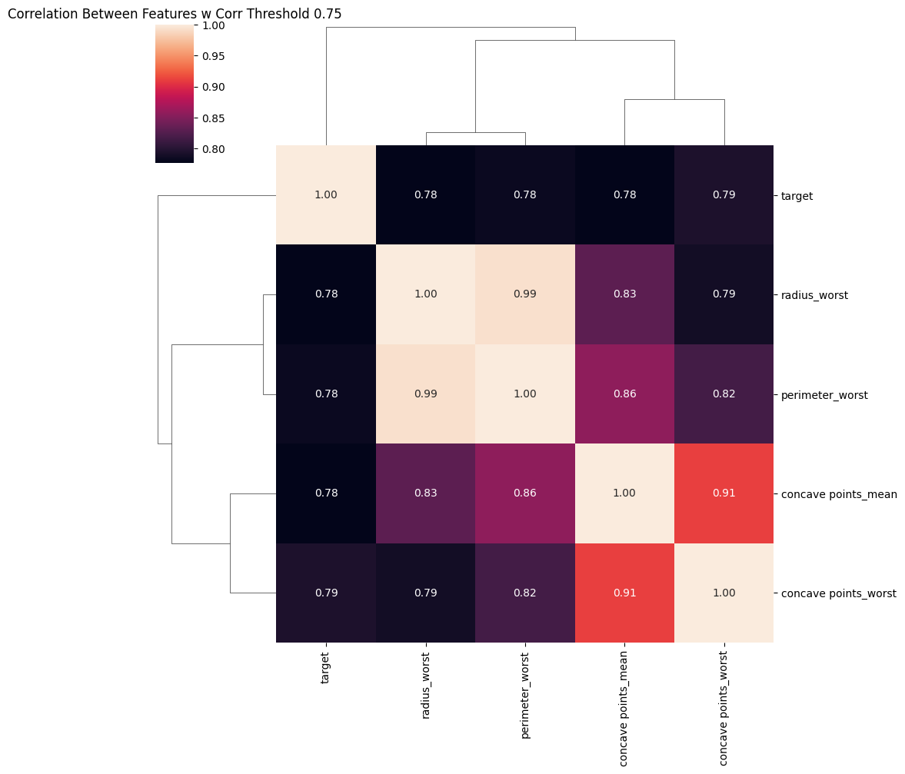
​    


#####  Візуальне порівняння розподілу «цільового» класу для кожної ознаки


```python
data_melted = pd.melt(data, id_vars = "target",
                      var_name = "features",
                      value_name = "value")
plt.figure()
sns.boxplot(x = "features", y = "value", hue = "target", data = data_melted)
plt.xticks(rotation = 90)
plt.show()
```


​    
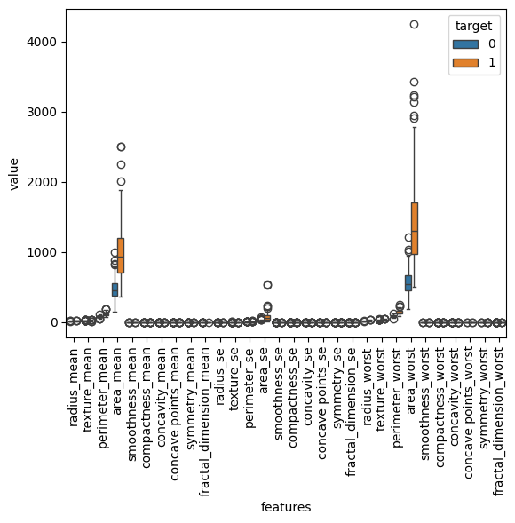
​    


##### Перехресна (парна) діаграма, що показує зв’язки між певними змінними певного кадру даних.

Для кращего зрозуміння зв’язку між змінними та виділення різних груп чи категорій.


```python
sns.pairplot(data[corr_features], diag_kind = "kde", markers = "+",hue = "target")
plt.show()
```


​    
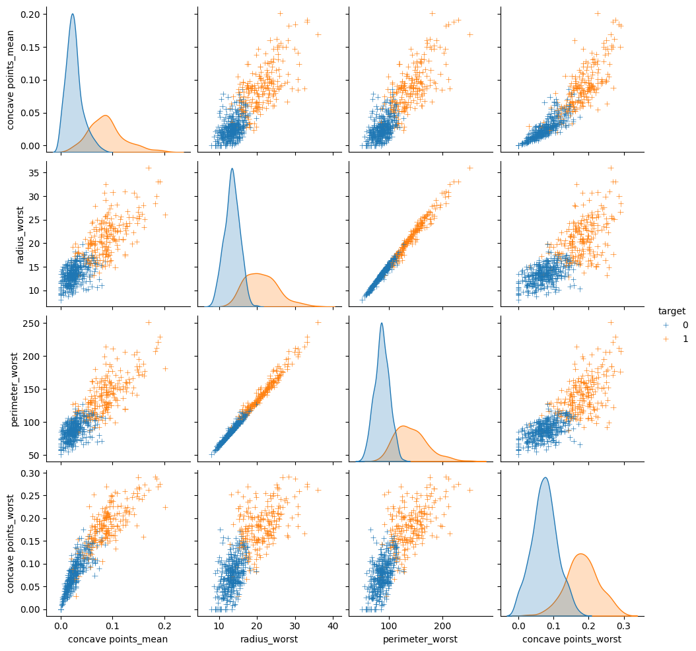
​    


##### Локальний фактор викиду (выброс, LOF - Local Outlier Factoro) — алгоритм для виявлення викидів.
Алгоритм обчислює локальне відхилення щільності заданої точки даних стосовно її сусідів. Він вважає викидами зразки, які мають значно меншу щільність, ніж їхні сусіди.

Алгоритм LOF позначає точки даних як **нормальні** або **викидні** за допомогою даних x і зберігає ці мітки в масиві під назвою y_pred.

Алгоритм LOF виявляє викиди, а потім очищаємо набір даних, видаляючи ці викиди з набору даних. Це корисно для отримання більш точних результатів для аналізу даних і моделювання.


```python
y = data.target
x = data.drop(["target"],axis = 1)
columns = x.columns.tolist()

clf = LocalOutlierFactor()
y_pred = clf.fit_predict(x)
X_score = clf.negative_outlier_factor_

outlier_score = pd.DataFrame()
outlier_score["score"] = X_score

# threshold
threshold = -2.5
filtre = outlier_score["score"] < threshold
outlier_index = outlier_score[filtre].index.tolist()

```

##### Створюється діаграма розсіювання. На графіку викиди відображаються синім знаком +, тоді як інші точки даних представлені чорним кольором і крапками меншого розміру.

Додаються великі точки перетину, що представляють оцінки викидів, а розміри точок перетину змінюються залежно від оцінки викидів кожної точки даних.


```python
plt.figure()
plt.scatter(x.iloc[outlier_index,0], x.iloc[outlier_index,1],color = "blue", s = 50, label = "Outliers")
plt.scatter(x.iloc[:,0], x.iloc[:,1], color = "k", s = 3, label = "Data Points")

radius = (X_score.max() - X_score)/(X_score.max() - X_score.min())
outlier_score["radius"] = radius
plt.scatter(x.iloc[:,0], x.iloc[:,1], s = 1000*radius, edgecolors = "r",facecolors = "none", label = "Outlier Scores")
plt.legend()
plt.show()

# drop outliers
x = x.drop(outlier_index)
y = y.drop(outlier_index).values
```


​    
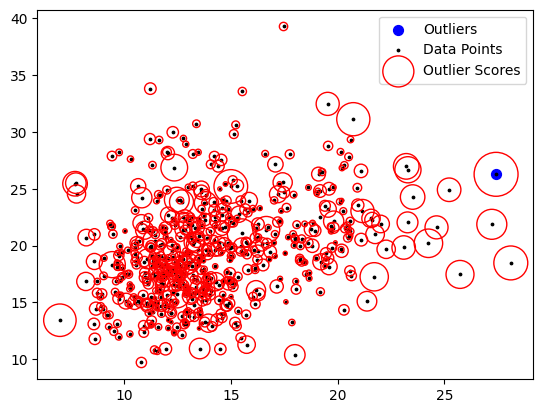
​    


#### ТРЕНУВАННЯ та оцінка ЯКОСТІ

##### Розподіл  даних


```python
# Train, test, split
test_size = 0.3
X_train, X_test, Y_train, Y_test = train_test_split(x, y, test_size = test_size, random_state = 42)
```

##### Масштабування даних
Середнє значення 0, дисперсія 1


```python
# This code first standardizes the data, then boxplots and dual plots.
# It helps to visually examine the distribution and relationships of data.

# Box plot is used to see the distribution and outliers of the data, while
# Pair plot is used to understand the relationships between variables.
scaler = StandardScaler()
X_train = scaler.fit_transform(X_train)
X_test = scaler.transform(X_test)

X_train_df = pd.DataFrame(X_train, columns = columns)
X_train_df_describe = X_train_df.describe()
X_train_df["target"] = Y_train
# box plot
data_melted = pd.melt(X_train_df, id_vars = "target",
                      var_name = "features",
                      value_name = "value")

plt.figure()
sns.boxplot(x = "features", y = "value", hue = "target", data = data_melted)
plt.xticks(rotation = 90)
plt.show()


# pair plot
sns.pairplot(X_train_df[corr_features], diag_kind = "kde", markers = "+",hue = "target")
plt.show()
```


​    
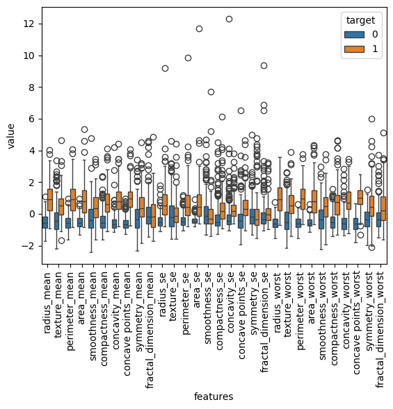
​    


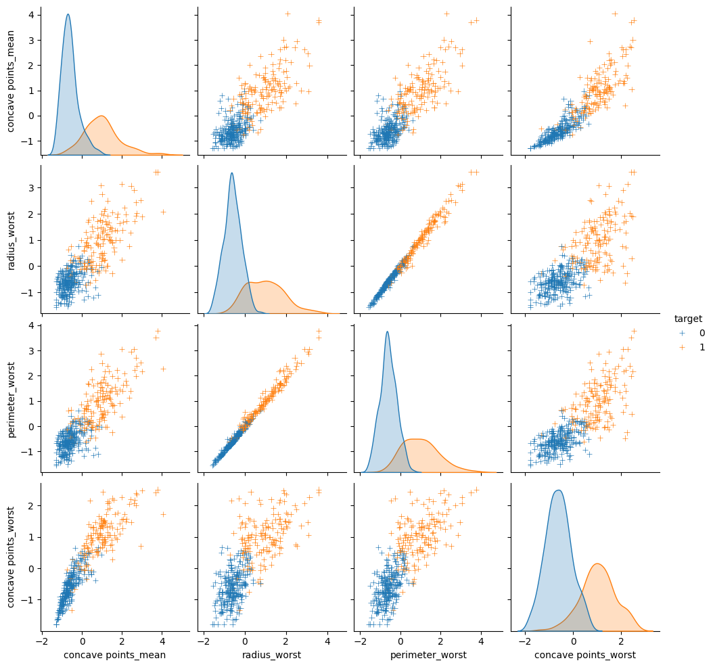
    


##### Тренування та тестування моделі класифікації KNN.

Оцінка продуктивність моделі за допомогою оцінки точності та матриці. Ці оцінки допомагають зрозуміти, наскільки успішною є модель і як відбувається процес класифікації.


```python
# %% Basic KNN Method
# This code creates a model using the KNN classification algorithm, trains
# this model, and evaluates its performance on test data. The results obtained demonstrate the classification ability and accuracy of the model.
knn = KNeighborsClassifier(n_neighbors = 2)
knn.fit(X_train, Y_train)
y_pred = knn.predict(X_test)
cm = confusion_matrix(Y_test, y_pred)
acc = accuracy_score(Y_test, y_pred)
score = knn.score(X_test, Y_test)
print("Score: ",score)
print("CM: ",cm)
print("Basic KNN Acc: ",acc)
```

    Score:  0.9532163742690059
    CM:  [[108   1]
     [  7  55]]
    Basic KNN Acc:  0.9532163742690059


##### Визначення найкращіх параметрів моделі KNN та оцінка продуктивність моделі, навченої цими параметрами.
!!! Найкращі гіперпараметри


```python
def KNN_Best_Params(x_train, x_test, y_train, y_test):

    k_range = list(range(1,31))
    weight_options = ["uniform","distance"]
    print()
    param_grid = dict(n_neighbors = k_range, weights = weight_options)

    knn = KNeighborsClassifier()
    grid = GridSearchCV(knn, param_grid, cv = 10, scoring = "accuracy")
    grid.fit(x_train, y_train)

    print("Best training score: {} with parameters: {}".format(grid.best_score_, grid.best_params_))
    print()

    # Нова модель з найліпшими парметрами
    knn = KNeighborsClassifier(**grid.best_params_)
    knn.fit(x_train, y_train)

    y_pred_test = knn.predict(x_test)
    y_pred_train = knn.predict(x_train)

    cm_test = confusion_matrix(y_test, y_pred_test)
    cm_train = confusion_matrix(y_train, y_pred_train)

    acc_test = accuracy_score(y_test, y_pred_test)
    acc_train = accuracy_score(y_train, y_pred_train)
    print("Test Score: {}, Train Score: {}".format(acc_test, acc_train))
    print()
    print("CM Test: ",cm_test)
    print("CM Train: ",cm_train)

    return grid
```


```python
grid = KNN_Best_Params(X_train, X_test, Y_train, Y_test)
```


    Best training score: 0.9670512820512821 with parameters: {'n_neighbors': 4, 'weights': 'uniform'}
    
    Test Score: 0.9590643274853801, Train Score: 0.9773299748110831
    
    CM Test:  [[107   2]
     [  5  57]]
    CM Train:  [[248   0]
     [  9 140]]


##### Метод головних компонент (PCA – principal component analysis)

Для відображення виконується зменшення розмірності до 2 за допомогою PCA, класифікації за допомогою моделі KNN та візуалізації результатів класифікації. PCA допомогає зробити більш зрозумілу візуалізацію та покращити продуктивність моделі за рахунок зменшення розміру даних.


```python
# %% PCA

scaler = StandardScaler()
x_scaled = scaler.fit_transform(x)

pca = PCA(n_components = 2)
pca.fit(x_scaled)
X_reduced_pca = pca.transform(x_scaled)
pca_data = pd.DataFrame(X_reduced_pca, columns = ["p1","p2"])
pca_data["target"] = y
sns.scatterplot(x = "p1", y = "p2", hue = "target", data = pca_data)
plt.title("PCA: p1 vs p2")


X_train_pca, X_test_pca, Y_train_pca, Y_test_pca = train_test_split(X_reduced_pca, y, test_size = test_size, random_state = 42)

grid_pca = KNN_Best_Params(X_train_pca, X_test_pca, Y_train_pca, Y_test_pca)

# visualize
cmap_light = ListedColormap(['orange',  'cornflowerblue'])
cmap_bold = ListedColormap(['darkorange', 'darkblue'])

h = .05 # step size in the mesh
X = X_reduced_pca
x_min, x_max = X[:, 0].min() - 1, X[:, 0].max() + 1
y_min, y_max = X[:, 1].min() - 1, X[:, 1].max() + 1
xx, yy = np.meshgrid(np.arange(x_min, x_max, h),
                     np.arange(y_min, y_max, h))

Z = grid_pca.predict(np.c_[xx.ravel(), yy.ravel()])

# Put the result into a color plot
Z = Z.reshape(xx.shape)
plt.figure()
plt.pcolormesh(xx, yy, Z, cmap=cmap_light)

# Plot also the training points
plt.scatter(X[:, 0], X[:, 1], c=y, cmap=cmap_bold,
            edgecolor='k', s=20)
plt.xlim(xx.min(), xx.max())
plt.ylim(yy.min(), yy.max())
plt.title("%i-Class classification (k = %i, weights = '%s')"
          % (len(np.unique(y)),grid_pca.best_estimator_.n_neighbors, grid_pca.best_estimator_.weights))
```


    Best training score: 0.9419230769230769 with parameters: {'n_neighbors': 9, 'weights': 'uniform'}
    
    Test Score: 0.9239766081871345, Train Score: 0.947103274559194
    
    CM Test:  [[103   6]
     [  7  55]]
    CM Train:  [[241   7]
     [ 14 135]]


    Text(0.5, 1.0, "2-Class classification (k = 9, weights = 'uniform')")


​    
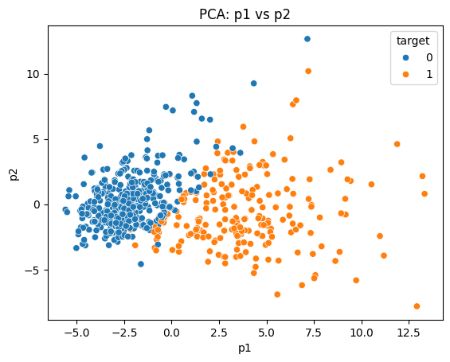
​    


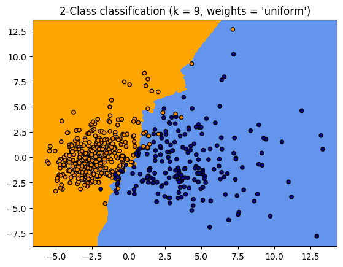
    


##### Neighbourhood components analysis NCA

Аналіз компонентів сусідства – метод навчання для класифікації багатовимірних даних у окремі класи відповідно до заданої метрики відстані над даними. Функціонально аналог алгоритму K-найближчих сусідів. Використовує пов’язану концепцію, яка називається стохастичними найближчими сусідами.


```python
#%% NCA

nca = NeighborhoodComponentsAnalysis(n_components = 2, random_state = 42)
nca.fit(x_scaled, y)
X_reduced_nca = nca.transform(x_scaled)
nca_data = pd.DataFrame(X_reduced_nca, columns = ["p1","p2"])
nca_data["target"] = y
sns.scatterplot(x = "p1",  y = "p2", hue = "target", data = nca_data)
plt.title("NCA: p1 vs p2")

X_train_nca, X_test_nca, Y_train_nca, Y_test_nca = train_test_split(X_reduced_nca, y, test_size = test_size, random_state = 42)

grid_nca = KNN_Best_Params(X_train_nca, X_test_nca, Y_train_nca, Y_test_nca)

# visualize
cmap_light = ListedColormap(['orange',  'cornflowerblue'])
cmap_bold = ListedColormap(['darkorange', 'darkblue'])

h = .2 # step size in the mesh
X = X_reduced_nca
x_min, x_max = X[:, 0].min() - 1, X[:, 0].max() + 1
y_min, y_max = X[:, 1].min() - 1, X[:, 1].max() + 1
xx, yy = np.meshgrid(np.arange(x_min, x_max, h),
                     np.arange(y_min, y_max, h))

Z = grid_nca.predict(np.c_[xx.ravel(), yy.ravel()])

# Put the result into a color plot
Z = Z.reshape(xx.shape)
plt.figure()
plt.pcolormesh(xx, yy, Z, cmap=cmap_light)

# Plot also the training points
plt.scatter(X[:, 0], X[:, 1], c=y, cmap=cmap_bold,
            edgecolor='k', s=20)
plt.xlim(xx.min(), xx.max())
plt.ylim(yy.min(), yy.max())
plt.title("%i-Class classification (k = %i, weights = '%s')"
          % (len(np.unique(y)),grid_nca.best_estimator_.n_neighbors, grid_nca.best_estimator_.weights))
```


    Best training score: 0.9873076923076922 with parameters: {'n_neighbors': 1, 'weights': 'uniform'}
    
    Test Score: 0.9941520467836257, Train Score: 1.0
    
    CM Test:  [[108   1]
     [  0  62]]
    CM Train:  [[248   0]
     [  0 149]]


    Text(0.5, 1.0, "2-Class classification (k = 1, weights = 'uniform')")


​    
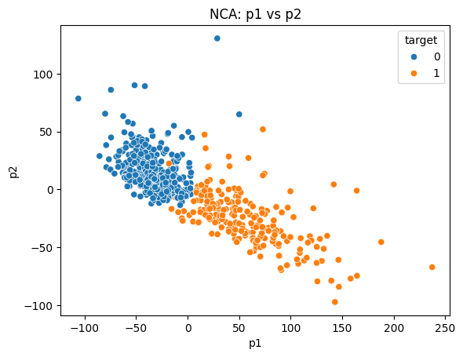
​    


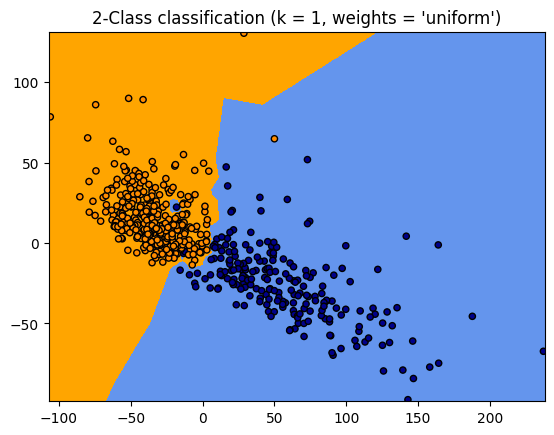
    


##### ТОЧНІСТЬ моделі

Обчислюється показник точності моделі KNN на основі тестових даних і візуально видображаються неправильно класифіковані точки даних.
Це допомагає зрозуміти, які точки даних модель неправильно класифікує, і допомагає оцінити продуктивність моделі.


```python
# %% find wrong decision
knn = KNeighborsClassifier(**grid_nca.best_params_)
knn.fit(X_train_nca,Y_train_nca)
y_pred_nca = knn.predict(X_test_nca)
acc_test_nca = accuracy_score(y_pred_nca,Y_test_nca)
knn.score(X_test_nca,Y_test_nca)

test_data = pd.DataFrame()
test_data["X_test_nca_p1"] = X_test_nca[:,0]
test_data["X_test_nca_p2"] = X_test_nca[:,1]
test_data["y_pred_nca"] = y_pred_nca
test_data["Y_test_nca"] = Y_test_nca

plt.figure()
sns.scatterplot(x="X_test_nca_p1", y="X_test_nca_p2", hue="Y_test_nca",data=test_data)

diff = np.where(y_pred_nca!=Y_test_nca)[0]
plt.scatter(test_data.iloc[diff,0],test_data.iloc[diff,1],label = "Wrong Classified",alpha = 0.2,color = "red",s = 1000)
```


    <matplotlib.collections.PathCollection at 0x7df78e7a6890>


​    
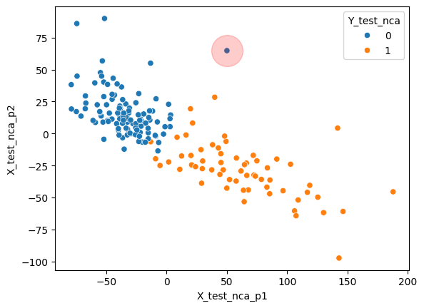
​    

