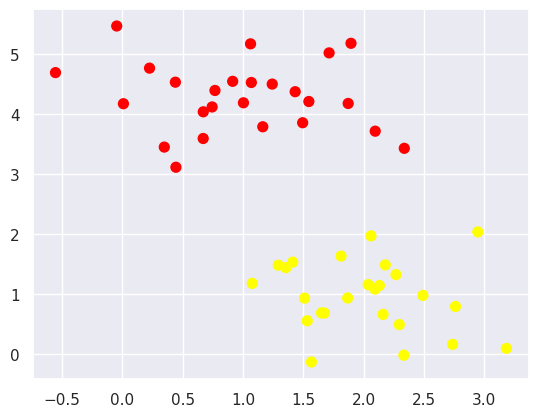
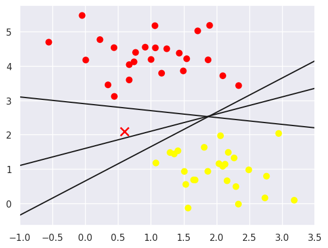
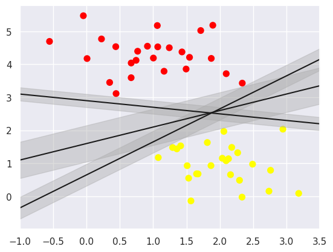
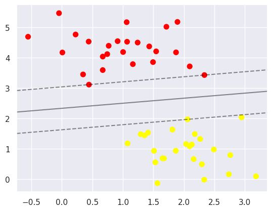
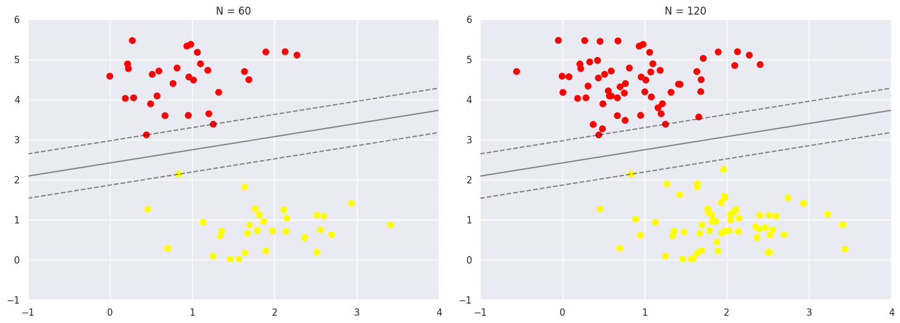

# Модуль 2. Лекція 08. Машина опорних векторів (Supporty Vector Machine)


### 1. Використання Scikit-learn ---> [SVM](https://scikit-learn.org/stable/modules/svm.html#svm)
##### Приклад на базі VanderPlas J. - Python Data Science Handbook - 2017

Завантаження бібліотек


```python
import numpy as np
import skimage.io as io
```


```python
%matplotlib inline
import matplotlib.pyplot as plt
from matplotlib.colors import ListedColormap
plt.rcParams['font.size'] = 16
```


```python
# Для статистики та відображення статистичних даних
from scipy import ndimage
from scipy import stats
import seaborn as sns; sns.set()
```


```python
# З sklearn імпорт лінійної регресії
from sklearn.linear_model import LinearRegression
from sklearn.datasets import make_blobs # генерація точок за Гаусом
```

#####  Формуємо випадкові дані (два кластера)

[sklearn.datasets.make_blobs](https://ogrisel.github.io/scikit-learn.org/sklearn-tutorial/modules/generated/sklearn.datasets.make_blobs.html)


```python
X, y = make_blobs(n_samples=50, centers=2,
                  random_state=0, cluster_std=0.60)
print (X.shape, y.shape)

plt.scatter(X[:, 0], X[:, 1], c=y, s=50, cmap='autumn');
```

    (50, 2) (50,)



    


```python
# "Новий" обєкт
x_new = 0.6
y_new = 2.1

# "Випробуємо" прямі, що розділяють класи
xfit = np.linspace(-1, 3.5)
plt.scatter(X[:, 0], X[:, 1], c=y, s=50, cmap='autumn')
plt.plot(x_new, y_new, 'x', color='red', markeredgewidth=2, markersize=10)

for m, b in [(1, 0.65), (0.5, 1.6), (-0.2, 2.9)]:
    plt.plot(xfit, m * xfit + b, '-k')

plt.xlim(-1, 3.5);
```


​    

​    


Яку пряму обрати ?


```python
# Намагаємось збільшити проміжок("розширити" пряму)
xfit = np.linspace(-1, 3.5)
plt.scatter(X[:, 0], X[:, 1], c=y, s=50, cmap='autumn')

for m, b, d in [(1, 0.65, 0.33), (0.5, 1.6, 0.55), (-0.2, 2.9, 0.2)]:
    yfit = m * xfit + b
    plt.plot(xfit, yfit, '-k')
    plt.fill_between(xfit, yfit - d, yfit + d, edgecolor='none',
                     color='#AAAAAA', alpha=0.4)

plt.xlim(-1, 3.5);
```


​    

​    


Sckit Learn Support Vector Machines [SVM Modul](https://scikit-learn.org/stable/modules/svm.html)

Sckit Learn SVС класифікатор [SVM SVC classifier](https://scikit-learn.org/stable/modules/generated/sklearn.svm.SVC.html)


```python
# Імпорт SVC -- Support vector classifier
from sklearn.svm import SVC

# Визначення моделі
model = SVC(kernel='linear', C=1E10)
# Навчання моделі
model.fit(X, y)
```

Класифікація нового зразку


```python
predX = np.array([0.5, 1.0])

#predX = np.array([0.5, 4.0])

predX = predX.reshape(1, -1)
print('Ознаки ', predX , 'Клас ' , model.predict(predX))
```

    Ознаки  [[0.5 1. ]] Клас  [1]


```python
# Для відображення результату
def plot_svc_decision_function(model, ax=None, plot_support=True):
    """Plot the decision function for a 2D SVC"""
    if ax is None:
        ax = plt.gca()
    xlim = ax.get_xlim()
    ylim = ax.get_ylim()

    # create grid to evaluate model
    x = np.linspace(xlim[0], xlim[1], 30)
    y = np.linspace(ylim[0], ylim[1], 30)
    Y, X = np.meshgrid(y, x)
    xy = np.vstack([X.ravel(), Y.ravel()]).T
    P = model.decision_function(xy).reshape(X.shape)

    # plot decision boundary and margins
    ax.contour(X, Y, P, colors='k',
               levels=[-1, 0, 1], alpha=0.5,
               linestyles=['--', '-', '--'])

    # plot support vectors
    if plot_support:
        ax.scatter(model.support_vectors_[:, 0],
                   model.support_vectors_[:, 1],
                   s=300, linewidth=1, facecolors='none');
    ax.set_xlim(xlim)
    ax.set_ylim(ylim)
```

####  Візуалізація результату


```python
plt.scatter(X[:, 0], X[:, 1], c=y, s=50, cmap='autumn')
plot_svc_decision_function(model)

```


​    

​    


```python
model.support_vectors_
```


    array([[0.44359863, 3.11530945],
           [2.33812285, 3.43116792],
           [2.06156753, 1.96918596]])


```python
def plot_svm(N=10, ax=None):
    X, y = make_blobs(n_samples=200, centers=2,
                      random_state=0, cluster_std=0.60)
    X = X[:N]
    y = y[:N]
    model = SVC(kernel='linear', C=1E10)
    model.fit(X, y)

    ax = ax or plt.gca()
    ax.scatter(X[:, 0], X[:, 1], c=y, s=50, cmap='autumn')
    ax.set_xlim(-1, 4)
    ax.set_ylim(-1, 6)
    plot_svc_decision_function(model, ax)

fig, ax = plt.subplots(1, 2, figsize=(16, 6))
fig.subplots_adjust(left=0.0625, right=0.95, wspace=0.1)
for axi, N in zip(ax, [60, 120]):
    plot_svm(N, axi)
    axi.set_title('N = {0}'.format(N))
```


​    

​    


```python

```
