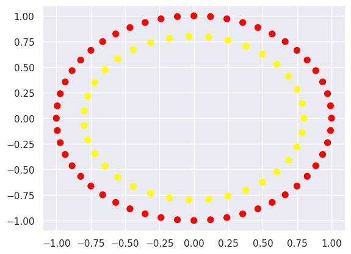
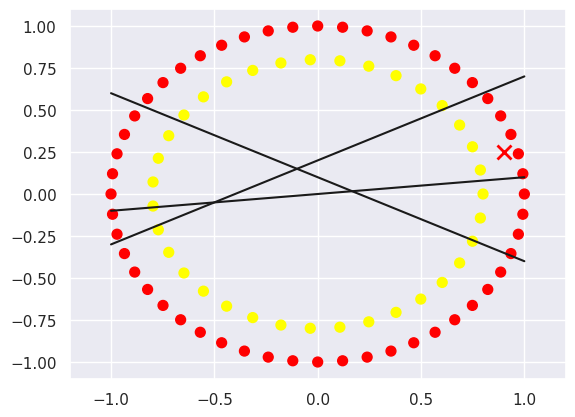
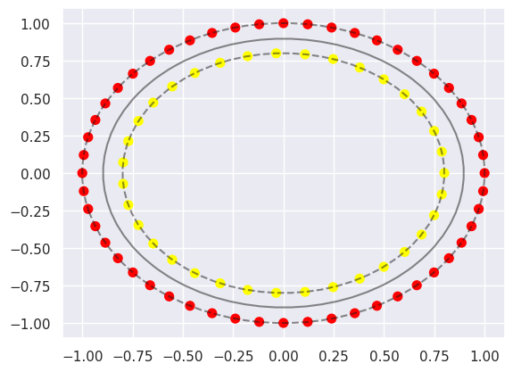

# Модуль 2. Лекція 08. Машина опорних векторів (Supporty Vector Machine)


## 2. Poly | RBF Kernels
Приклад на базі VanderPlas J. - Python Data Science Handbook - 2017

Завантаження бібліотек


```python
import numpy as np
import skimage.io as io
```


```python
%matplotlib inline
import matplotlib.pyplot as plt
from matplotlib.colors import ListedColormap
plt.rcParams['font.size'] = 16
```


```python
# Для статистики та відображення стат даних
from scipy import ndimage
from scipy import stats
import seaborn as sns; sns.set()
```


```python
# З sklearn імпорт лінійної регресії
from sklearn.linear_model import LinearRegression
from sklearn.datasets import make_circles
```

####  Формуємо випадкові дані (два кластера)

#### [make_circles](https://scikit-learn.org/stable/modules/generated/sklearn.datasets.make_circles.html#sklearn.datasets.make_circles)


```python
X, y = make_circles((52, 35))
print (X.shape, y.shape)
plt.scatter(X[:, 0], X[:, 1], c=y, s=50, cmap='autumn')
```

    (87, 2) (87,)


    <matplotlib.collections.PathCollection at 0x7b3d703581f0>


​    

​    


```python
# "Випробуємо" прямі, що розділяють класи
xfit = np.linspace(-1, 1)
plt.scatter(X[:, 0], X[:, 1], c=y, s=50, cmap='autumn')
plt.plot([0.9], [0.25], 'x', color='red', markeredgewidth=2, markersize=10)

for m, b in [(.1, 0.0), (0.5, .2), (-0.5, .1)]:
    plt.plot(xfit, m * xfit + b, '-k')

plt.xlim(-1.2, 1.2)
```


    (-1.2, 1.2)


​    

​    


Sckit Learn Support Vector Machines [SVM Modul](https://scikit-learn.org/stable/modules/svm.html)

Sckit Learn SVС класифікатор [SVM SVC classifier](https://scikit-learn.org/stable/modules/generated/sklearn.svm.SVC.html)


```python
# Імпорт SVC -- Support vector classifier
from sklearn.svm import SVC
# model = SVC(kernel='linear')
model = SVC(kernel='rbf', C=1E10)
#model = SVC(kernel="poly", C=100, gamma="auto", degree=2, coef0=1)
model.fit(X, y)
```


```python
predX = np.array([0.5, 1.0])
#predX = np.array([0.0, .25])
predX = predX.reshape(1, -1)
print('Ознаки ', predX , 'Клас ' , model.predict(predX))
```

    Ознаки  [[0.5 1. ]] Клас  [0]


```python
# Для відображення результату
def plot_svc_decision_function(model, ax=None, plot_support=True):
    """Plot the decision function for a 2D SVC"""
    if ax is None:
        ax = plt.gca()
    xlim = ax.get_xlim()
    ylim = ax.get_ylim()

    # create grid to evaluate model
    x = np.linspace(xlim[0], xlim[1], 30)
    y = np.linspace(ylim[0], ylim[1], 30)
    Y, X = np.meshgrid(y, x)
    xy = np.vstack([X.ravel(), Y.ravel()]).T
    P = model.decision_function(xy).reshape(X.shape)

    # plot decision boundary and margins
    ax.contour(X, Y, P, colors='k',
               levels=[-1, 0, 1], alpha=0.5,
               linestyles=['--', '-', '--'])

    # plot support vectors
    if plot_support:
        ax.scatter(model.support_vectors_[:, 0],
                   model.support_vectors_[:, 1],
                   s=300, linewidth=1, facecolors='none');
    ax.set_xlim(xlim)
    ax.set_ylim(ylim)
```

####  Візуалізація результату


```python
plt.scatter(X[:, 0], X[:, 1], c=y, s=50, cmap='autumn')
plot_svc_decision_function(model)

```


​    

​    


```python
model.support_vectors_
```


    array([[ 8.85456026e-01,  4.64723172e-01],
           [ 2.39315664e-01,  9.70941817e-01],
           [-9.70941817e-01,  2.39315664e-01],
           [-8.22983866e-01, -5.68064747e-01],
           [ 4.64723172e-01, -8.85456026e-01],
           [-3.54604887e-01,  9.35016243e-01],
           [-7.48510748e-01,  6.63122658e-01],
           [-9.35016243e-01,  3.54604887e-01],
           [ 7.48510748e-01,  6.63122658e-01],
           [ 9.35016243e-01, -3.54604887e-01],
           [-8.22983866e-01,  5.68064747e-01],
           [ 9.70941817e-01, -2.39315664e-01],
           [ 1.20536680e-01, -9.92708874e-01],
           [-4.64723172e-01, -8.85456026e-01],
           [ 1.20536680e-01,  9.92708874e-01],
           [-3.54604887e-01, -9.35016243e-01],
           [-6.63122658e-01,  7.48510748e-01],
           [ 9.35016243e-01,  3.54604887e-01],
           [-2.39315664e-01, -9.70941817e-01],
           [ 9.92708874e-01, -1.20536680e-01],
           [-8.85456026e-01, -4.64723172e-01],
           [ 6.12323400e-17,  1.00000000e+00],
           [ 8.85456026e-01, -4.64723172e-01],
           [-5.68064747e-01,  8.22983866e-01],
           [-7.48510748e-01, -6.63122658e-01],
           [-8.85456026e-01,  4.64723172e-01],
           [ 8.22983866e-01,  5.68064747e-01],
           [-5.68064747e-01, -8.22983866e-01],
           [-1.20536680e-01, -9.92708874e-01],
           [ 5.68064747e-01, -8.22983866e-01],
           [-9.35016243e-01, -3.54604887e-01],
           [-4.64723172e-01,  8.85456026e-01],
           [ 7.48510748e-01, -6.63122658e-01],
           [ 1.00000000e+00,  0.00000000e+00],
           [ 3.54604887e-01, -9.35016243e-01],
           [-9.70941817e-01, -2.39315664e-01],
           [ 6.63122658e-01,  7.48510748e-01],
           [ 3.54604887e-01,  9.35016243e-01],
           [-1.20536680e-01,  9.92708874e-01],
           [ 6.02457173e-01, -5.26350981e-01],
           [-6.47213595e-01, -4.70228202e-01],
           [ 8.00000000e-01,  0.00000000e+00],
           [-5.52850119e-01,  5.78235891e-01],
           [-7.96779435e-01, -7.17114471e-02],
           [ 4.98791841e-01, -6.25465186e-01],
           [-3.58918643e-02,  7.99194453e-01],
           [ 6.02457173e-01,  5.26350981e-01],
           [-4.40717585e-01,  6.67658603e-01],
           [-5.52850119e-01, -5.78235891e-01],
           [ 7.48987897e-01,  2.81099859e-01],
           [ 4.98791841e-01,  6.25465186e-01],
           [ 1.07386613e-01, -7.92759809e-01],
           [-1.78016747e-01,  7.79942330e-01],
           [-7.71170289e-01, -2.12829476e-01],
           [ 3.79094930e-01, -7.04476425e-01],
           [-7.20775094e-01,  3.47106991e-01],
           [-4.40717585e-01, -6.67658603e-01],
           [-7.20775094e-01, -3.47106991e-01],
           [ 7.87143671e-01, -1.42845516e-01],
           [-6.47213595e-01,  4.70228202e-01],
           [-7.71170289e-01,  2.12829476e-01],
           [ 3.79094930e-01,  7.04476425e-01],
           [ 6.86759035e-01,  4.10319422e-01],
           [-3.14420025e-01,  7.35622218e-01],
           [ 2.47213595e-01, -7.60845213e-01]])

