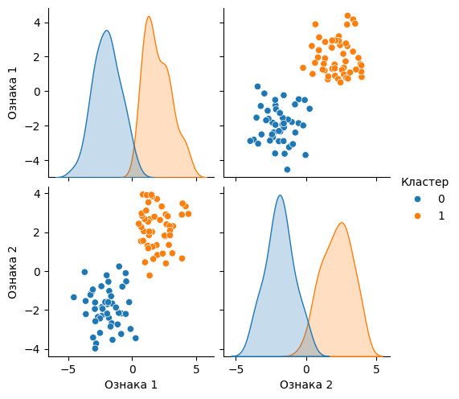
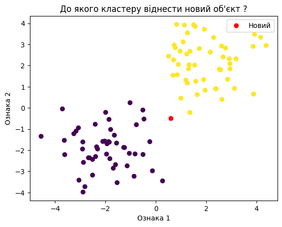
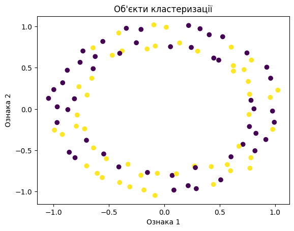
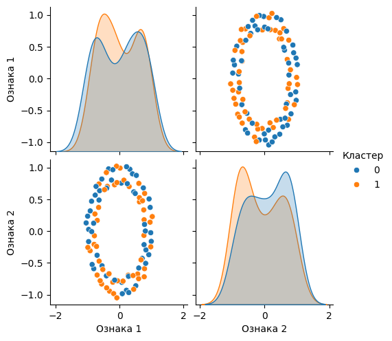
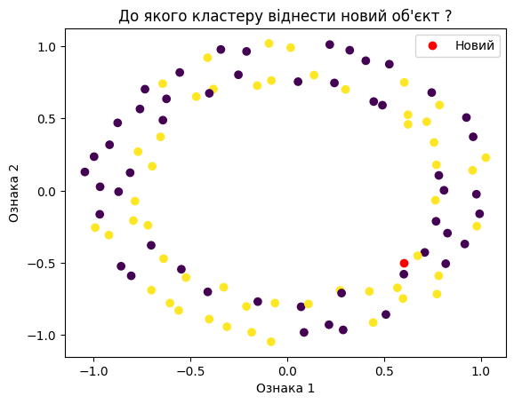

# Модуль 3. Лекція 01. Кластеризація

## Завдання кластеризації

Імпорт бібліотек

```python
import numpy as np
from sklearn import datasets
import matplotlib.pyplot as plt
import seaborn as sns
import pandas as pd
```

## **Генерація даних для прикладу**

Використовуємо  scikit-learn  [datasets.make_blobs](https://scikit-learn.org/stable/modules/generated/sklearn.datasets.make_blobs.html)

Для прикладу генеруємо дві групи (кластера) обєктів


```python
num_center = 2
center = [[-2.,-2.],[2.,2.]]
X, y_true = datasets.make_blobs(n_samples=100, centers=center, cluster_std=1.0, random_state=0)
```

### **Візуалізація дадтасету**


```python
# Scatter plot of the data points
plt.scatter(X[:, 0], X[:, 1], c=y_true, cmap='viridis')
plt.title("Об'єкти кластеризації")
plt.xlabel('Ознака 1')
plt.ylabel('Ознака 2')
plt.show()
```


​    

​    


### **Попарна візуалізація розподілу**


```python
# Create a DataFrame from your data
df = pd.DataFrame(X, columns=['Ознака 1', 'Ознака 2'])

# Add the true labels to the DataFrame
df['Кластер'] = y_true

# Create a pairplot
selected_vars = ['Ознака 1', 'Ознака 2']
sns.pairplot(df, vars=selected_vars, hue='Кластер')
plt.show()
```


​    

​    


## Додається новий об'єкт. До якого кластеру його віднести


```python
new_obj = np.array([.6, -.5])
```


```python
# Scatter plot of the data points
plt.scatter(X[:, 0], X[:, 1], c=y_true, cmap='viridis')
plt.plot(new_obj [0],new_obj [1], 'o', color = 'red', label='Новий')
plt.title("До якого кластеру віднести новий об'єкт ?")
plt.xlabel('Ознака 1')
plt.ylabel('Ознака 2')
plt.legend()
plt.show()
```


​    

​    


## Інший розподіл обєктів


```python
from sklearn.datasets import make_circles
X, y = make_circles(noise = 0.03, random_state=42)

```


```python
# Scatter plot of the data points
plt.scatter(X[:, 0], X[:, 1], c=y_true, cmap='viridis')
plt.title("Об'єкти кластеризації")
plt.xlabel('Ознака 1')
plt.ylabel('Ознака 2')
plt.show()
```


​    

​    


```python
# Create a DataFrame from your data
df = pd.DataFrame(X, columns=['Ознака 1', 'Ознака 2'])

# Add the true labels to the DataFrame
df['Кластер'] = y_true

# Create a pairplot
selected_vars = ['Ознака 1', 'Ознака 2']
sns.pairplot(df, vars=selected_vars, hue='Кластер')
plt.show()
```


​    

​    


```python
# Scatter plot of the data points
plt.scatter(X[:, 0], X[:, 1], c=y_true, cmap='viridis')
plt.plot(new_obj [0],new_obj [1], 'o', color = 'red', label='Новий')
plt.title("До якого кластеру віднести новий об'єкт ?")
plt.xlabel('Ознака 1')
plt.ylabel('Ознака 2')
plt.legend()
plt.show()
```


​    

​    


```python

```
