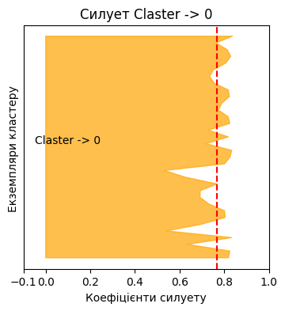

# Модуль 3. Лекція 02. Кластеризація. Оцінка якості методом силуетів

### Імпорт


```python
import numpy as np
import matplotlib.cm as cm
import matplotlib.pyplot as plt
```


```python
from sklearn.cluster import KMeans
from sklearn.datasets import make_blobs
from sklearn import datasets
from sklearn.metrics import silhouette_samples, silhouette_score
```

### Приклад. Три кластери

Для прикладу генеруємо три групи (кластера) об'єктів за допомогою scikit-learn  [datasets.make_blobs](https://scikit-learn.org/stable/modules/generated/sklearn.datasets.make_blobs.html)


```python
n_clasters = 3
center = [[-2.,-2.],[2.,2.],[-2.,2.]]
X, y_true = datasets.make_blobs(n_samples=100, centers=center, cluster_std=.5, random_state=0)
```


```python
mean = X.mean(axis=0)
std = X.std(axis=0)
X = (X - mean) / std
```


```python
plt.scatter(X[:, 0], X[:, 1], c=y_true, cmap='viridis')
plt.title('Нормалізований датасет')
plt.xlabel('Ознака 1')
plt.ylabel('Ознака 2')
plt.show()
```


​    

​    


### Аналіз силуетів.

Силуетна оцінка якості кластеризації за допомогою [SciKit-learn Silhoette](https://scikit-learn.org/stable/auto_examples/cluster/plot_kmeans_silhouette_analysis.html)

Вважаємо, що задача кластеризації вирішена. Маємо визначену n_clasters  та відповідні мітки.

Аналіз силуетів можна використовувати для вивчення відстані поділу між  кластерами. Графік силуету показує, наскільки близько кожна точка в одному кластері до точок у сусідніх кластерах, і, таким чином, забезпечує спосіб візуальної оцінки таких параметрів, як кількість кластерів. Цей показник має діапазон [-1, 1].

Коефіцієнти силуету  біля +1 вказують на те, що вибірка знаходиться далеко від сусідніх кластерів. Значення 0 вказує на те, що вибірка знаходиться на межі прийняття рішення між двома сусідніми кластерами або дуже близько до неї, а від’ємні значення вказують на те, що ці вибірки могли бути призначені неправильному кластеру.

Аналіз силуету типово використовується для вибору оптимального значення для n_clusters.

###  Силует кластеру


```python
n_clusters = 3
```

Середній силует


```python
silhouette_avg = silhouette_score(X, y_true)
print("Для кількості кластерів =", n_clusters,"Середній сілует :", silhouette_avg)

```

    Для кількості кластерів = 3 Середній сілует : 0.7671347595399822


### Силует кластеру для кожного семплу


```python
# Обчислення силуету для кожного обєкта
sample_silhouette_values = silhouette_samples(X, y_true)
sample_silhouette_values.shape
```


    (100,)


#### Силует першого кластеру (мітка = 0)


```python
first_cluster_silhouette_values = sample_silhouette_values[y_true == 0]
size_cluster_0 = first_cluster_silhouette_values.shape[0]

color = ["orange", "green"]
fig, ax  = plt.subplots( )
fig.set_size_inches(4, 4)
ax.set_xlim([-0.1, 1])
y_lower = 1
y_upper = y_lower + size_cluster_0

ax.fill_betweenx(np.arange(y_lower, y_upper),
            0,
            first_cluster_silhouette_values,
            facecolor=color,
            edgecolor=color,
            alpha=0.7,
            )

# Мітка силуету
ax.text(-0.05, y_lower + 0.5 * size_cluster_0, str('Claster -> 0'))

ax.set_title("Силует " + str('Claster -> 0'))
ax.set_xlabel("Коефіцієнти силуету")
ax.set_ylabel("Екземпляри кластеру ")

# Ветрикальна - середнє значення силуету для кластеру
ax.axvline(x=silhouette_avg, color="red", linestyle="--")

ax.set_yticks([])  # Clear the yaxis labels / ticks
ax.set_xticks([-0.1, 0, 0.2, 0.4, 0.6, 0.8, 1])

plt.show()
```


​    

​    


#### Силует другого кластеру (мітка = 1)


```python
secnd_cluster_silhouette_values = sample_silhouette_values[y_true == 1]
size_cluster_1 = secnd_cluster_silhouette_values.shape[0]


color = ["orange", "green"]
fig, ax  = plt.subplots( )
fig.set_size_inches(4, 4)
ax.set_xlim([-0.1, 1])
y_lower = 1
y_upper = y_lower + size_cluster_1

ax.fill_betweenx(np.arange(y_lower, y_upper),
            0,
            secnd_cluster_silhouette_values,
            facecolor=color,
            edgecolor=color,
            alpha=0.7,
            )

# Мітка силуету
ax.text(-0.05, y_lower + 0.5 * size_cluster_0, str('Claster -> 1'))

ax.set_title("Силует " + str('Claster -> 1'))
ax.set_xlabel("Коефіцієнти силуету")
ax.set_ylabel("Екземпляри кластеру ")

# Ветрикальна - середнє значення силуету для кластеру
ax.axvline(x=silhouette_avg, color="red", linestyle="--")

ax.set_yticks([])  # Clear the yaxis labels / ticks
ax.set_xticks([-0.1, 0, 0.2, 0.4, 0.6, 0.8, 1])

plt.show()
```


​    

​    


#### Силует третього кластеру (мітка = 2)


```python
third_cluster_silhouette_values = sample_silhouette_values[y_true == 2]
size_cluster_2 = third_cluster_silhouette_values.shape[0]

color = ["orange", "green"]
fig, ax  = plt.subplots( )
fig.set_size_inches(4, 4)
ax.set_xlim([-0.1, 1])
y_lower = 1
y_upper = y_lower + size_cluster_2

ax.fill_betweenx(np.arange(y_lower, y_upper),
            0,
            third_cluster_silhouette_values,
            facecolor=color,
            edgecolor=color,
            alpha=0.7,
            )

# Мітка силуету
ax.text(-0.05, y_lower + 0.5 * size_cluster_0, str('Claster -> 2'))

ax.set_title("Силует " + str('Claster -> 2'))
ax.set_xlabel("Коефіцієнти силуету")
ax.set_ylabel("Екземпляри кластеру ")

# Ветрикальна - середнє значення силуету для кластеру
ax.axvline(x=silhouette_avg, color="red", linestyle="--")

ax.set_yticks([])  # Clear the yaxis labels / ticks
ax.set_xticks([-0.1, 0, 0.2, 0.4, 0.6, 0.8, 1])

plt.show()
```


​    

​    


### Інший розподіл екземплярів кластеру


```python
X, y_true = datasets.make_blobs(n_samples=100, centers=center, cluster_std=1.5, random_state=0)
mean = X.mean(axis=0)
std = X.std(axis=0)
X = (X - mean) / std
plt.scatter(X[:, 0], X[:, 1], c=y_true, cmap='viridis')
plt.title('Нормалізований датасет')
plt.xlabel('Ознака 1')
plt.ylabel('Ознака 2')
plt.show()
```


​    

​    


```python
silhouette_avg = silhouette_score(X, y_true)
print("Для кількості кластерів =", n_clusters,"Середній сілует :", silhouette_avg)

```

    Для кількості кластерів = 3 Середній сілует : 0.3488496193409598


```python
# Обчислення силуету для кожного обєкта
sample_silhouette_values = silhouette_samples(X, y_true)
sample_silhouette_values.shape
```


    (100,)


```python
first_cluster_silhouette_values = sample_silhouette_values[y_true == 0]
size_cluster_0 = first_cluster_silhouette_values.shape[0]

color = ["orange", "green"]
fig, ax  = plt.subplots( )
fig.set_size_inches(4, 4)
ax.set_xlim([-0.1, 1])
y_lower = 1
y_upper = y_lower + size_cluster_0

ax.fill_betweenx(np.arange(y_lower, y_upper),
            0,
            first_cluster_silhouette_values,
            facecolor=color,
            edgecolor=color,
            alpha=0.7,
            )

# Мітка силуету
ax.text(-0.05, y_lower + 0.5 * size_cluster_0, str('Claster -> 0'))

ax.set_title("Силует " + str('Claster -> 0'))
ax.set_xlabel("Коефіцієнти силуету")
ax.set_ylabel("Екземпляри кластеру ")

# Ветрикальна - середнє значення силуету для кластеру
ax.axvline(x=silhouette_avg, color="red", linestyle="--")

ax.set_yticks([])  # Clear the yaxis labels / ticks
ax.set_xticks([-0.1, 0, 0.2, 0.4, 0.6, 0.8, 1])

plt.show()
```


​    

​    


