# Модуль 3. Лекція 03. Кластеризація. Метод k-Means

### 1. Найпростіший приклад.

Based on [The Math and Code Behind K-Means Clustering](https://towardsdatascience.com/the-math-and-code-behind-k-means-clustering-795582423666)


```python
import numpy as np
from sklearn import datasets
import matplotlib.pyplot as plt
import seaborn as sns
import pandas as pd
```

### Основні функції k-Means

#### Ініціалізація K центроідів


```python
def initialize_centroids(X,K):
    # Simple random initialization, consider k-means++ for improvement
    indices = np.random.permutation(X.shape[0])
    # print(indices)
    centroids = X[indices[:K]]
    return centroids
```

#### Функція обчислення відстані обєктів до центроідів


```python
def compute_distance(X, centroids):
    distances = np.zeros((X.shape[0], K))
    for k in range(K):
        distances[:, k] = np.linalg.norm(X - centroids[k], axis=1) ** 2
    return distances
```

#### Функція оновлення центроідів


```python
def compute_centroids(X, K, labels):
    centroids = np.zeros((K, X.shape[1]))
    for k in range(K):
        if np.any(labels == k):
            centroids[k] = np.mean(X[labels == k], axis=0)
        else:
            centroids[k] = X[np.random.choice(X.shape[0])]
    return centroids
```

#### Пошук найближчого центроіду


```python
def find_closest_cluster(distances):
    return np.argmin(distances, axis=1)
```

#### Передбачення


```python
def predict(X):
    distances = compute_distance(X, centroids)
    print(distances)
    return find_closest_cluster(distances)
```

## **Приклад 1. Два кластери**

Для прикладу генеруємо дві групи (кластера) обєктів за допомогою scikit-learn  [datasets.make_blobs](https://scikit-learn.org/stable/modules/generated/sklearn.datasets.make_blobs.html)


```python
num_center = 2
center = [[-2.,-2.],[2.,2.]]
X, y_true = datasets.make_blobs(n_samples=100, centers=center, cluster_std=1.0, random_state=0)
```


```python
# Scatter plot of the data points
plt.scatter(X[:, 0], X[:, 1], c=y_true, cmap='viridis')
plt.title("Об'єкти кластеризації")
plt.xlabel('Ознака 1')
plt.ylabel('Ознака 2')
plt.show()
```


    
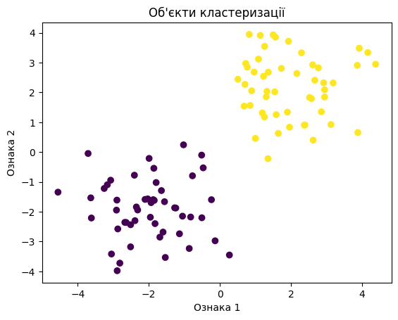
    


```python
mean = X.mean(axis=0)
std = X.std(axis=0)
X = (X - mean) / std
```


```python
plt.scatter(X[:, 0], X[:, 1], c=y_true, cmap='viridis')
plt.title('Нормалізований датасет')
plt.xlabel('Ознака 1')
plt.ylabel('Ознака 2')
plt.show()
```


    
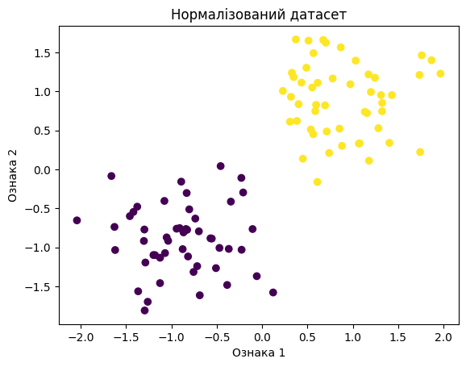
    


```python
# Create a DataFrame from your data
df = pd.DataFrame(X, columns=['Feature 1', 'Feature 2'])

# Add the true labels to the DataFrame
df['Label'] = y_true

# Create a pairplot
sns.pairplot(df, hue='Label')
plt.show()
```


    
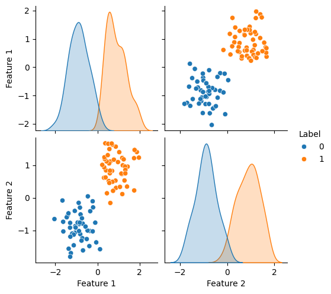
    


### Параметри ітераційного процесу


```python
# Максимальна кількість ітерацій
max_iters = 20
# Припустима помилка збіжності 1e-4
tol = 1e-4
# Кількість центроїдів !!! Передбачаємо 2 кластери
K = 2
```

### Ітераційний процес


```python
centroids = initialize_centroids(X, K)
```


```python
# Scatter plot of the data points
plt.scatter(X[:, 0], X[:, 1], c=y_true, cmap='viridis')
plt.scatter(centroids[:, 0], centroids[:, 1], marker='x', c ='red' )
plt.title('Початкове положення центроідів')
plt.xlabel('Ознака 1')
plt.ylabel('Ознака 2')
plt.show()
```


    
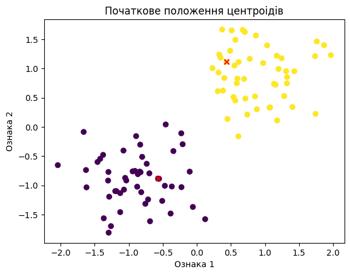
    


Цикл оновлення центроідів


```python
for i in range(max_iters):
    print ('Ітерація',i)
    print ('Координти Центроідів',centroids)
    # Для кожного обєкту обчислюємо відстань до кожного центроіду
    distances = compute_distance(X,centroids)
    # print(distances[0]) # Відстані до першого обєкту
    # Знаходемо найближчий кластер
    labels = find_closest_cluster(distances)
    # print(labels[0])  # Клас першого обєкту
    # Налаштовуємо центроіди
    new_centroids = compute_centroids(X,  K, labels)
    # print ('Змінені Центроіди',new_centroids)  # Нові центроїди
    # Compute inertia (sum of squared distances)# Сума квадратів відстанєй для кожного класу
    inertia = np.sum([distances[i, label] for i, label in enumerate(labels)])
    # print (inertia)
    # Різниця між старими та новими центроідами
    # if np.allclose(centroids, new_centroids, atol=tol):
    if np.allclose(centroids, new_centroids, atol=tol) or inertia <= tol:
        break
    centroids = new_centroids
    inertia_ = inertia

print ('ЗНАЙДЕНІ центроіди',centroids)

```

    Ітерація 0
    Координти Центроідів [[-0.56945975 -0.88380871]
     [ 0.43348512  1.11422798]]
    Ітерація 1
    Координти Центроідів [[-0.88885559 -0.89529546]
     [ 0.88885559  0.89529546]]
    ЗНАЙДЕНІ центроіди [[-0.88885559 -0.89529546]
     [ 0.88885559  0.89529546]]
    


```python
# Для перевірки
inertia = np.sum([distances[i, label] for i, label in enumerate(labels)])
inertia
```


    40.83817841459215


```python
# Scatter plot of the data points
plt.scatter(X[:, 0], X[:, 1], c=y_true, cmap='viridis')
plt.scatter(centroids[:, 0], centroids[:, 1],marker='*', c ='red' )
plt.title('Знайдені центроіди класів')
plt.xlabel('Feature 1')
plt.ylabel('Feature 2')
plt.show()
```


    
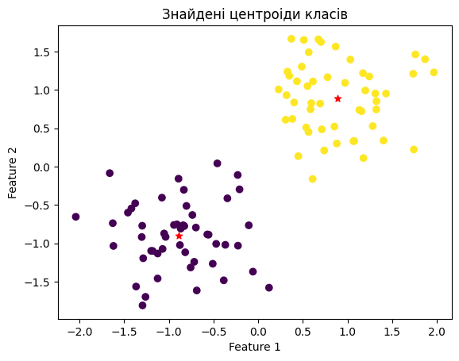
    


#### Новий обєкт


```python
new_obj  = np.array([[0.1,-1.]])
ypred = predict(new_obj )
print('Class', ypred[0])
```

    [[0.98879841 4.21443802]]
    Class 0
    


```python
# Scatter plot of the data points
plt.scatter(X[:, 0], X[:, 1], c=y_true, cmap='viridis')
plt.scatter(centroids[:, 0], centroids[:, 1],marker='*', c ='red' )
plt.plot(new_obj[0,0], new_obj[0, 1], 'o', color = 'red', label='Новий')
plt.title('Новий обєкт')
plt.xlabel('Feature 1')
plt.ylabel('Feature 2')
plt.legend()
plt.show()
```


    
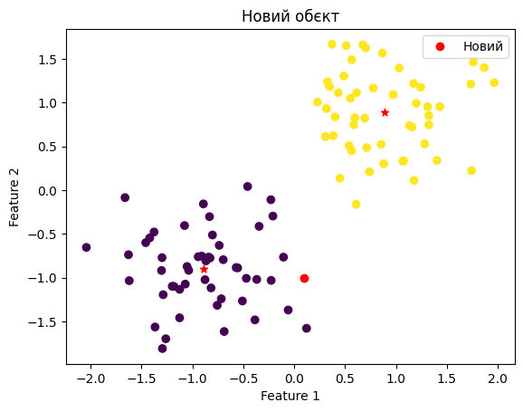
    


## **Приклад 2. Три кластери**

Для прикладу генеруємо три групи (кластера) обєктів за допомогою scikit-learn  [datasets.make_blobs](https://scikit-learn.org/stable/modules/generated/sklearn.datasets.make_blobs.html)


```python
num_center = 3
center = [[-2.,-2.],[2.,2.],[2.,2.]]
X, y_true = datasets.make_blobs(n_samples=300, centers=num_center, cluster_std=0.60, random_state=0)
```


```python
print (X.shape, y_true.shape)
print (X[100], y_true[100])
```

    (300, 2) (300,)
    [2.47153141 0.8019196 ] 1
    

### **Візуалізація дадтасету**


```python
# Scatter plot of the data points
plt.scatter(X[:, 0], X[:, 1], c=y_true, cmap='viridis')
plt.title('Датасет')
plt.xlabel('Ознака 1')
plt.ylabel('Ознака 2')
plt.show()
```


    
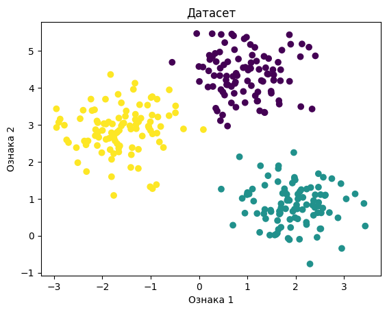
    


### Нормалізація даних


```python
mean = X.mean(axis=0)
std = X.std(axis=0)
X = (X - mean) / std
```


```python
print (X.shape, y_true.shape)
print (X[100], y_true[100])
```

    (300, 2) (300,)
    [ 1.26154325 -1.20626315] 1
    


```python
plt.scatter(X[:, 0], X[:, 1], c=y_true, cmap='viridis')
plt.title('Нормалізований датасет')
plt.xlabel('Ознака 1')
plt.ylabel('Ознака 2')
plt.show()
```


    
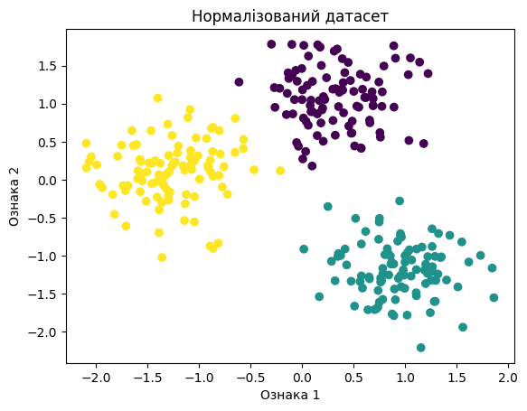
    


### **Попарна візуалізація розподілу**


```python
# Create a DataFrame from your data
df = pd.DataFrame(X, columns=['Feature 1', 'Feature 2'])

# Add the true labels to the DataFrame
df['Label'] = y_true

# Create a pairplot
sns.pairplot(df, hue='Label')
plt.show()
```


    
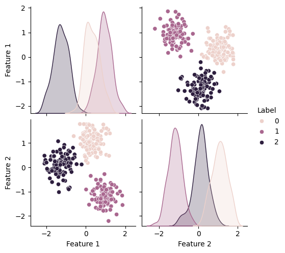
    


### Параметри ітераційного процесу


```python
# Максимальна кількість ітерацій (by default = 100)
max_iters = 20
# Припустима помилка збіжності 1e-4
tol = 1e-4
# Кількість центроїдів
K = 3
```

### Ітераційний процес


```python
centroids = initialize_centroids(X, K)
```


```python
# Scatter plot of the data points
plt.scatter(X[:, 0], X[:, 1], c=y_true, cmap='viridis')
plt.scatter(centroids[:, 0], centroids[:, 1], marker='x', c ='red' )
plt.title('Початкове положення центроідів')
plt.xlabel('Ознака 1')
plt.ylabel('Ознака 2')
plt.show()
```


    
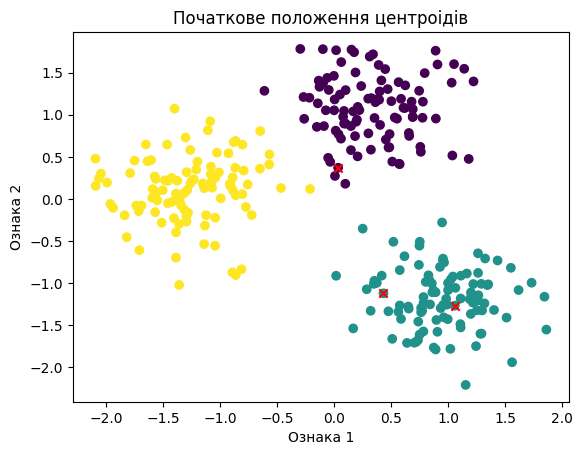
    


Цикл оновлення центроідів


```python
for i in range(max_iters):
    print ('Ітерація',i)
    print ('Координти Центроідів',centroids)
    # Для кожного обєкту обчислюємо відстань до кожного центроіду
    distances = compute_distance(X,centroids)
    # print(distances[0]) # Відстані до першого обєкту
    # Знаходемо найближчий кластер
    labels = find_closest_cluster(distances)
    # print(labels[0])  # Клас першого обєкту
    # Налаштовуємо центроіди
    new_centroids = compute_centroids(X,  K, labels)
    # print ('Змінені Центроіди',new_centroids)  # Нові центроїди
    # Compute inertia (sum of squared distances)# Сума квадратів відстанєй для кожного класу
    inertia = np.sum([distances[i, label] for i, label in enumerate(labels)])
    # print (inertia)
    # Різниця між старими та новими центроідами
    # if np.allclose(centroids, new_centroids, atol=tol):
    if np.allclose(centroids, new_centroids, atol=tol) or inertia <= tol:
        break
    centroids = new_centroids
    inertia_ = inertia

print ('ЗНАЙДЕНІ центроіди',centroids)


```

    Ітерація 0
    Координти Центроідів [[ 0.4317271  -1.1207796 ]
     [ 0.03412661  0.37046703]
     [ 1.05662279 -1.26754793]]
    Ітерація 1
    Координти Центроідів [[ 0.2844692  -1.00964547]
     [-0.45582165  0.61833809]
     [ 1.08047626 -1.24410757]]
    Ітерація 2
    Координти Центроідів [[ 0.22732071 -0.99016192]
     [-0.45942179  0.62329426]
     [ 1.06789433 -1.23305858]]
    Ітерація 3
    Координти Центроідів [[ 0.19952761 -0.94204465]
     [-0.45942179  0.62329426]
     [ 1.0550313  -1.24072406]]
    Ітерація 4
    Координти Центроідів [[ 0.01265537 -0.88785155]
     [-0.45162221  0.6361799 ]
     [ 1.03971774 -1.23674007]]
    Ітерація 5
    Координти Центроідів [[-0.21629109 -0.87046607]
     [-0.44148992  0.64877255]
     [ 1.02653078 -1.22166141]]
    Ітерація 6
    Координти Центроідів [[-0.59701394 -0.71139076]
     [-0.41083709  0.68495075]
     [ 1.01033566 -1.21034578]]
    Ітерація 7
    Координти Центроідів [[-1.31873027 -0.24658491]
     [-0.21888599  0.8175978 ]
     [ 0.9562037  -1.19659728]]
    Ітерація 8
    Координти Центроідів [[-1.34143156  0.03301584]
     [ 0.18762221  1.01484822]
     [ 0.93974182 -1.1853206 ]]
    Ітерація 9
    Координти Центроідів [[-1.28779992  0.0972303 ]
     [ 0.30041175  1.0592303 ]
     [ 0.93974182 -1.1853206 ]]
    Ітерація 10
    Координти Центроідів [[-1.27406828  0.10874422]
     [ 0.31840176  1.06699388]
     [ 0.93974182 -1.1853206 ]]
    Ітерація 11
    Координти Центроідів [[-1.26344688  0.10883922]
     [ 0.32370505  1.07648137]
     [ 0.93974182 -1.1853206 ]]
    ЗНАЙДЕНІ центроіди [[-1.26344688  0.10883922]
     [ 0.32370505  1.07648137]
     [ 0.93974182 -1.1853206 ]]
    


```python
# Для перевірки
inertia = np.sum([distances[i, label] for i, label in enumerate(labels)])
inertia
```


    84.0159300253161


```python
# Scatter plot of the data points
plt.scatter(X[:, 0], X[:, 1], c=y_true, cmap='viridis')
plt.scatter(centroids[:, 0], centroids[:, 1],marker='*', c ='red' )
plt.title('Знайдені центроіди класів')
plt.xlabel('Feature 1')
plt.ylabel('Feature 2')
plt.show()
```


    
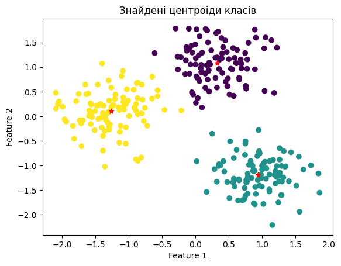
    


### Новий обєкт


```python
new_obj  = np.array([[1.5,-1.0]])
ypred = predict(new_obj )
print('Class', ypred[0])
```

    [[8.86616306 5.69544469 0.34823295]]
    Class 2
    


```python
# Scatter plot of the data points
plt.scatter(X[:, 0], X[:, 1], c=y_true, cmap='viridis')
plt.scatter(centroids[:, 0], centroids[:, 1],marker='*', c ='red' )
plt.plot(new_obj[0,0], new_obj[0, 1], 'o', color = 'red', label='Новий')
plt.title('Новий обєкт')
plt.xlabel('Feature 1')
plt.ylabel('Feature 2')
plt.legend()
plt.show()
```


    
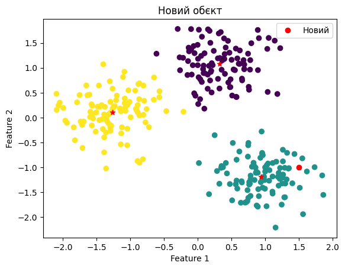
    


## Інший розподіл обєктів


```python
from sklearn.datasets import make_circles
X, y = make_circles(noise = 0.03, random_state=42)

```


```python
# Scatter plot of the data points
plt.scatter(X[:, 0], X[:, 1], c=y_true, cmap='viridis')
plt.title("Об'єкти кластеризації")
plt.xlabel('Ознака 1')
plt.ylabel('Ознака 2')
plt.show()
```


    
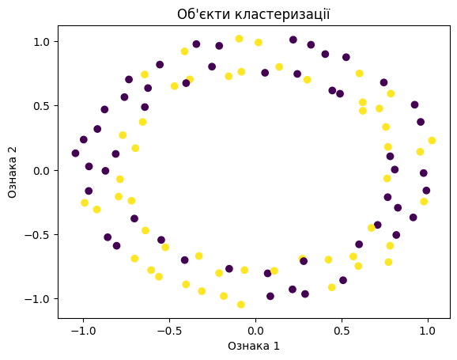
    


### Параметри ітераційного процесу


```python
# Максимальна кількість ітерацій
max_iters = 40
# Припустима помилка збіжності 1e-4
tol = 1e-5
# Кількість центроїдів !!! Передбачаємо 2 кластери
K = 2
```

### Ітераційний процес


```python
centroids = initialize_centroids(X, K)
```


```python
# Scatter plot of the data points
plt.scatter(X[:, 0], X[:, 1], c=y_true, cmap='viridis')
plt.scatter(centroids[:, 0], centroids[:, 1], marker='x', c ='red' )
plt.title('Початкове положення центроідів')
plt.xlabel('Ознака 1')
plt.ylabel('Ознака 2')
plt.show()
```


    
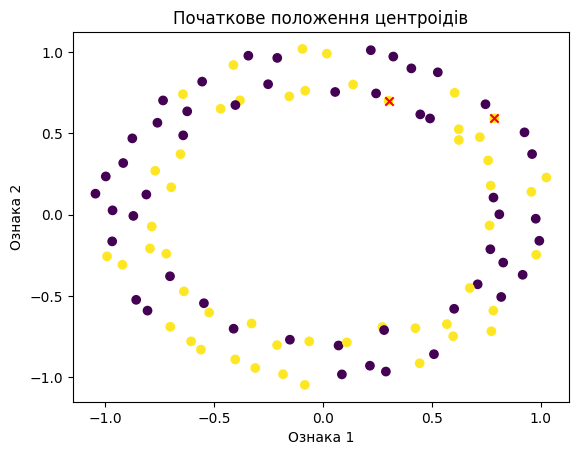
    


Цикл оновлення центроідів


```python
for i in range(max_iters):
    print ('Ітерація',i)
    print ('Координти Центроідів',centroids)
    # Для кожного обєкту обчислюємо відстань до кожного центроіду
    distances = compute_distance(X,centroids)
    # print(distances[0]) # Відстані до першого обєкту
    # Знаходемо найближчий кластер
    labels = find_closest_cluster(distances)
    # print(labels[0])  # Клас першого обєкту
    # Налаштовуємо центроіди
    new_centroids = compute_centroids(X,  K, labels)
    # print ('Змінені Центроіди',new_centroids)  # Нові центроїди
    # Compute inertia (sum of squared distances)# Сума квадратів відстанєй для кожного класу
    inertia = np.sum([distances[i, label] for i, label in enumerate(labels)])
    # print (inertia)
    # Різниця між старими та новими центроідами
    # if np.allclose(centroids, new_centroids, atol=tol):
    if np.allclose(centroids, new_centroids, atol=tol) or inertia <= tol:
        break
    centroids = new_centroids
    inertia_ = inertia

print ('ЗНАЙДЕНІ центроіди',centroids)

```

    Ітерація 0
    Координти Центроідів [[0.30145251 0.70133879]
     [0.78613819 0.59284503]]
    Ітерація 1
    Координти Центроідів [[-0.39275632  0.09977437]
     [ 0.7022245  -0.18068399]]
    Ітерація 2
    Координти Центроідів [[-0.48561609  0.12544713]
     [ 0.62132224 -0.16236598]]
    Ітерація 3
    Координти Центроідів [[-0.51415994  0.15258512]
     [ 0.58285435 -0.17459734]]
    Ітерація 4
    Координти Центроідів [[-0.52113735  0.17033231]
     [ 0.56755875 -0.18700717]]
    Ітерація 5
    Координти Центроідів [[-0.52723606  0.1894298 ]
     [ 0.5516881  -0.1995915 ]]
    Ітерація 6
    Координти Центроідів [[-0.5315732   0.21210937]
     [ 0.53444675 -0.21449064]]
    ЗНАЙДЕНІ центроіди [[-0.5315732   0.21210937]
     [ 0.53444675 -0.21449064]]
    


```python
# Для перевірки
inertia = np.sum([distances[i, label] for i, label in enumerate(labels)])
inertia
```


    49.048641817896396


```python
# Scatter plot of the data points
plt.scatter(X[:, 0], X[:, 1], c=y_true, cmap='viridis')
plt.scatter(centroids[:, 0], centroids[:, 1],marker='*', c ='red' )
plt.title('Знайдені центроіди класів')
plt.xlabel('Feature 1')
plt.ylabel('Feature 2')
plt.show()
```


    
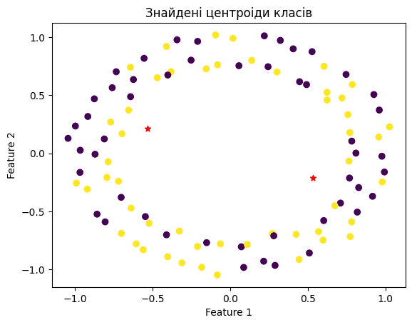
    


#### Новий обєкт


```python
new_obj  = np.array([[0.1,-1.]])
ypred = predict(new_obj )
print('Class', ypred[0])
```

    [[1.86809382 0.80576894]]
    Class 1
    


```python
# Scatter plot of the data points
plt.scatter(X[:, 0], X[:, 1], c=y_true, cmap='viridis')
plt.scatter(centroids[:, 0], centroids[:, 1],marker='*', c ='red' )
plt.plot(new_obj[0,0], new_obj[0, 1], 'o', color = 'red', label='Новий')
plt.title('Новий обєкт')
plt.xlabel('Feature 1')
plt.ylabel('Feature 2')
plt.legend()
plt.show()
```


    
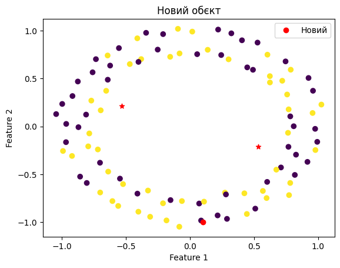
    

