# Модуль 3. Лекція 03. Кластеризація. Оцінка якості.

Частина 1. Метод k-Means з використанням scikit-learn

Частина 2. Метод силуетів для оцінки якості кластеризації та визначення кількості "оптимальної" кластерів


## Частина 1. Метод k-Means бібліотеки scikit-learn

### Метод k-Means бібліотеки scikit-learn [K-Means clustering](https://scikit-learn.org/stable/modules/generated/sklearn.cluster.KMeans.html#sklearn.cluster.KMeans)


```
class sklearn.cluster.KMeans(n_clusters=8, *, init='k-means++', n_init='auto', max_iter=300, tol=0.0001, verbose=0, random_state=None, copy_x=True, algorithm='lloyd')
```

Параметри:
- **n_clusters** ціле, за замовчуванням=8. Кількість кластерів для формування, а також кількість центроїдів для створення.

- **init** {‘k-means++’, ‘random’}, або масив форми $(n\_clusters, n\_features)$, за замовчуванням=’k-means++’. Спосіб ініціалізації центроідів.

- **n_init** ‘auto’ або ціле, default=’auto’. Кількість разів, коли алгоритм k-means виконується з різними початковими числами центроїда. Остаточними результатами є найкращі результати послідовних прогонів n_init з точки зору інерції.
- **algorithm**{“lloyd”, “elkan”}, default=”lloyd”. Алгоритм для використання. За замовчування класичний алгоритм - "lloyd".

Атрибути:

- **cluster_centers_** масив форми $(n\_clusters, n\_features)$. Координати центрів кластерів. Якщо алгоритм зупиняється до повного сходження (дивись tol і max_iter), вони не будуть узгоджуватися з labels_.

- **labels_** масив форми $(n\_labels_,)$. Мітки кожної точки

- **inertia_float**. Сума квадратів відстаней зразків до найближчого центру кластера.

Атрибут FIT  (пристосування, навчання)
```
fit_predict(X)
```
Використовується спеціально для неконтрольованих оцінювачів, це відповідає моделі та повертає прогнози (схожі на прогнози  на навчальних даних). У кластеризаторах ці передбачення також зберігаються в атрибуті labels_  .

Результат .fit_predict(X) зазвичай еквівалентний .fit(X).predict(X). Параметри для fit_predict такі самі, як і для fit.


### Імпорт


```python
import numpy as np
import matplotlib.cm as cm
import matplotlib.pyplot as plt
```


```python
from sklearn.cluster import KMeans
from sklearn.datasets import make_blobs
from sklearn import datasets
from sklearn.metrics import silhouette_samples, silhouette_score
```

### **Приклад 1. K-means. Два кластери**

Для прикладу генеруємо дві групи (кластера) обєктів за допомогою scikit-learn  [datasets.make_blobs](https://scikit-learn.org/stable/modules/generated/sklearn.datasets.make_blobs.html)


```python
num_center = 2
center = [[-2.,-2.],[2.,2.]]
X, y_true = datasets.make_blobs(n_samples=100, centers=center, cluster_std=1.0, random_state=0)
```


```python
print(X.shape, y_true.shape)
```

    (100, 2) (100,)


```python
mean = X.mean(axis=0)
std = X.std(axis=0)
X = (X - mean) / std
```


```python
plt.scatter(X[:, 0], X[:, 1], c=y_true, cmap='viridis')
plt.title('Нормалізований датасет')
plt.xlabel('Ознака 1')
plt.ylabel('Ознака 2')
plt.show()
```


​    
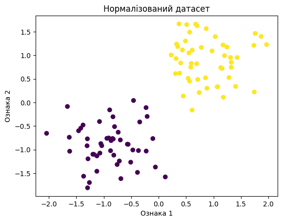
​    


Параметри для k-means


```python
# Кількість центроїдів !!! Передбачаємо 2 кластери
num_clusters = 2
# Кількість початклових варіантів центроідів
num_attempt = 5
```


```python
# Створення моделі K-means та навчання її на нормалізованих даних
kmeans = KMeans(n_clusters=num_clusters, n_init=num_attempt, random_state=0)
kmeans.fit(X)
```


```python
# Отримання координат центроїдів
centroids = kmeans.cluster_centers_

# Виведення координат центроїдів
print("Координати центроїдів:")
print(centroids)


```

    Координати центроїдів:
    [[ 0.88885559  0.89529546]
     [-0.88885559 -0.89529546]]


```python
# Візуалізація центроїдів
plt.figure(figsize=(8, 6))
plt.scatter(X[:, 0], X[:, 1], c=y_true, cmap='coolwarm', edgecolors='k')
plt.title('Хмара даних двох клістерів з центроїдами')
plt.xlabel('Ознака 1')
plt.ylabel('Ознака 2')
plt.scatter(centroids[:, 0], centroids[:, 1], s=100, color=["orange", "green"], marker='o', edgecolor="black", zorder=10)
plt.show()
```


​    
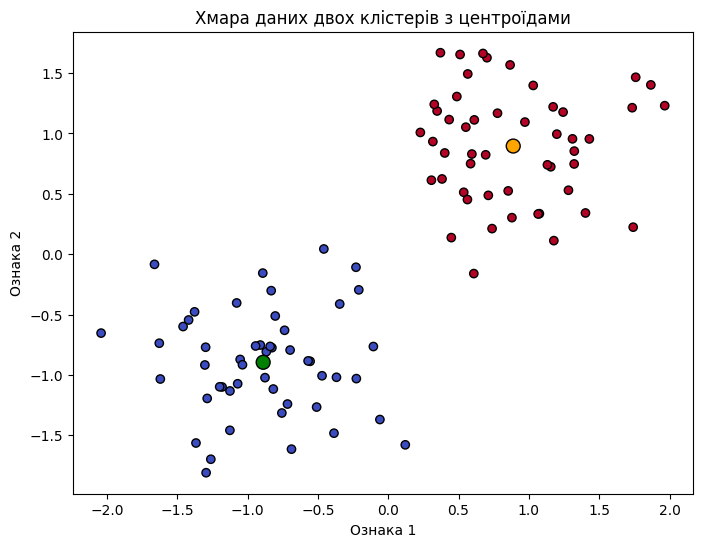
​    


Передбачення


```python
# new_obj  = np.array([[-1.5, -1.0]])
new_obj  = np.array([[1.5, 1.0]])
print(new_obj.shape)
```

    (1, 2)


```python
y_pred = kmeans.predict(new_obj)
print(y_pred.shape, y_pred)
```

    (1,) [0]


```python
# Візуалізація нового оюєкту
plt.figure(figsize=(8, 6))
plt.scatter(X[:, 0], X[:, 1], c=y_true, cmap='coolwarm', edgecolors='k')
plt.title('Хмара даних двох клістерів з центроїдами')
plt.xlabel('Ознака 1')
plt.ylabel('Ознака 2')
plt.scatter(centroids[:, 0], centroids[:, 1], s=100, color=["orange", "green"], marker='o', edgecolor="black", zorder=10)
plt.scatter(new_obj[0, 0], new_obj[0:, 1], s=100, color="red", marker='X', edgecolor="black", zorder=10)
plt.show()
```


​    
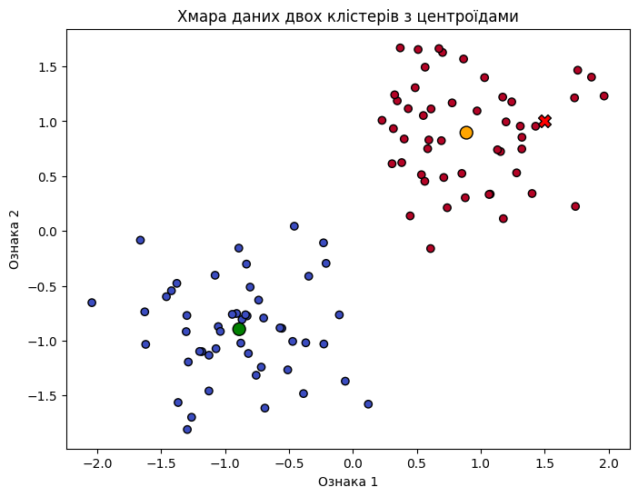
​    


### **Приклад 2. K-means. Три кластери**

Для прикладу генеруємо три групи (кластера) обєктів за допомогою scikit-learn  [datasets.make_blobs](https://scikit-learn.org/stable/modules/generated/sklearn.datasets.make_blobs.html)


```python
num_center = 3
center = [[-2.,-2.],[2.,2.],[-2.,2.]]
X, y_true = datasets.make_blobs(n_samples=100, centers=center, cluster_std=1.0, random_state=0)
```


```python
print(X.shape, y_true.shape)
```

    (100, 2) (100,)


```python
mean = X.mean(axis=0)
std = X.std(axis=0)
X = (X - mean) / std
```


```python
plt.scatter(X[:, 0], X[:, 1], c=y_true, cmap='viridis')
plt.title('Нормалізований датасет')
plt.xlabel('Ознака 1')
plt.ylabel('Ознака 2')
plt.show()
```


​    
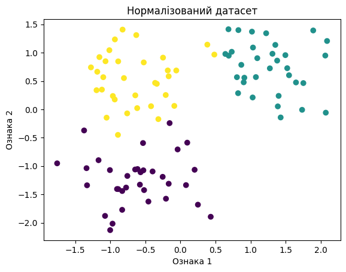
​    


Параметри для k-means


```python
# Кількість центроїдів !!! Передбачаємо 2 кластери
num_clusters = 3
# Кількість початклових варіантів центроідів
num_attempt = 10
```


```python
# Створення моделі K-means та навчання її на нормалізованих даних
kmeans = KMeans(n_clusters=num_clusters, n_init=num_attempt, random_state=0)
kmeans.fit(X)
```


```python
# Отримання координат центроїдів
centroids = kmeans.cluster_centers_

# Виведення координат центроїдів
print("Координати центроїдів:")
print(centroids)


```

    Координати центроїдів:
    [[ 1.21584197  0.75974342]
     [-0.70615211  0.48417129]
     [-0.6047758  -1.27528791]]


```python
# Візуалізація центроїдів
plt.figure(figsize=(8, 6))
plt.scatter(X[:, 0], X[:, 1], c=y_true, cmap='coolwarm', edgecolors='k')
plt.title('Хмара даних двох клістерів з центроїдами')
plt.xlabel('Ознака 1')
plt.ylabel('Ознака 2')
plt.scatter(centroids[:, 0], centroids[:, 1], s=100, color=["orange", "green", "blue"], marker='o', edgecolor="black", zorder=10)
plt.show()
```


​    
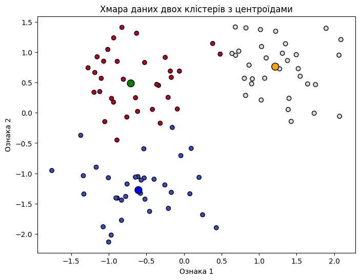
​    


Передбачення


```python
# new_obj  = np.array([[1.5, 1.0]]) # Кластер № 0
# new_obj  = np.array([[-1.5, 1.0]]) # Кластер № 1
new_obj  = np.array([[-1.5, -1.0]]) # Кластер № 2
print(new_obj.shape)
```

    (1, 2)


```python
y_pred = kmeans.predict(new_obj)
print(y_pred.shape, y_pred)
```

    (1,) [2]


```python
# Візуалізація нового оюєкту
plt.figure(figsize=(8, 6))
plt.scatter(X[:, 0], X[:, 1], c=y_true, cmap='coolwarm', edgecolors='k')
plt.title('Хмара даних двох клістерів з центроїдами')
plt.xlabel('Ознака 1')
plt.ylabel('Ознака 2')
plt.scatter(centroids[:, 0], centroids[:, 1], s=100, color=["orange", "green", 'blue'], marker='o', edgecolor="black", zorder=10)
plt.scatter(new_obj[0, 0], new_obj[0:, 1], s=100, color="red", marker='X', edgecolor="black", zorder=10)
plt.show()
```


​    

​    


```python

```

### **Приклад 3. K-means. Два кластери  moons**

Для прикладу генеруємо дві групи (кластера) обєктів за допомогою scikit-learn  [datasets.make_moons](https://scikit-learn.org/stable/modules/generated/sklearn.datasets.make_moons.html)


```python
from sklearn.datasets import make_moons
```


```python
X, y = make_moons(n_samples=100, noise=0.05, random_state=42)
print( X.shape, y.shape)
```

    (100, 2) (100,)


```python
plt.scatter(X[:, 0], X[:, 1], c=y_true, cmap='viridis')
plt.title('Moons')
plt.xlabel('Ознака 1')
plt.ylabel('Ознака 2')
plt.show()
```


​    
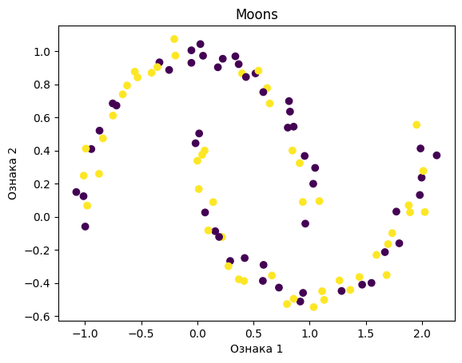
​    


Параметри для k-means


```python
# Кількість центроїдів !!! Передбачаємо 2 кластери
num_clusters = 2
# Кількість початклових варіантів центроідів
num_attempt = 10
```


```python
# Створення моделі K-means та навчання її на нормалізованих даних
kmeans = KMeans(n_clusters=num_clusters, n_init=num_attempt, random_state=0)
kmeans.fit(X)
```


```python
# Отримання координат центроїдів
centroids = kmeans.cluster_centers_

# Виведення координат центроїдів
print("Координати центроїдів:")
print(centroids)


```

    Координати центроїдів:
    [[ 1.20775865 -0.07900739]
     [-0.20296939  0.5750386 ]]


```python
# Візуалізація центроїдів
plt.figure(figsize=(8, 6))
plt.scatter(X[:, 0], X[:, 1], c=y_true, cmap='coolwarm', edgecolors='k')
plt.title('Хмара даних двох клістерів з центроїдами')
plt.xlabel('Ознака 1')
plt.ylabel('Ознака 2')
plt.scatter(centroids[:, 0], centroids[:, 1], s=100, color=["orange", "green"], marker='o', edgecolor="black", zorder=10)
plt.show()
```


​    
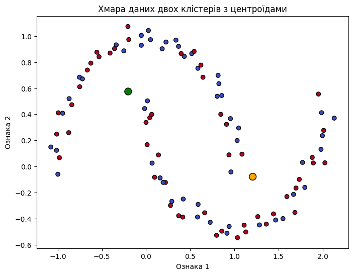
​    


Передбачення


```python
new_obj  = np.array([[1.5, 1.0]]) # Кластер № ???
# new_obj  = np.array([[-1.5, -1.0]]) # Кластер № ???
print(new_obj.shape)
```

    (1, 2)


```python
y_pred = kmeans.predict(new_obj)
print(y_pred.shape, y_pred)
```

    (1,) [0]


```python
# Візуалізація нового оюєкту
plt.figure(figsize=(8, 6))
plt.scatter(X[:, 0], X[:, 1], c=y_true, cmap='coolwarm', edgecolors='k')
plt.title('Хмара даних двох клістерів з центроїдами')
plt.xlabel('Ознака 1')
plt.ylabel('Ознака 2')
plt.scatter(centroids[:, 0], centroids[:, 1], s=100, color=["orange", "green"], marker='o', edgecolor="black", zorder=10)
plt.scatter(new_obj[0, 0], new_obj[0:, 1], s=100, color="red", marker='X', edgecolor="black", zorder=10)
plt.show()
```


​    
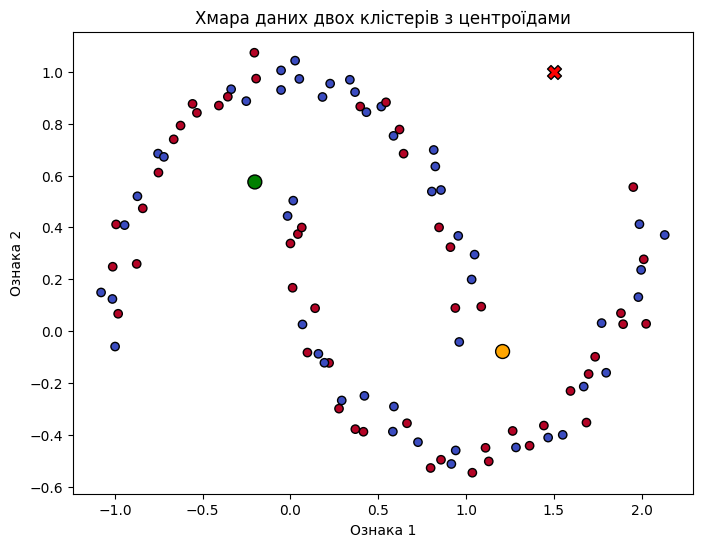
​    


## Частина 2. Метод силуетів для оцінки якості кластеризації та визначення кількості "оптимальної" кластерів

Аналіз силуетів можна використовувати для вивчення відстані поділу між отриманими кластерами. Графік силуету показує, наскільки близько кожна точка в одному кластері до точок у сусідніх кластерах, і, таким чином, забезпечує спосіб візуальної оцінки таких параметрів, як кількість кластерів. Цей показник має діапазон [-1, 1].

Коефіцієнти силуету (так називають ці значення) біля +1 вказують на те, що вибірка знаходиться далеко від сусідніх кластерів. Значення 0 вказує на те, що вибірка знаходиться на межі прийняття рішення між двома сусідніми кластерами або дуже близько до неї, а від’ємні значення вказують на те, що ці вибірки могли бути призначені неправильному кластеру.

Аналіз силуету типово використовується для вибору оптимального значення для n_clusters.


```python
# Генеруємо екземпляри
X, y = make_blobs(
    n_samples=500,
    n_features=2,
    centers=4,
    cluster_std=1,
    center_box=(-10.0, 10.0),
    shuffle=True,
    random_state=1,
)
```


```python
# Візуалізація
plt.figure(figsize=(8, 6))
plt.scatter(X[:, 0], X[:, 1], c=y, cmap='coolwarm', edgecolors='k')
plt.title('Дадасет')
plt.xlabel('Ознака 1')
plt.ylabel('Ознака 2')
plt.show()
```


​    
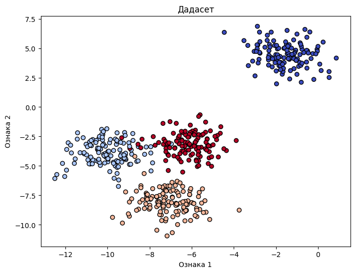
​    


Визначення сілуетів для різної кількості кластерів за допомогою [SciKit-learn Silhoette](https://scikit-learn.org/stable/auto_examples/cluster/plot_kmeans_silhouette_analysis.html)


```python
range_n_clusters = [2, 3, 4, 5, 6]

for n_clusters in range_n_clusters:
    # Стоврення підграфику  з 1 стрічки та 2 колонками
    fig, (ax1, ax2) = plt.subplots(1, 2)
    fig.set_size_inches(10, 5)

    # Перший підгграфик  сілует
    # Коефіцієнти сілуету змінюются від -1 до 1 but in this example all
    # для прикладу встановлюємо [-0.1, 1]
    ax1.set_xlim([-0.1, 1])
    # Терм (n_clusters+1)*10 для простору між сілуетами
    ax1.set_ylim([0, len(X) + (n_clusters + 1) * 10])

    # Ініціалізація сластеру з  n_clusters.
    clusterer = KMeans(n_clusters=n_clusters, n_init='auto',random_state=10)
    cluster_labels = clusterer.fit_predict(X)

    # Середнє значення сілуету
    silhouette_avg = silhouette_score(X, cluster_labels)
    print(
        "For n_clusters =",
        n_clusters,
        "The average silhouette_score is :",
        silhouette_avg,
    )

    # Сілуети для кожного екземпляру (оюєкту)
    sample_silhouette_values = silhouette_samples(X, cluster_labels)

    y_lower = 10
    for i in range(n_clusters):
        # Агрегірування сілуетів для кожного екземпляру кластеру i, та їх сортування
        ith_cluster_silhouette_values = sample_silhouette_values[cluster_labels == i]

        ith_cluster_silhouette_values.sort()

        size_cluster_i = ith_cluster_silhouette_values.shape[0]
        y_upper = y_lower + size_cluster_i

        color = cm.nipy_spectral(float(i) / n_clusters)
        ax1.fill_betweenx(
            np.arange(y_lower, y_upper),
            0,
            ith_cluster_silhouette_values,
            facecolor=color,
            edgecolor=color,
            alpha=0.7,
        )

        # Помітка сілуету номером кластеру
        ax1.text(-0.05, y_lower + 0.5 * size_cluster_i, str(i))

        # нове y_lower для настпного сабплоту
        y_lower = y_upper + 10  # 10 для 0 екземпляру

    ax1.set_title("The silhouette plot for the various clusters.")
    ax1.set_xlabel("The silhouette coefficient values")
    ax1.set_ylabel("Cluster label")

    # The vertical line for average silhouette score of all the values
    ax1.axvline(x=silhouette_avg, color="red", linestyle="--")

    ax1.set_yticks([])  # Clear the yaxis labels / ticks
    ax1.set_xticks([-0.1, 0, 0.2, 0.4, 0.6, 0.8, 1])

    # 2nd Plot showing the actual clusters formed
    colors = cm.nipy_spectral(cluster_labels.astype(float) / n_clusters)
    ax2.scatter(
        X[:, 0], X[:, 1], marker=".", s=30, lw=0, alpha=0.7, c=colors, edgecolor="k"
    )

    # Помітка кластерів
    centers = clusterer.cluster_centers_
    # Відобразити як коло з центром кластеру
    ax2.scatter(
        centers[:, 0],
        centers[:, 1],
        marker="o",
        c="white",
        alpha=1,
        s=200,
        edgecolor="k",
    )

    for i, c in enumerate(centers):
        ax2.scatter(c[0], c[1], marker="$%d$" % i, alpha=1, s=50, edgecolor="k")

    ax2.set_title("The visualization of the clustered data.")
    ax2.set_xlabel("Feature space for the 1st feature")
    ax2.set_ylabel("Feature space for the 2nd feature")

    plt.suptitle(
        "Аналіз сілутів для кластризації KMeans з n_clusters = %d"
        % n_clusters,
        fontsize=14,
        fontweight="bold",
    )

plt.show()
```

    For n_clusters = 2 The average silhouette_score is : 0.7049787496083262
    For n_clusters = 3 The average silhouette_score is : 0.5882004012129721
    For n_clusters = 4 The average silhouette_score is : 0.6505186632729437
    For n_clusters = 5 The average silhouette_score is : 0.5662344175321901
    For n_clusters = 6 The average silhouette_score is : 0.4358297989156284


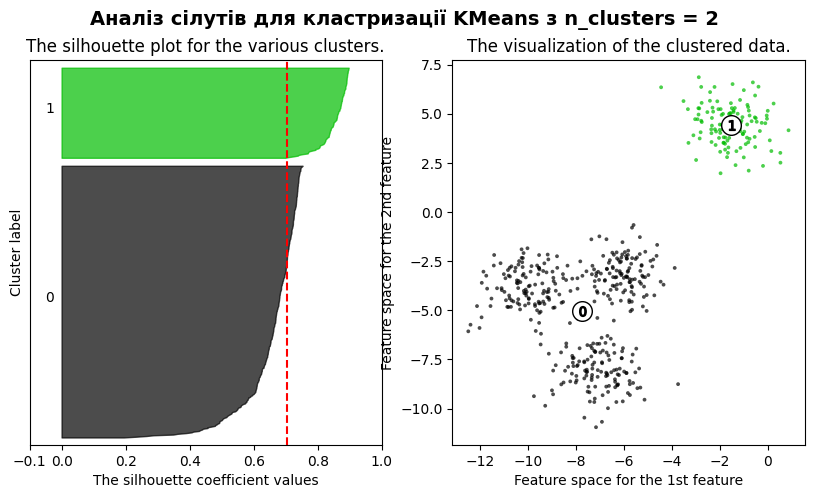
    


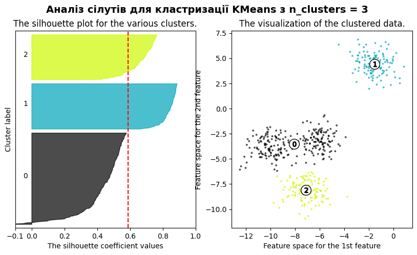
    


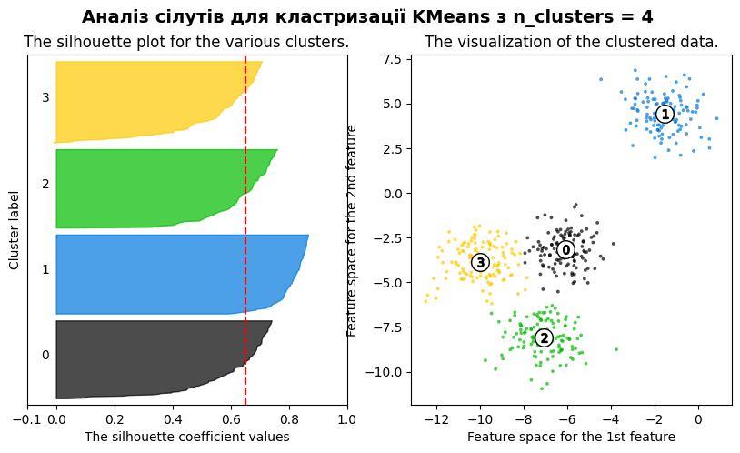
    


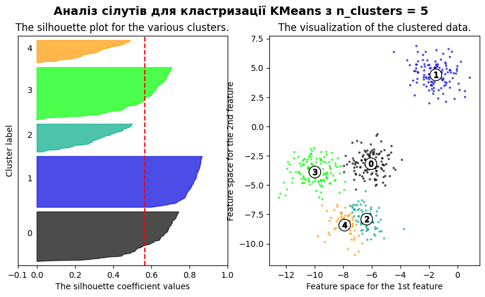
    


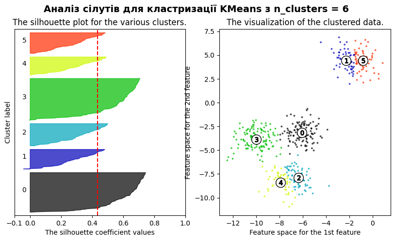
    


 У цьому прикладі аналіз силуету використовується для вибору оптимального значення для n_clusters. Графік силуету показує, що значення n_clusters 3, 5 і 6 є поганим вибором для наведених даних через наявність кластерів із нижчими за середні оцінками силуету, а також через значні коливання розміру графіків силуету. Аналіз силуету більш неоднозначний у виборі між 2 і 4.

Також з товщини силуетної ділянки можна візуалізувати розмір кластера. Діаграма силуету для кластера 0, коли n_clusters дорівнює 2, має більший розмір завдяки групуванню 3 підкластерів в один великий кластер. Однак, коли n_clusters дорівнює 4, усі графіки мають більш-менш однакову товщину і, отже, однакові розміри, що також можна перевірити на позначеній діаграмі розсіювання праворуч.


```python


```
