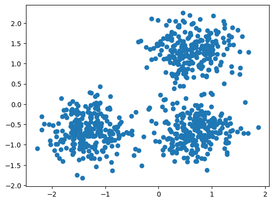
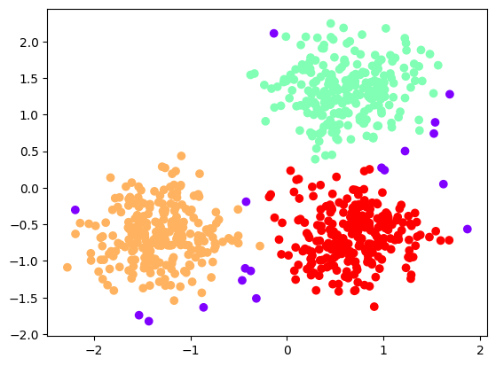
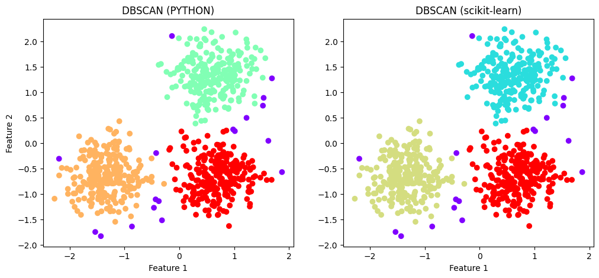

# Модуль 3. Лекція 04. Кластеризація. Метод DBSCAN

## Приклад 1. DBSCAN на Python

DBSCAN (__Density-Based Spatial Clustering of Applications with Noise, просторова кластеризація на основі щільності з шумом__) знаходить ядро вибірки в областях високої щільності та розширює з них кластери. Алгоритм добрий для даних, які містять кластери однакової щільності.

1. DBSCAN починається з довільної початкової точки даних, яка не була раніше відвідана. Околиці цієї точки виділяють за допомогою параметру відстані епсилон **eps** (усі точки, які знаходяться в межах відстані **eps**, є точками околиць).
2. Якщо є достатня кількість точок (відповідно до параметру **min_samples**) у цій околиці, починається процес кластеризації, і поточна точка даних стає першою точкою в новому кластері. Інакше ця точка буде позначена як шум (пізніше ця шумна точка може стати частиною кластера). В обох випадках ця точка позначена як «відвідана».
3. Для цієї першої точки в новому кластері точки в межах її околиці відстані **eps** також стають частиною того самого кластера. Ця процедура приведення всіх точок в околиці ε до одного кластера потім повторюється для всіх нових точок, які щойно були додані до групи кластерів.
4. Цей процес виконання  кроків 2 і 3 повторюється, доки не будуть визначені всі точки в кластері, тобто всі точки в межах ε околиці кластера не будуть відвідані та позначені.
5. Після завершення роботи з поточним кластером нова невідвідана точка витягується та обробляється, що призводить до виявлення наступного кластера або шуму. Цей процес повторюється, доки всі точки не будуть позначені як відвідані. Оскільки наприкінці цього було відвідано всі точки, кожна точка буде позначена як належна до кластеру або як шумова.

Позначення:
- **Core points** (ядерні, базові точки) — точки в кластері, що мають *min_pts* сусідів у своєму оточенні *eps* або більше. Це означає, що точки лежать в області високої щільності даних.
- **Border points** (прикордонні точки) — точки у кластері, які мають менше, ніж *min_pts* сусідів у своєму оточенні *eps*, але лежать в оточенні *eps* інших ядерних(базових) точок. Це означає, що точки лежать межі кластерів.
- **Noise points** (шумові точки) - це викиди, які не належать до жодного кластера, тобто точки розташовані в області низької щільності даних.
- ----------------

### Імпорт бібліотек


```python
import numpy as np
import matplotlib.pyplot as plt
from sklearn.cluster import DBSCAN
from sklearn.neighbors import NearestNeighbors
from sklearn.datasets import make_circles, make_blobs, make_moons
from sklearn.metrics import adjusted_rand_score
from sklearn.preprocessing import StandardScaler
```

### Функція кластеризаця датасету D за допомогою алгоритму DBSCAN.

dbscan приймає
- набір даних `D` (список векторів),
- порогову відстань `eps`
- мінімально необхідну кількість точок `MinPts`.
Повертає список міток кластера.

Мітка -1 означає шум, а потім кластери нумеруються починаючи з 1.


```python
def dbscan(D, eps, MinPts):
    # У списку labels буде остаточне призначення кластера для кожної точки в D.
    # є два зарезервованих значення:
    #  -1 - вказує на точку шуму (NOISE)
    #  0  - означає, що точку не  розгдянуто
    # Спочатку всі мітки дорівнюють 0

    labels = [0]*len(D)

    # C це ID поточного кластеру
    C = 0

    # Цикл відповідає лише за вибір нових початкових точок -
    # точки - з якої можна створити новий кластер.
    # Після того, як дійсну вихідну точку знайдено, створюється новий кластер
    # Зростання кластера обробляється процедурою 'expandCluster'.

    # Для кожної точки P у наборі даних D...
    # ('P' - індекс точки)
    for P in range(0, len(D)):
        # Тільки точки, які ще не були марковані, вибраються як нові
        # початкові точки.

        # Якщо мітка точки не дорівнює 0, перейдіть до наступної точки.
        if not (labels[P] == 0):
            continue

        # Визначаються всі сусідні точки P.
        NeighborPts = region_query(D, P, eps)

        # Якщо число нижче MinPts, ця точка є шумом.
        # Ця точка позначається як NOISE
        # - коли це недійсна початкова точка. Точка NOISE може бути пізніше
        # підібрана іншим кластером як гранична точка (це єдина
        # умова, за якої мітка кластера може змінюватися - з NOISE на
        # щось ще).

        if len(NeighborPts) < MinPts:
            labels[P] = -1

        # В іншому випадку, якщо поблизу є принаймні MinPts  точок,
        # ця точка використовується як ядро нового кластера.
        else:
            C += 1
            grow_cluster(D, labels, P, NeighborPts, C, eps, MinPts)

    # Всі точки кластеризовані
    return labels
```

### Формування нового кластеру із міткою `C` із початкової точки `P`.

Функція шукає в наборі даних, щоб знайти всі точки, які належать
до нового кластера. Коли ця функція повертається, кластер `C` завершено.
Параметри:
- `D` - набір даних (список векторів)
- `labels` – список, зберігє мітки кластерів для всіх точок набору даних
- `P` - Індекс початкової точки для цього нового кластера
- `NeighborPts` - усі сусіди `P`
- `C` - мітка для цього нового кластера.
- `eps` - Порогова відстань
- `MinPts` - мінімальна необхідна кількість сусідів


```python
def grow_cluster(D, labels, P, NeighborPts, C, eps, MinPts):
    # Призначаємо мітку кластера початковій точці.
    labels[P] = C

    # Аналіз кожного сусіда P (сусіди означені як Pn).
    # NeighborPts використовується як черга FIFO точок для пошуку, тобто черга
    # зростатиме, коли відкриваються нові точки розширення кластеру.
    #  FIFO поведінка досягається за допомогою циклу while.
    # У NeighborPts точки представлені своїм індексом в оригіналі набору даних

    i = 0
    while i < len(NeighborPts):

        # Отримання наступної точки з черги.
        Pn = NeighborPts[i]

        # Якщо Pn було позначено NOISE під час початкового пошуку, тоді
        #  це не точка розширення кластеру (у неї недостатньо сусідів), тому
        # вона зберігається як кінцева точка кластеру C і аналузуємо наступну

        if labels[Pn] == -1:
            labels[Pn] = C

        # В іншому випадку, якщо Pn ще не означена, вкзуємо як частину C.
        elif labels[Pn] == 0:
            # Додаємо Pn до кластера C (призначаємо мітку кластера C).
            labels[Pn] = C

            # Знайходемо усіх сусідів Pn
            PnNeighborPts = region_query(D, Pn, eps)

            # Якщо Pn має принаймні MinPts сусідів, це точка розширення
            # Додаємо всіх його сусідів до черги FIFO для подальшого пошуку
            if len(PnNeighborPts) >= MinPts:
                NeighborPts = NeighborPts + PnNeighborPts

                # Якщо Pn не має достатньо сусідів, то це кінцева точка.
                # Не ставимо його сусідів у чергу як точки розширення.

        # До наступної точки в FIFO черзі.
        i += 1

```

### Функція визначає усі точки в наборі даних `D` на відстані `eps` від точки `P`.


```python
def region_query(D, P, eps):

    neighbors = []

    # Для кожної точки датасету
    for Pn in range(0, len(D)):

        # Якщо відстанб менш eps, додаєм до списку сусідів
        if np.linalg.norm(D[P] - D[Pn]) < eps:
            neighbors.append(Pn)

    return neighbors
```

### Завантаження, та відображення  датасету


```python
# Три блоба
centers = [[1, 1], [-1, -1], [1, -1]]
X, labels_true = make_blobs(n_samples=750, centers=centers, cluster_std=0.4,
                             random_state=0)


# X, y = make_circles(n_samples=250, noise=0.05, factor=0.5, random_state=0)
# X, y = make_moons(n_samples=250, noise=0.05, random_state=0)
X = StandardScaler().fit_transform(X)
print(labels_true)
```

    [0 1 0 2 0 1 1 2 0 0 1 1 1 2 1 0 1 1 2 2 2 2 2 2 1 1 2 0 0 2 0 1 1 0 1 0 2
     0 0 2 2 1 1 1 1 1 0 2 0 1 2 2 1 1 2 2 1 0 2 1 2 2 2 2 2 0 2 2 0 0 0 2 0 0
     2 1 0 1 0 2 1 1 0 0 0 0 1 2 1 2 2 0 1 0 1 0 1 1 0 0 2 1 2 0 2 2 2 2 0 0 0
     1 1 1 1 0 0 1 0 1 2 1 0 0 1 2 1 0 0 2 0 2 2 2 0 1 2 2 0 1 0 2 0 0 2 2 2 2
     1 0 2 1 1 2 2 2 0 1 0 1 0 1 0 2 2 1 1 2 2 1 0 1 2 2 2 1 1 2 2 0 1 2 0 0 2
     0 0 1 0 1 0 1 1 2 2 0 0 1 1 2 1 2 2 2 2 0 2 0 2 2 0 2 2 2 0 0 1 1 1 2 2 2
     2 1 2 2 0 0 2 0 0 0 1 0 1 1 1 2 1 1 0 1 2 2 1 2 2 1 0 0 1 1 1 0 1 0 2 0 2
     0 2 2 2 1 1 0 0 1 1 0 0 2 1 2 2 1 1 2 1 2 0 2 2 0 1 2 2 0 2 2 0 0 2 0 2 0
     2 1 0 0 0 1 2 1 2 2 0 2 2 0 0 2 1 1 1 1 1 0 1 1 1 1 0 0 1 1 1 0 2 0 1 2 2
     0 0 2 0 2 1 0 2 0 2 0 2 2 0 1 0 1 0 2 2 1 1 1 2 0 2 0 2 1 2 2 0 1 0 1 0 0
     0 0 2 0 2 0 1 0 1 2 1 1 1 0 1 1 0 2 1 0 2 2 1 1 2 2 2 1 2 1 2 0 2 1 2 1 0
     1 0 1 1 0 1 2 0 1 0 0 2 1 2 2 2 2 1 0 0 0 0 1 0 2 1 0 1 2 0 0 1 0 1 1 0 2
     0 2 2 2 1 1 2 0 1 0 0 1 0 1 1 2 2 1 0 1 2 2 1 1 1 1 0 0 0 2 2 1 2 1 0 0 1
     2 1 0 0 2 0 1 0 2 1 0 2 2 1 0 2 0 2 1 1 0 2 0 0 1 1 1 1 0 1 0 1 0 0 2 0 1
     1 2 1 1 0 1 0 2 1 0 0 1 0 1 1 2 2 1 2 2 1 2 1 1 1 1 2 0 0 0 1 2 2 0 2 0 2
     1 0 1 1 0 0 1 2 1 2 2 0 2 1 1 1 2 0 0 2 0 2 2 0 2 0 1 1 1 1 0 0 0 2 1 1 1
     1 2 2 2 0 2 1 1 0 0 1 0 2 1 2 1 0 2 2 0 0 1 0 0 2 0 0 0 2 0 2 0 0 1 1 0 0
     1 2 2 0 0 0 0 2 1 1 1 2 1 0 0 2 2 0 1 2 0 1 2 2 1 0 0 0 1 2 0 0 0 2 2 2 0
     1 1 1 1 1 0 0 2 1 2 0 1 1 1 0 2 1 1 1 2 1 2 0 2 2 1 0 0 0 1 1 2 0 0 2 2 1
     2 2 2 0 2 1 2 1 1 1 2 0 2 0 2 2 0 0 2 1 2 0 2 0 0 0 1 0 2 1 2 0 1 0 0 2 0
     2 1 1 2 1 0 1 2 1 2]
    


```python
import matplotlib.pyplot as plt

plt.scatter(X[:, 0], X[:, 1])
plt.show()
```


    

    


### Кластеризація


```python
# Параметри
eps = 0.3
min_pts = 10
# Виклик клстеризація
my_clusters = dbscan(X, eps, min_pts)
print(my_clusters)
```

    [1, 2, 1, 3, 1, 2, 2, 3, 1, 1, 2, 2, 2, 3, 2, 1, -1, 2, 2, 3, 3, 3, 3, 3, 2, 2, 3, 1, 1, 3, 1, 2, 2, 1, 2, 1, 3, 1, 1, 3, 3, 2, 2, 2, 2, 2, 1, 3, 1, 2, 3, 3, 2, 2, 3, 3, 2, 1, 3, 2, 3, 3, 3, 3, 3, 1, 3, 3, 1, 1, 1, 3, 1, 1, 3, 2, -1, 2, 1, 3, 2, 2, 1, 1, 1, 1, 2, 3, 2, 3, 3, 1, 2, 1, 2, -1, 2, 2, 1, 1, 3, 2, 3, 1, 3, 3, 3, 3, -1, 1, -1, 2, 2, 2, 2, 1, 1, 2, 1, 2, 3, 2, 1, 1, 2, 3, 2, 1, 1, 3, 1, 3, 3, 3, 1, -1, 3, 3, 1, 2, 1, 3, 1, 1, 3, 3, -1, 3, 2, -1, 3, 2, 2, 3, 3, 3, 1, 2, 1, 2, 1, 2, 1, 3, 3, -1, 2, 3, 3, 2, 1, 2, 3, 3, 3, 2, 2, 3, 3, 1, 2, 3, 1, 1, 3, 1, 1, 2, 1, 2, 1, 2, 2, 3, 3, 1, 1, 2, 2, 3, 2, 3, 3, 3, 3, 1, 3, 1, 3, 3, 1, 3, 3, 3, 1, 1, 2, 2, 2, 3, 3, 3, 3, 2, 3, 3, 1, 1, 3, 1, 1, 1, 2, 1, 2, 2, 2, 3, 2, 2, 1, 2, 3, 3, 2, 3, 3, 2, 1, 1, 2, 2, 2, 1, 2, 1, 3, 1, 3, 3, 3, 3, 3, 2, 2, 1, 1, 2, 2, 1, 1, 3, 2, -1, 3, 2, 2, 3, 2, 3, 1, 3, 3, 1, 2, 3, 3, 1, 3, 3, 1, 1, 3, 1, 3, 1, 3, 2, 1, 1, 1, 2, 3, 2, 3, 3, 1, 3, 3, 1, 1, 3, 2, 2, 2, 2, 2, 1, 2, 2, 2, 2, 1, 1, 2, 2, 2, 1, 3, 1, 2, 3, 3, 1, 1, 3, 1, 3, 2, 1, 3, 1, 3, 1, 3, 3, 1, 2, 1, 2, 1, 3, 3, 2, 2, 2, 3, 1, 3, 1, 3, 2, 3, 3, 1, 2, 1, 2, 1, 1, 1, 1, 3, 1, 3, 1, 2, 1, 2, 3, 2, 2, 2, 1, 2, 2, 1, 3, 2, 1, 3, 3, 2, 2, 3, 3, 3, 2, 3, 2, 3, 1, 3, 2, 3, 2, 1, 2, 1, 2, 2, 1, 2, 3, -1, 2, 1, 1, 3, 2, 3, 3, 3, 3, 2, 1, 1, 1, 1, 2, 1, 3, 2, 1, 2, 3, 1, 1, 2, 1, 2, 2, 1, -1, 1, 3, 3, 3, 2, 2, 3, 1, 2, 1, 1, 2, 1, 2, 2, 3, 3, -1, 1, 2, 3, 3, 2, 2, 2, 2, 1, 1, 1, 3, 3, 2, 3, 2, 1, 1, 2, 3, 2, 1, 1, 3, 1, 2, 1, 3, 2, 1, 3, 3, 2, 1, 1, 1, 3, 2, 2, 1, 3, 1, 1, 2, 2, 2, 2, 1, 2, 1, 2, 1, 1, 3, 1, 2, 2, 3, 2, 2, 1, 2, 1, 3, 2, 1, 1, 2, 1, 2, 2, 3, 3, 2, 3, 3, 2, 3, 2, 2, 2, 2, 3, 1, 1, 1, 2, 3, 3, 1, 3, 1, 3, 2, 1, 2, 2, 1, 1, 2, 3, 2, 3, 3, 1, 3, 2, 2, 2, 3, 1, 1, 3, 1, 3, 3, 1, 3, 1, 2, 2, 2, 2, 1, 1, 1, 3, 2, 2, 2, 2, 3, 3, 3, 1, 3, 2, 2, 1, 1, 2, 1, 3, 2, 3, 2, 1, 3, 3, 1, 1, 2, 1, 1, 3, 1, 1, 1, 3, 1, 3, 1, 1, 2, 2, 1, 1, 2, 3, 3, 1, 1, 1, 1, 3, -1, 2, 2, 3, 2, 1, 1, 3, 3, 1, 2, 3, 1, 2, 3, 3, 2, 1, 1, -1, -1, 3, 1, 1, 1, 3, -1, 3, 1, 2, 2, 2, 2, 2, 1, 1, 3, 2, 3, 1, 2, 2, 2, 1, 3, 2, 2, -1, 3, 2, 3, 1, 3, 3, 2, 1, 1, 1, 2, 2, 3, 1, 1, 3, 3, 2, 3, 3, 3, 1, 3, 2, 3, 2, 2, 2, 3, 1, 3, 1, 3, 3, 1, 1, 3, 2, 3, 1, 3, 1, 1, 1, 2, 1, 3, 2, 3, 1, 2, 1, 1, 3, 1, 3, 2, 2, 3, 2, 1, 2, 3, 2, 3]
    

### Відображення кластеризованого датасету


```python
plt.scatter(X[:, 0], X[:, 1], c=my_clusters, cmap='rainbow')
plt.show()

```


    

    


### Порівняння з функцією DBSCAN  від  scikit-learn


```python
dbscan_pred_res = DBSCAN(eps=eps, min_samples=min_pts).fit(X)
skl_labels = dbscan_pred_res.labels_
print(skl_labels)
```

    [ 0  1  0  2  0  1  1  2  0  0  1  1  1  2  1  0 -1  1  1  2  2  2  2  2
      1  1  2  0  0  2  0  1  1  0  1  0  2  0  0  2  2  1  1  1  1  1  0  2
      0  1  2  2  1  1  2  2  1  0  2  1  2  2  2  2  2  0  2  2  0  0  0  2
      0  0  2  1 -1  1  0  2  1  1  0  0  0  0  1  2  1  2  2  0  1  0  1 -1
      1  1  0  0  2  1  2  0  2  2  2  2 -1  0 -1  1  1  1  1  0  0  1  0  1
      2  1  0  0  1  2  1  0  0  2  0  2  2  2  0 -1  2  2  0  1  0  2  0  0
      2  2 -1  2  1 -1  2  1  1  2  2  2  0  1  0  1  0  1  0  2  2 -1  1  2
      2  1  0  1  2  2  2  1  1  2  2  0  1  2  0  0  2  0  0  1  0  1  0  1
      1  2  2  0  0  1  1  2  1  2  2  2  2  0  2  0  2  2  0  2  2  2  0  0
      1  1  1  2  2  2  2  1  2  2  0  0  2  0  0  0  1  0  1  1  1  2  1  1
      0  1  2  2  1  2  2  1  0  0  1  1  1  0  1  0  2  0  2  2  2  2  2  1
      1  0  0  1  1  0  0  2  1 -1  2  1  1  2  1  2  0  2  2  0  1  2  2  0
      2  2  0  0  2  0  2  0  2  1  0  0  0  1  2  1  2  2  0  2  2  0  0  2
      1  1  1  1  1  0  1  1  1  1  0  0  1  1  1  0  2  0  1  2  2  0  0  2
      0  2  1  0  2  0  2  0  2  2  0  1  0  1  0  2  2  1  1  1  2  0  2  0
      2  1  2  2  0  1  0  1  0  0  0  0  2  0  2  0  1  0  1  2  1  1  1  0
      1  1  0  2  1  0  2  2  1  1  2  2  2  1  2  1  2  0  2  1  2  1  0  1
      0  1  1  0  1  2 -1  1  0  0  2  1  2  2  2  2  1  0  0  0  0  1  0  2
      1  0  1  2  0  0  1  0  1  1  0 -1  0  2  2  2  1  1  2  0  1  0  0  1
      0  1  1  2  2 -1  0  1  2  2  1  1  1  1  0  0  0  2  2  1  2  1  0  0
      1  2  1  0  0  2  0  1  0  2  1  0  2  2  1  0  0  0  2  1  1  0  2  0
      0  1  1  1  1  0  1  0  1  0  0  2  0  1  1  2  1  1  0  1  0  2  1  0
      0  1  0  1  1  2  2  1  2  2  1  2  1  1  1  1  2  0  0  0  1  2  2  0
      2  0  2  1  0  1  1  0  0  1  2  1  2  2  0  2  1  1  1  2  0  0  2  0
      2  2  0  2  0  1  1  1  1  0  0  0  2  1  1  1  1  2  2  2  0  2  1  1
      0  0  1  0  2  1  2  1  0  2  2  0  0  1  0  0  2  0  0  0  2  0  2  0
      0  1  1  0  0  1  2  2  0  0  0  0  2 -1  1  1  2  1  0  0  2  2  0  1
      2  0  1  2  2  1  0  0 -1 -1  2  0  0  0  2 -1  2  0  1  1  1  1  1  0
      0  2  1  2  0  1  1  1  0  2  1  1 -1  2  1  2  0  2  2  1  0  0  0  1
      1  2  0  0  2  2  1  2  2  2  0  2  1  2  1  1  1  2  0  2  0  2  2  0
      0  2  1  2  0  2  0  0  0  1  0  2  1  2  0  1  0  0  2  0  2  1  1  2
      1  0  1  2  1  2]
    


```python
plt.figure(figsize=(12, 5))

plt.subplot(1, 2, 1)
plt.scatter(X[:, 0], X[:, 1], c=my_clusters, cmap='rainbow')
plt.title('DBSCAN (PYTHON)')
plt.xlabel("Feature 1")
plt.ylabel("Feature 2")

plt.subplot(1, 2, 2)
plt.scatter(X[:, 0], X[:, 1], c=skl_labels, cmap='rainbow')
plt.title('DBSCAN (scikit-learn)')
plt.xlabel("Feature 1")

plt.show()
```


    

    


### Поточкове порівняння


```python
for i in range(0, len(skl_labels)):
    if not skl_labels[i] == -1:
        skl_labels[i] += 1
```


```python
# Співпадають мітки ???

num_disagree = 0
for i in range(0, len(skl_labels)):
    if not skl_labels[i] == my_clusters[i]:
        print('Scikit learn:', skl_labels[i], 'Python:', my_clusters[i])
        num_disagree += 1

if num_disagree == 0:
    print('PASS - Всі мітки співпали!')
else:
    print('FAIL -', num_disagree, 'Не мпівпали')

```

    PASS - Всі мітки співпали!
    
