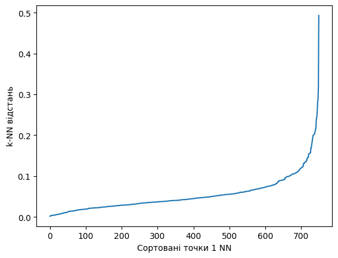

# Модуль 3. Лекція 04. Кластеризація. Метод DBSCAN

## Використання "КОЛІНА" для ВИЗНАЧЕННЯ EPS


[SEE Method for determining the optimal eps value](https://www.datanovia.com/en/lessons/dbscan-density-based-clustering-essentials/)

Метод "ELBOW" полягає в обчисленні k-відстаней до найближчих сусідів у матриці точок.
Ідея: обчислити середнє значення відстаней кожної точки до **k** її найближчих сусідів. Значення **k** буде вказано користувачем і відповідає MinPts.
Далі ці **k** -відстані відображаються в порядку зростання. Мета – визначити «коліно», що відповідає оптимальному параметру **eps**.
Коліно відповідає порогу, де відбувається різка зміна вздовж кривої **k**-відстаней.

## Імпорт бібліотек


```python
import numpy as np
import matplotlib.pyplot as plt
from sklearn.cluster import DBSCAN
from sklearn.neighbors import NearestNeighbors
from sklearn.datasets import make_circles, make_blobs, make_moons
from sklearn.metrics import adjusted_rand_score
from sklearn.preprocessing import StandardScaler
```

### Завантаження датасету


```python
X, labels_true = make_blobs(
    n_samples=750, centers=[[1, 1], [-1, -1], [1, -1]], cluster_std=0.4, random_state=0)

# X, y = make_moons(n_samples=250, noise=0.05, random_state=0)
# X, y = make_circles(n_samples=300, noise=0.05, factor=0.5, random_state=0)
X = StandardScaler().fit_transform(X)
# print(y)
```

Відображення датасету


```python
plt.scatter(X[:, 0], X[:, 1])
plt.show()
```


    

    


```python
n_neighb = 5
nbrs = NearestNeighbors(n_neighbors=n_neighb).fit(X)
# Функція Kneighbors повертає відстань точки до себе (тобто перший стовпець буде нулями)
# Знайти k-сусідів точки
neigh_dist, neigh_ind = nbrs.kneighbors(X)
# print(neigh_dist.shape, neigh_ind.shape)
# print(neigh_dist[0], neigh_ind[0])
# Сортування відстаней до сусідів у зростаючому порядку
# axis = 0 виконує сортування впродовж попередньої осі
sort_neigh_dist = np.sort(neigh_dist, axis=0)
# print(sort_neigh_dist.shape)
# print(sort_neigh_dist[0:3])
```

### Відображення залежності


```python
neighb = 1
k_dist = sort_neigh_dist[:, neighb]
plt.plot(k_dist)
plt.ylabel("k-NN відстань")
plt.xlabel("Сортовані точки " + str(neighb) +  " NN")
plt.show()

```


    

    


```python

```
