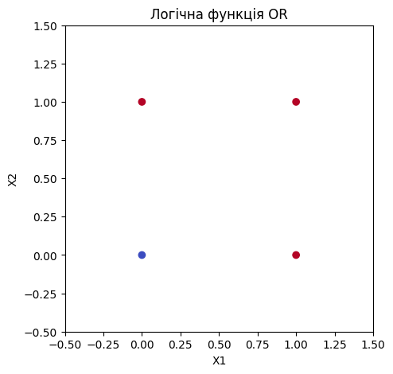
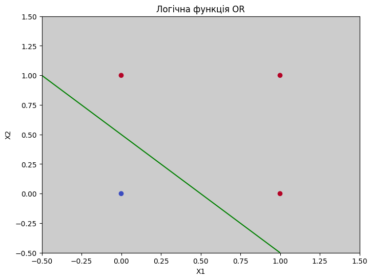

# Модуль 5. Лекція 01. Штучний нейрон

## Приклад 1. Штучний нейрон як логічний елемент "OR"

Logical OR

|Input X|Input Y|Output Z|
|:--:|:--:|:--:|
| 0 | 0 |0  |
| 1 | 0 |1  |
| 0 | 1 |1  |
| 1 | 1 |1  |


```python
import numpy as np
import matplotlib.pyplot as plt
```

Функції активації


```python
# Лінійна
def activation_linear (x):
    return (x)

# Сігмоіда
def activation_sigmoid (x):
    return 1/(1+np.exp(-x))

# Гіпертан
def activation_tanh (x):
    return np.tanh(x)

# Signum
def activation_signum (x):
    return np.sign(x)

# Step
def activation_step (x):
    ans = np.sign(x)
    return 0.5*(ans+1.0)

```

### Штучний лінійний нейрон


```python
def nn_lin (x,y,w1,w2,b):
    # ! Лінійна функція активації
    z = x*w1+y*w2+b
    return z
```

### Штучний НЕ лінійний нейрон (перспетрон)


```python
def nn_out (x,y,w1,w2,b, func):
    z = x*w1+y*w2+b
    # print(z)
    out = func(z)
    return out
```


```python
# ТЕСТУВАННЯ ВИЗНАЧЕННЯ ФУНКЦІЙ АКТИВАЦІЇ (Only for actvation testing)
x_min = y_min = -1.0
x_max = y_max = 2.0
N_x = 4
N_y = 4
x_val = np.linspace(x_min, x_max, N_x)
y_val = np.linspace(x_min, x_max, N_y)
Xmesh, Ymesh = np.meshgrid(x_val, y_val)
w1 = -.5
w2 = .5
b = 0
test_out = nn_out (Xmesh, Ymesh, w1, w2, b, activation_step)
print ('X = ', x_val)
print ('Y = ', y_val)
print ('OUT = ', test_out)
```

    X =  [-1.  0.  1.  2.]
    Y =  [-1.  0.  1.  2.]
    OUT =  [[0.5 0.  0.  0. ]
     [1.  0.5 0.  0. ]
     [1.  1.  0.5 0. ]
     [1.  1.  1.  0.5]]


### Межі зміни змінних для побудови графіків


```python
x_min = y_min = -.5
x_max = y_max = 1.5
N_x = 50
N_y = 50
```

### Логічна функція "OR"


```python
# TRAIN OR (Нічого не тренуємо)
x_train = np.array([[0.0, 0.0],[0.0, 1.0],[1.0, 0.0],[1.0, 1.0]])
print(x_train)
y_train  = np.array([[0.0],[1.0],[1.0],[1.0]])
print(y_train)
print(x_train.shape, y_train.shape)
```

    [[0. 0.]
     [0. 1.]
     [1. 0.]
     [1. 1.]]
    [[0.]
     [1.]
     [1.]
     [1.]]
    (4, 2) (4, 1)


Відображення логічної функції "OR"


```python
fig1 = plt.figure (figsize=(5, 5))
ax1 = fig1.subplots()
ax1.set_xlim([x_min, x_max])
ax1.set_ylim([x_min, x_max])
plt.scatter(x_train[:, 0], x_train[:, 1], c=y_train[:, 0], cmap='coolwarm')
plt.title('Логічна функція OR')
plt.xlabel('X1')
plt.ylabel('X2')
plt.show()

```


​    

​    


### Ваги та зміщення


```python
W1 = 0.5
W2 = 0.5
B  = -0.25
```


```python
# Ствроення сітки
x_val = np.linspace(x_min, x_max, N_x)
y_val = np.linspace(x_min, x_max, N_y)
Xmesh, Ymesh = np.meshgrid(x_val, y_val)
Zmesh = nn_lin (Xmesh, Ymesh, W1, W2, B)
```


```python
fig2 = plt.figure (figsize=(8, 6))
ax2 = fig2.subplots()

# Імітація роботи нейрону для різних значень входів, визначених сіткою
ax2.set_facecolor('0.8')

#ax2.contour(Xmesh, Ymesh, Zmesh)
# Лінія вказує, де вихід лінійного нейрону дорівнює НУЛЮ
ax2.contour(Xmesh, Ymesh, Zmesh, levels=0, colors='g')
plt.scatter(x_train[:, 0], x_train[:, 1], c=y_train[:, 0], cmap='coolwarm')
plt.title('Логічна функція OR')
plt.xlabel('X1')
plt.ylabel('X2')
plt.show()

```


​    

​    


## Нейрон - логічний елемент "АБО"


```python

# Визначаємо функцію активації
# actovation_foo = activation_linear
# actovation_foo = activation_tanh
# actovation_foo = activation_signum
actovation_foo = activation_step


NN_out = nn_out (x_train[:, 0], x_train[:, 1], W1, W2, B, activation_step)
print ('X', x_train[:, 0])
print ('Y',x_train[:, 1])
print ('Z', NN_out)


```

    X [0. 0. 1. 1.]
    Y [0. 1. 0. 1.]
    Z [0. 1. 1. 1.]


# ПРАЦЮЄ
