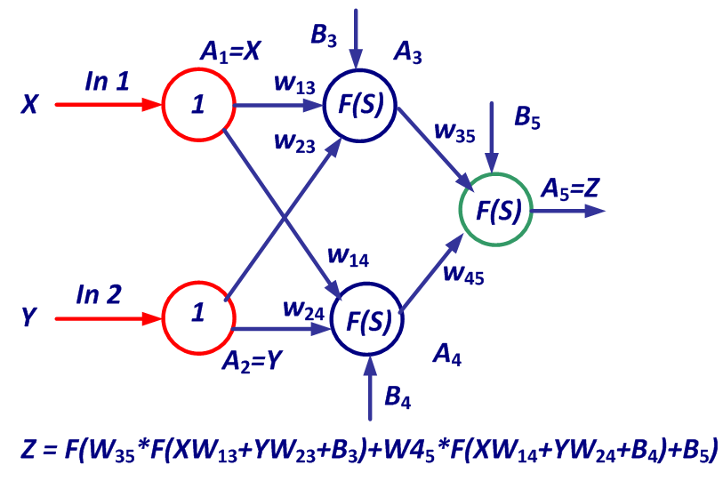
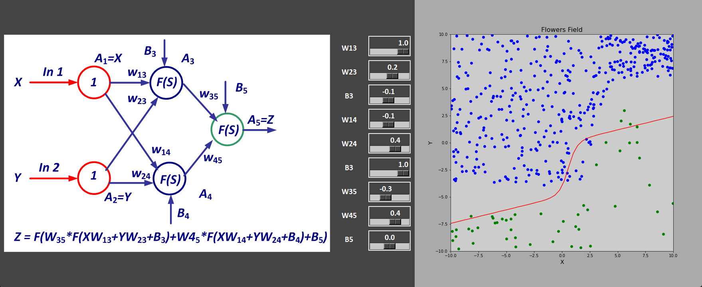

# Модуль 5. Лекція 01. Штучний нейрон

### Приклад найпростішого багатошарового перспетрону.

### 2. Ілюстрація вирішення задачі бінарної класифікації

### Інтерактивне визначення ваг та зміщень

### Нейронна мережа:

​    вхідний шар - два нейрони
​    прихований шар - два нейрони
​    вихідний шар один нейрон

#### 6 ваг (W13, W14, W23,W24,W35, W45)

#### 3 зміщення (B3, B4, B5)

--------------------

### Імпорт бібліотек

Важливо: використовується бібліотека tkinter. Необхідно попередньо встановити import numpy as np
`import matplotlib`
`matplotlib.use('TkAgg')`
`from matplotlib.backends.backend_tkagg import (FigureCanvasTkAgg, NavigationToolbar2Tk)`
`from matplotlib.figure import Figure`
`import tkinter as tk`

### Функції розділу квітів
##### Сінусоідальна функція розділу квітів
`def separate_sin (x, ks, As):`
    `'''`
    `x -  аргумент`
    `ks - коефіцієнт нахилу`
    `As - Амплітуда`
    `'''`
    `return As * np.sin(1.5* x)+ ks * x`

`Asin = 1`
`Ksin = 0.5` 

##### Гіперболічний тангенс функція розділу  квітів
`def separate_th (x, As, Bs):`
    `'''`
    `x - аргумент`
    `Вs - коэффициент зміщення` 
    `As - Амплітуда` 
    `'''`
    `return As * np.tanh(x-Bs)`

`Aht = 5`
`Bht = 3`

### Функції активації
#### Лінійна
`def activation_linear (x):`
    `return (x)`

### Сигмоїда
`def activation_sigmoid (x):`
    `return 1/(1+np.exp(-x))`

### Гіперболічний тангенс
`def activation_tanh (x):`
    `return np.tanh(x)`

### Сігнум
`def activation_signum (x):`
    `return np.sign(x)`

### Двійковий крок
`def activation_step (x):`
    `ans = np.sign(x)`
    `return 0.5*(ans+1.0)`

### CREATE TINTER MAIN ROOT FRAME 
`fgColor = "#fff"`
`cvColor = "#aaa"`
`bgColor = "#444"`

`mainroot = tk.Tk()`
`mainroot.configure(background = bgColor)`
`mainroot.title('Interactive Plot with Tkinter')`
`mainroot.minsize(width = 1000 , height = 700)`

### Label Frame
`frameL = tk.Frame(mainroot, width=5, height=700, padx=5, pady=5, bg = bgColor)`
`frameL.grid(row=0, column=2)`
    
`w13_label = tk.Label(frameL, text='W13', width = 5, height = 1,`
                         `font = ('Calibri Bold', 15), fg = fgColor, bg = bgColor)`
`w13_label.pack(padx=5, pady=15)`
`w23_label = tk.Label(frameL, text='W23', width = 5, height = 1,`
                         `font = ('Calibri Bold', 15), fg = fgColor, bg = bgColor)`
`w23_label.pack(padx=5, pady=15)`
`b3_label = tk.Label(frameL, text='B3', width = 5, height = 1,` 
                        `font = ('Calibri Bold', 15), fg = fgColor, bg = bgColor)`
`b3_label.pack(padx=5, pady=15)`
    
`w14_label = tk.Label(frameL, text='W14', width = 5, height = 1,` 
                         `font = ('Calibri Bold', 15), fg = fgColor, bg = bgColor)`
`w14_label.pack(padx=5, pady=15)`
`w24_label = tk.Label(frameL, text='W24', width = 5, height = 1,`
                         `font = ('Calibri Bold', 15), fg = fgColor, bg = bgColor)`
`w24_label.pack(padx=5, pady=15)`
`b4_label = tk.Label(frameL, text='B3', width = 5, height = 1,` 
                        `font = ('Calibri Bold', 15), fg = fgColor, bg = bgColor)`
`b4_label.pack(padx=5, pady=15)`
    
`w35_label = tk.Label(frameL, text='W35', width = 5, height = 1,`
                         `font = ('Calibri Bold', 15), fg = fgColor, bg = bgColor)`
`w35_label.pack(padx=5, pady=15)`
`w45_label = tk.Label(frameL, text='W45', width = 5, height = 1,`
                         `font = ('Calibri Bold', 15), fg = fgColor, bg = bgColor)`
`w45_label.pack(padx=5, pady=15)`
`b5_label = tk.Label(frameL, text='B5', width = 5, height = 1,`
                        `font = ('Calibri Bold', 15), fg = fgColor, bg = bgColor)`
`b5_label.pack(padx=5, pady=15)`

### Siders  Frame
`frameS = tk.Frame(mainroot, width=100, height=700, padx=5, pady=5, bg = bgColor)`
`frameS.grid(row=0, column=3)`
    
`w13_slider = tk.Scale(frameS, from_=-1, to=+1, resolution=0.1, orient='horizontal',
                        font = ('Calibri Bold', 15), fg = fgColor, bg = bgColor)
w13_slider.pack(padx=5, pady=5)
w13_slider.set(1.0)
w23_slider = tk.Scale(frameS, from_=-1, to=+1, resolution=0.1, orient='horizontal',`
                        `font = ('Calibri Bold', 15), fg = fgColor, bg = bgColor)`
`w23_slider.pack(padx=5, pady=5)`
`w23_slider.set(.2)`
`b3_slider = tk.Scale(frameS, from_=-1, to=+1, resolution=0.1, orient='horizontal',
                        font = ('Calibri Bold', 15), fg = fgColor, bg = bgColor)
b3_slider.pack(padx=5, pady=5)
b3_slider.set(-.1)
    
w14_slider = tk.Scale(frameS, from_=-1, to=+1, resolution=0.1, orient='horizontal',`
                        `font = ('Calibri Bold', 15), fg = fgColor, bg = bgColor)`
`w14_slider.pack(padx=5, pady=5)`
`w14_slider.set(-.1)`
`w24_slider = tk.Scale(frameS, from_=-1, to=+1, resolution=0.1, orient='horizontal',
                        font = ('Calibri Bold', 15), fg = fgColor, bg = bgColor)
w24_slider.pack(padx=5, pady=5)
w24_slider.set(.4)
b4_slider = tk.Scale(frameS, from_=-1, to=+1, resolution=0.1, orient='horizontal',`
                        `font = ('Calibri Bold', 15), fg = fgColor, bg = bgColor)`
`b4_slider.pack(padx=5, pady=5)`
`b4_slider.set(1.0)`
    
`w35_slider = tk.Scale(frameS, from_=-1, to=+1, resolution=0.1, orient='horizontal',
                        font = ('Calibri Bold', 15), fg = fgColor, bg = bgColor)
w35_slider.pack(padx=5, pady=5)
w35_slider.set(-.3)
w45_slider = tk.Scale(frameS, from_=-1, to=+1, resolution=0.1, orient='horizontal',`
                        `font = ('Calibri Bold', 15), fg = fgColor, bg = bgColor)`
`w45_slider.pack(padx=5, pady=5)`
`w45_slider.set(.4)`
`b5_slider = tk.Scale(frameS, from_=-1, to=+1, resolution=0.1, orient='horizontal',`
                        `font = ('Calibri Bold', 15), fg = fgColor, bg = bgColor)`
`b5_slider.pack(padx=5, pady=5)`
`b5_slider.set(.0)`

### PLOT Frame
`fig = Figure(figsize=(10, 10))`
`#fig.patch.set_facecolor('xkcd:gray')|`
`fig.patch.set_facecolor(cvColor)`
`ax = fig.add_subplot(111)`

`canvas1 = FigureCanvasTkAgg(fig, master=mainroot)  # A tk.DrawingArea.`
`canvas1.draw()`
`canvas1.get_tk_widget().grid(row=0, column=4)`

### Відображення мережі
`riss1 = tk.PhotoImage(file = './MLP_Ris_4.png')`

`frameimage = tk.Frame(mainroot, width=300, height=700, padx=5, pady=5, bg = bgColor)`
`frameimage.grid(row=0, column=1)`
`image_label = tk.Label(frameimage, image = riss1)`
`image_label.pack(padx=5, pady=15)`

`NX = 50`
`NY = 50`

`X = np.linspace(-10, 10, NX)`
`Y = np.linspace(-10, 10, NY)`

`N = 400 # Кількість квітів`

### Зелені
`Gx = np.random.uniform(-10, 10, NX)`
`Gy = np.zeros(NX)`

`for i in range(NX):`
    `#Gy[i] = np.random.uniform(-10, separate_line(Gx[i],k,s)-1,1)`
    `#Gy[i] = np.random.uniform(-10, separate_sin(Gx[i],Ksin,Asin)-1,1)`
    `Gy[i] = np.random.uniform(-10, separate_th(Gx[i],Aht, Bht)-1.5, 1)`
`G  = np.column_stack((Gx,Gy))`

### Сині
`Bx = np.random.uniform(-10, 10,N)`
`By = np.zeros(N)`
`for i in range(N):`
    `#By[i] = np.random.uniform(separate_line(Bx[i],k,s)+1,10,1)`
    `#By[i] = np.random.uniform(separate_sin(Bx[i],Ksin,Asin)+1,10,1)`
    `By[i] = np.random.uniform(separate_th(Bx[i],Aht, Bht)+1,10, 1)`
`B = np.column_stack((Bx,By))`

### Інтерактивна візуалізація
def plot(val):
    ax.cla()
      

    W13 = w13_slider.get()
    W23 = w23_slider.get()
    B3  = b3_slider.get()
    W14 = w14_slider.get()
    W24 = w24_slider.get()
    B4  = b4_slider.get()
    W35 = w35_slider.get()
    W45 = w45_slider.get()
    B5  = b5_slider.get()
    
    # Опис нейромережі
    def nn_out (x,y,func):
        A1 = x
        A2 = y 
        A3 = func(A1*W13+A2*W23+B3)
        A4 = func(A1*W14+A2*W24+B4)
        A5 = func(A3*W35+A4*W45+B5)        
        return A5
    
    Xmesh, Ymesh = np.meshgrid(X, Y)
    
    Zmesh = nn_out (Xmesh, Ymesh, activation_tanh)
    
    ax.set_facecolor('0.8')
    
    ax.scatter(G[:,0],G[:,1], c='g')
    ax.scatter(B[:,0],B[:,1], c='b')
    
    ax.contour(Xmesh, Ymesh, Zmesh, levels=[0], colors='r')
    ax.set_title ("Flowers Field", fontsize=16)
    ax.set_ylabel("Y", fontsize=14)
    ax.set_xlabel("X", fontsize=14)
    
    canvas1.draw()

### Звязування події "переміщення" повзунків до функції оновлення графіка

`w13_slider.bind("<Motion>", plot)`
`w23_slider.bind("<Motion>", plot)`
`b3_slider.bind("<Motion>", plot)`
`w14_slider.bind("<Motion>", plot)`
`w24_slider.bind("<Motion>", plot)`
`b4_slider.bind("<Motion>", plot)`
`w35_slider.bind("<Motion>", plot)`
`w45_slider.bind("<Motion>", plot)`
`b5_slider.bind("<Motion>", plot)`

### MAIN LOOP
`mainroot.mainloop()`
`print('NORMAL EXIT')`

