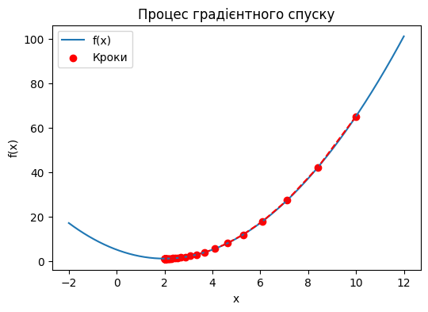
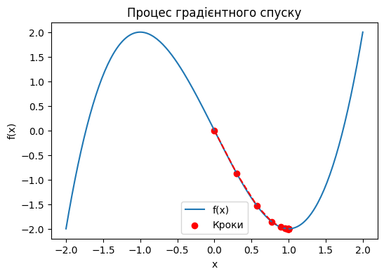

# Модуль 5. Лекція 03. Градієнтний спуск

## Приклад 1. Аналітичне обчислення градієнту. Одновимірний випадок.


```python
import numpy as np
import matplotlib.pyplot as plt
import matplotlib.animation as animation
```

### Функція градієнтного спуску


```python
def gradient_descent(starting_point, learning_rate, max_iterations, tolerance):
    '''
    starting_point - початкове значення X - скаляр
    learning_rate  - швидкість навчання
    max_iterations - максимальан кількість ітерацій
    tolerance  -  максимальне допустиме значення  кроку

    Повертає
    x - знайдене значення аргументу, в якому досягається минимум
    history - покрокові значення X в пороцесі  пошуку
    '''
    x = starting_point
    history = [x]
    for _ in range(max_iterations):
        gradient = df(x)
        new_x = x - learning_rate * gradient
        history.append(new_x)
        if abs(new_x - x) < tolerance:
            break
        x = new_x
        # print(x)  #включаємо, якщо потрібно
    return x, history
```


```python
# Визначення функції, яку потрібно мінімізувати
def f(x):
    return x**2 - 4*x + 5

# Визначення градієнту функції
def df(x):
    return 2*x - 4
```


```python
# Параметри пошуку
starting_point = 10
learning_rate = 0.1
max_iterations = 1000
tolerance = 1e-6

# Виконання градієнтного спуску
minimum, history = gradient_descent(starting_point, learning_rate, max_iterations, tolerance)

print('Кількість шагів', len(history)-1)

# Візуалізація процесу пошукк
x_vals = np.linspace(-2, 12, 400)
y_vals = f(x_vals)

plt.figure(figsize=(6, 4))
plt.plot(x_vals, y_vals, label='f(x)')
plt.scatter(history, [f(x) for x in history], color='red', label='Кроки')
plt.plot(history, [f(x) for x in history], color='red', linestyle='--')
plt.xlabel('x')
plt.ylabel('f(x)')
plt.legend()
plt.title('Процес градієнтного спуску')
plt.show()

```

    Кількість шагів 66
    


    

    


```python
# Виизначення кубічної функції
def f(x):
    return x**3 - 3*x

# Градієнт (похідна)
def df(x):
    return 3*x**2 - 3

# print (df(-1.5))
```


```python
# Параметри
# starting_point = 2 великий крок
starting_point = 0
# starting_point = -1 # немає пошуку
# starting_point = -1.5 # крокує в іншу сторону

learning_rate = 0.1
max_iterations = 1000
tolerance = 1e-6

# Виконання градієнтного спуску
minimum, history = gradient_descent(starting_point, learning_rate, max_iterations, tolerance)
print('Кількість шагів', len(history)-1)

# Візуалізація процесу пошукк
x_vals = np.linspace(-2, 2, 200)
y_vals = f(x_vals)

plt.figure(figsize=(6, 4))
plt.plot(x_vals, y_vals, label='f(x)')
plt.scatter(history, [f(x) for x in history], color='red', label='Кроки')
plt.plot(history, [f(x) for x in history], color='red', linestyle='--')
plt.xlabel('x')
plt.ylabel('f(x)')
plt.legend()
plt.title('Процес градієнтного спуску')
plt.show()

```

    Кількість шагів 18
    


    

    


```python

```
