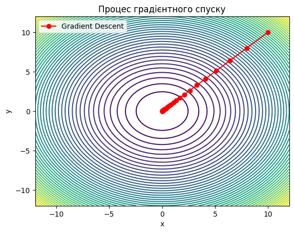

# Модуль 5. Лекція 03. Градієнтний спуск

## Приклад 2. Аналітичне обчислення градієнту. Двовимірний випадок.


```python
import numpy as np
import matplotlib.pyplot as plt
import matplotlib.animation as animation
```

### Функція градієнтного спуску


```python
def gradient_descent(starting_point, learning_rate, max_iterations, tolerance):
    '''
    starting_point - початкове значення X - вектор
    learning_rate  - швидкість навчання
    max_iterations - максимальан кількість ітерацій
    tolerance  -  максимальне допустиме значення  кроку

    Повертає
    x - знайдене значення аргументу, в якому досягається минимум
    history - покрокові значення X в пороцесі  пошуку
    '''
    point = np.array(starting_point)
    history = [point]
    for _ in range(max_iterations):
        gradient = df(point[0], point[1])
        new_point = point - learning_rate * gradient
        history.append(new_point)
        if np.linalg.norm(new_point - point) < tolerance:
            break
        point = new_point
    return point, history
```

МІНІМІЗАЦІЯ ФУНКЦІЇ ДВОХ ЗМІННИХ


```python
# Визначення функції, яку потрібно мінімізувати
def f(x, y):
    return x**2 + y**2

# Визначення градієнту функції
def df(x, y):
    dfdx = 2*x
    dfdy = 2*y
    return np.array([dfdx, dfdy])
```


```python
# Параметри пошуку
starting_point = [10, 10]
learning_rate = 0.1
max_iterations = 1000
tolerance = 1e-6

# Виконання спуску
minimum, history = gradient_descent(starting_point, learning_rate, max_iterations, tolerance)

# Візуалізвція процесу спуску
x_vals = np.linspace(-12, 12, 400)
y_vals = np.linspace(-12, 12, 400)
X, Y = np.meshgrid(x_vals, y_vals)
Z = f(X, Y)

plt.contour(X, Y, Z, levels=50)
history = np.array(history)
plt.plot(history[:, 0], history[:, 1], 'ro-', label='Gradient Descent')
plt.xlabel('x')
plt.ylabel('y')
plt.legend()
plt.title('Процес градієнтного спуску')
plt.show()

```


    

    


```python

```
