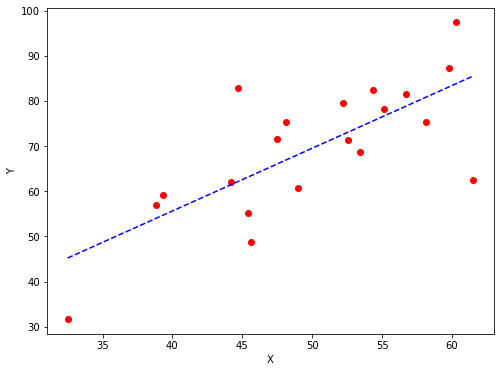
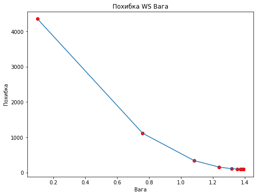

# Модуль 5. Лекція 03. Градієнтний спуск

### Приклад 3.  Вирішення задачі лінійної регресії

###               Y = W*X+B

### Пошук ваги та зміщення за методом градієнтного  спуску

#### Імпорт бібліотек

`import numpy as np`
`import matplotlib.pyplot as plt`

#### Функція похибки (MSE)
    # Calculating the loss or cost
    `def mean_squared_error(y_true, y_predicted):
    	cost = np.sum((y_true-y_predicted)**2) / len(y_true)
    	return cost

#### Функція градієнтного спуску
    def gradient_descent(x, y, iterations = 1000, learning_rate = 0.0001, 
                         tolerance = 1e-6):
    
    	# Ініціалізація
    	current_weight = 0.1  # почакове значення ваги W 
    	current_bias = 0.01 # початкове значення зміщення B 
    	iterations = iterations  # максимальна кількість ітерацій 
    	learning_rate = learning_rate # швідкисть навчання
    	n = float(len(x))  # кілкість зразків (семплів)
      
    	costs = []   # покрокове значення похибки
    	weights = [] # покрокове значення ваги
    	previous_cost = 0.0
      
    	# Пошук оптимадльних параметрівEstimation of optimal parameters 
    	for i in range(iterations):
          
        	# Передбачення для кожного семплу
    	    y_predicted = (current_weight * x) + current_bias
          
        	# Обчислення похибки для кожного семплу
    	    current_cost = mean_squared_error(y, y_predicted)
      
        	# Якщо ЗМІНА похибки меньш за максимальне  допустиме
    	    # СТОП
        	if abs(previous_cost-current_cost) <= tolerance:
            	break
          
       		previous_cost = current_cost
      
    	    costs.append(current_cost)
        	weights.append(current_weight)
              
    	    # Обчислення компонент градієнту
        	weight_derivative = -(2/n) * sum(x * (y-y_predicted))
    	    bias_derivative = -(2/n) * sum(y-y_predicted)
          
        	# Корекція ваги та зміщення
    	    current_weight = current_weight - (learning_rate * weight_derivative)
        	current_bias = current_bias - (learning_rate * bias_derivative)
                  
    	    # Друк
        	print(f"Ітерація {i+1}: Похибка {current_cost: .5f}, Вага \
    		    {current_weight: .3f}, Змішення {current_bias: .3f}")
        
       	# Візуалізація
    	plt.figure(figsize = (8,6))
    	plt.plot(weights, costs)
    	plt.scatter(weights, costs, marker='o', color='red')
    	plt.title("Похибка WS Вага")
    	plt.ylabel("Похибка")
    	plt.xlabel("Вага")
    	plt.show()
      
    	return current_weight, current_bias

​        
### MAIN FUNCTION
​      
​    def main():
​    	# Датасет !!! Тільки одна фіча
​    	X = np.array([32.50234527, 53.42680403, 61.53035803, 47.47563963, 59.81320787,
​        	   55.14218841, 52.21179669, 39.29956669, 48.10504169, 52.55001444,
​    	       45.41973014, 54.35163488, 44.1640495 , 58.16847072, 56.72720806,
​        	   48.95588857, 44.68719623, 60.29732685, 45.61864377, 38.81681754])
​    	Y = np.array([31.70700585, 68.77759598, 62.5623823 , 71.54663223, 87.23092513,
​        	   78.21151827, 79.64197305, 59.17148932, 75.3312423 , 71.30087989,
​    	       55.16567715, 82.47884676, 62.00892325, 75.39287043, 81.43619216,
​        	   60.72360244, 82.89250373, 97.37989686, 48.84715332, 56.87721319])
​      
    	# Пошук рішення
    	estimated_weight, eatimated_bias = gradient_descent(X, Y, iterations=2000)
    	print(f"Знайдена вага: {estimated_weight}\nЗнайдене зміщення Bias: {eatimated_bias}")
      
    	# Обчислюємо передбачені дані за знайденими парметрами
    	Y_pred = estimated_weight*X + eatimated_bias
      
    	# Взуалізація лінійної регресії
    	plt.figure(figsize = (8,6))
    	plt.scatter(X, Y, marker='o', color='red')
    	plt.plot([min(X), max(X)], [min(Y_pred), max(Y_pred)], color='blue',markerfacecolor='red',
             markersize=10,linestyle='dashed')
    	plt.xlabel("X")
    	plt.ylabel("Y")
    	plt.show()

### RUN MAIN FUNCTION
`if `__name__=="__main__":

`
    main()`

### РЕЗУЛЬТАТ

