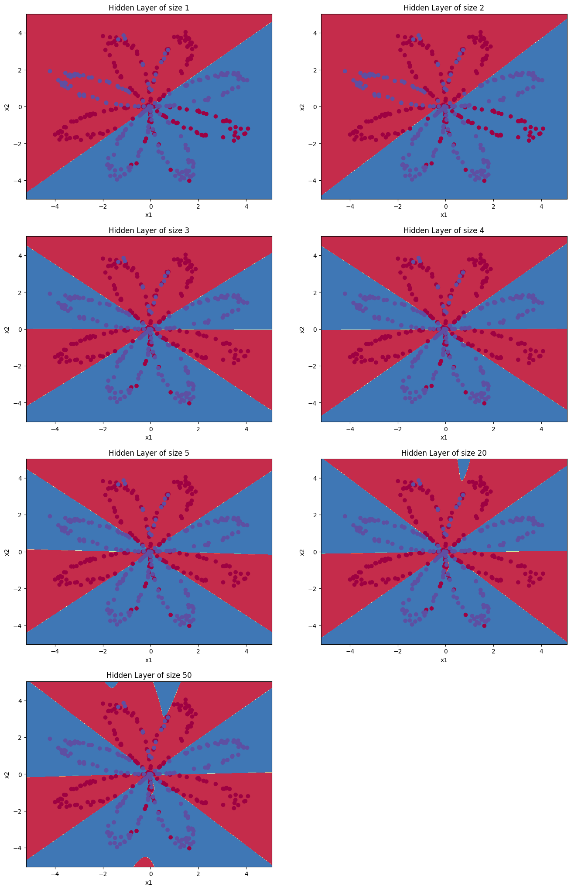

# Модуль 5. Лекція 04. Найпростіша MLP

## Приклад 1. Вирішення задачі бінарної класифікаці за допомогою найпростішої MLP. Градієнтний спуск

[Створено на основі](https://github.com/hussain0048/Deep-Learning/blob/master/Planar_data_classification_with_one_hidden_layer.ipynb)

## Імпорт бібліотек


```python
import numpy as np
np.random.seed(1) # set a seed so that the results are consistent
import matplotlib.pyplot as plt
%matplotlib inline
```


```python
import sklearn.linear_model
from sklearn import datasets
from sklearn.datasets import make_blobs, make_classification, make_gaussian_quantiles
```

### Функція активації - сігмоїд


```python
def sigmoid(x):
    """
    Обчислення сігмоїди від x

    Аргументи:
    x -- скаляр або numpy масив довільного розміру

    Повертає:
    s -- sigmoid(x)
    """
    s = 1/(1+np.exp(-x))
    return s
```

## Створення датасету

### Функція створення датасету


```python
def load_planar_dataset():
    """
    Створення дадасету

    Повертає:
    X -- двовмірний масив координт точок формату (N, D)
    X -- двовмірний масив міток формату (N, 1)
    """
    np.random.seed(1)
    m = 400 # кількість екземплярів
    N = int(m/2) # клькість обєктів на клас
    D = 2 # розмірність
    X = np.zeros((m,D)) # матрицяЮ де кожний рядок - єкземпляр
    Y = np.zeros((m,1), dtype='uint8') # вектор міток (0 для червоних, 1 для синіх)
    a = 4 # максимальна кількість лучів "квітка"

    for j in range(2):
        ix = range(N*j,N*(j+1))
        t = np.linspace(j*3.12,(j+1)*3.12,N) + np.random.randn(N)*0.2 # елементарний кут
        r = a*np.sin(4*t) + np.random.randn(N)*0.2 # радіус
        X[ix] = np.c_[r*np.sin(t), r*np.cos(t)]
        Y[ix] = j

    X = X.T
    Y = Y.T

    return X, Y
```


```python
X, Y = load_planar_dataset()
m = Y.shape[1]  # training set size
print ('N  = %d тренувальних екземплярів!' % (m))

shape_X = X.shape
shape_Y = Y.shape
print ('Формат X : ' + str(shape_X))
print ('Формат Y : ' + str(shape_Y))

```

    N  = 400 тренувальних екземплярів!
    Формат X : (2, 400)
    Формат Y : (1, 400)


### Візуалізація датасету


```python
plt.scatter(X[0, :], X[1, :], c=Y, s=40, cmap=plt.cm.Spectral);
```


​    


## **НЕЙРОННА МЕРЕЖА**

### Використвуємо найпростіший MLP:


- 2 входи
- 1 прихований шар з 4 нейронами
- шар виведення з одним нейроном

**Формально**:
Для кожного екземпляру $x^{(i)}$:
$$s^{[1] (i)} =  W^{[1]} x^{(i)} + b^{[1] (i)}\tag{1}$$
$$a^{[1] (i)} = \tanh(z^{[1] (i)})\tag{2}$$
$$s^{[2] (i)} = W^{[2]} a^{[1] (i)} + b^{[2] (i)}\tag{3}$$
$$\hat{y}^{(i)} = a^{[2] (i)} = \sigma(z^{ [2] (i)})\tag{4}$$
Loss для кожного екземпляру 

$$Loss(i) = y*\log\left(a^{[2] (i)}\right) + (1-y)\log\left(1- a^{[2] (i)}\right)  \small \tag{6}$$

Отримавши передбачення для всіх екземплярів, обчислюємо Cost як:

$$cost = - \frac{1}{m} \sum\limits_{i = 0}^{m} Loss(i) \small \tag{6}$$

Остаточно передбачення  (0 або 1)

$$y^{(i)}_{prediction} = \begin{cases} 1 & \mbox{if } a^{[2](i)} > 0.5 \\ 0 & \mbox{otherwise } \end{cases}\tag{5}$$


**Типовий підхід до побудови моделі:**

- Визначити структуру мережі(№ вхідних ознак, № нейронів в скритому шарі,  № нейронів в вихідному шарі).
- Ініціалізувати параметри (ваги та зміщення) моделі
- Цикл :
  - Виконати пряме розповсюдження. Для кожного екземпляру обчислити Loss.
  - Обчислити Cost .
  - Виконати зворотне розповсюдження для отримання градієнтів.
  - Корегувати ваги та зміщення (gradient descent).

### Визначення розмірів шарів


```python
def layer_sizes(X, Y):
    """
    Аргументи:
    X -- вхідний датасет формату (кількість ознак, кількість екземплярів)
    Y -- labels of shape (кількість виходів, кількість екземплярів)

    Returns:
    n_x -- розмір вхідного шару
    n_h -- розмір прихованого шару
    n_y -- розмір вихідного шару
    """

    n_x = X.shape[0] # розмір вхідного шару
    n_h = 4
    n_y = Y.shape[0] # розмір вихідного шару

    return (n_x, n_h, n_y)
```


```python
(n_x, n_h, n_y) = layer_sizes(X, Y)
print("Розмір вхідного шару   : n_x = " + str(n_x))
print("Розмір прихованого шару: n_h = " + str(n_h))
print("Розмір вихідного шару  : n_y = " + str(n_y))
```

    Розмір вхідного шару   : n_x = 2
    Розмір прихованого шару: n_h = 4
    Розмір вихідного шару  : n_y = 1


### Функція ініціалізації параметрів (ваг та зміщень) моделі (випадкові значення)


```python
def initialize_parameters(n_x, n_h, n_y):
    """
    Аргументи:
    n_x -- розмір вхідного шару
    n_h -- розмір прихованого шару
    n_y -- розмір вихідного шару

    Повертає
    params -- python словник з параметрами:
                    W1 -- матриця ваг формату (n_h, n_x)
                    b1 -- вектор зміщень формату (n_h, 1)
                    W2 -- матриця ваг формату (n_y, n_h)
                    b2 -- вектор зміщень формату (n_y, 1)
    """

    np.random.seed(2)

    W1 = np.random.randn(n_h, n_x) * 0.01
    b1 = np.zeros(shape=(n_h, 1))
    W2 = np.random.randn(n_y, n_h) * 0.01
    b2 = np.zeros(shape=(n_y, 1))


    assert (W1.shape == (n_h, n_x))
    assert (b1.shape == (n_h, 1))
    assert (W2.shape == (n_y, n_h))
    assert (b2.shape == (n_y, 1))

    parameters = {"W1": W1,
                  "b1": b1,
                  "W2": W2,
                  "b2": b2}

    return parameters
```

Початкові значення ваг та зміщень


```python
parameters = initialize_parameters(n_x, n_h, n_y)
print("W1 = " + str(parameters["W1"]))
print("b1 = " + str(parameters["b1"]))
print("W2 = " + str(parameters["W2"]))
print("b2 = " + str(parameters["b2"]))
```

    W1 = [[-0.00416758 -0.00056267]
     [-0.02136196  0.01640271]
     [-0.01793436 -0.00841747]
     [ 0.00502881 -0.01245288]]
    b1 = [[0.]
     [0.]
     [0.]
     [0.]]
    W2 = [[-0.01057952 -0.00909008  0.00551454  0.02292208]]
    b2 = [[0.]]


### Головний цикл


#### Пряме розповсюдження


```python
def forward_propagation(X, parameters):
    """
    Argument:
    X -- матриця вхідних даних розміром  (n_x, m)
    parameters -- python словник, з параметрами (вихід функції ініціалізації)

    Повертає:
    A2 -- Вихід функції активації вихідного шару (сігмоїда)
    cache -- словник, що містить "S1", "A1", "S2" and "A2"
    """

    # Отримання парамметрів мережі з словника
    W1 = parameters['W1']
    b1 = parameters['b1']
    W2 = parameters['W2']
    b2 = parameters['b2']


    # Реалізація прямого розповсюдження для обчислення A2 (ймовірність)

    S1 = np.dot(W1, X) + b1
    A1 = np.tanh(S1)
    S2 = np.dot(W2, A1) + b2
    A2 = sigmoid(S2)


    assert(A2.shape == (1, X.shape[1]))

    cache = {"S1": S1,
             "A1": A1,
             "S2": S2,
             "A2": A2}

    return A2, cache
```

Виклик прямого розповсюдження


```python
# Тільки для перевірки
A2, cache = forward_propagation(X, parameters)
print(np.mean(cache['S1']), np.mean(cache['A1']), np.mean(cache['S2']), np.mean(cache['A2']))
```

    0.0003302739109308174 0.0003297369555060898 -4.356925794513689e-05 0.49998910768597105


### Функція вартості (COST)


```python
def compute_cost(A2, Y, parameters):
    """
    Обчислює перехресну ентропійну вартість для заданих параметрів нейромережі

    Аргументи:
    A2 -- Сигмоїдний вихід , формат (1, кількість екземплярів)
    Y --  Вектор форми "справжніх" міток (1, кількість екземплярів)
    parameters -- python словник , що містить параметри W1, b1, W2 і b2

    Повертає:
    cost -- крос-ентропійна вартість
    """

    m = Y.shape[1] # кількість екземплярів

    # Отримання W1 , W2 з параметрів

    W1 = parameters['W1']
    W2 = parameters['W2']


    # Обчсленнчя вартості (cross-entropy cost)

    logprobs = np.multiply(np.log(A2), Y) + np.multiply((1 - Y), np.log(1 - A2))
    cost = - np.sum(logprobs) / m


    cost = np.squeeze(cost)     # отримання скаляру з матриці
                                # [[17]] --> 17
    assert(isinstance(cost, float))

    return cost
```


```python
# Тільки для перевірки
print("cost = " + str(compute_cost(A2, Y, parameters)))
```

    cost = 0.6930480201239823


### Зворотнє розповсюдження


```python
def backward_propagation(parameters, cache, X, Y):
    """
    Виконує зворотне розповсюдження

    Аргументи:
    parameters-- словник python, що містить параметри
    cache -- словник, що містить "Z1", "A1", "Z2" і "A2".
    X -- вхідні дані формату (2, кількість прикладів)
    Y -- вектор  "справжніх" міток формату (1, кількість прикладів)

    Повертає:
    grads -- словник python, що містить градієнти щодо різних параметрів

    """
    m = X.shape[1]

    # Отримуємо  W1 , W2 з словника "parameters".
    W1 = parameters['W1']
    W2 = parameters['W2']

    # Отримуємо A1 , A2 з словника "cache".
    A1 = cache['A1']
    A2 = cache['A2']

    # Очислюємо похідні dW1, db1, dW2, db2.
    dS2= A2 - Y
    dW2 = (1 / m) * np.dot(dS2, A1.T)
    db2 = (1 / m) * np.sum(dS2, axis=1, keepdims=True)
    dS1 = np.multiply(np.dot(W2.T, dS2), 1 - np.power(A1, 2))
    dW1 = (1 / m) * np.dot(dS1, X.T)
    db1 = (1 / m) * np.sum(dS1, axis=1, keepdims=True)


    # Формуємо словик з компонентами градієнту
    grads = {"dW1": dW1,
             "db1": db1,
             "dW2": dW2,
             "db2": db2}

    return grads
```


```python
# Тільки для перевірки
grads = backward_propagation(parameters, cache, X, Y)
print ("dW1 = "+ str(grads["dW1"]))
print ("db1 = "+ str(grads["db1"]))
print ("dW2 = "+ str(grads["dW2"]))
print ("db2 = "+ str(grads["db2"]))
```

    dW1 = [[ 0.00023606 -0.00207914]
     [ 0.0002091  -0.00178201]
     [-0.00012051  0.0010843 ]
     [-0.00051496  0.00449162]]
    db1 = [[ 1.06848030e-07]
     [-9.70907252e-07]
     [-7.20012658e-08]
     [ 3.03048452e-07]]
    dW2 = [[-1.75478714e-05  3.70240274e-03 -1.25686736e-03 -2.55725650e-03]]
    db2 = [[-1.0892314e-05]]


### Градієнтний спуск


```python
def update_parameters(parameters, grads, learning_rate=1.2):
    """
    Updates parameters using the gradient descent update rule given above

    Arguments:
    parameters -- python dictionary containing your parameters
    grads -- python dictionary containing your gradients

    Returns:
    parameters -- python dictionary containing your updated parameters

    Оновлює параметри за допомогою градієнтного спуску

    Аргументи:
    parameters-- словник python, що містить параметри
    cache -- словник, що містить "Z1", "A1", "Z2" і "A2"

    Повертає:
    parameters -- словник python, що містить оновлені параметри
    """


    # Отримання кожного параметру з словника "parameters"
    W1 = parameters['W1']
    b1 = parameters['b1']
    W2 = parameters['W2']
    b2 = parameters['b2']


    # Отримання компонент градієнта  з словника "grads"
    dW1 = grads['dW1']
    db1 = grads['db1']
    dW2 = grads['dW2']
    db2 = grads['db2']

    # Оновлення кожного пармаметру
    W1 = W1 - learning_rate * dW1
    b1 = b1 - learning_rate * db1
    W2 = W2 - learning_rate * dW2
    b2 = b2 - learning_rate * db2

    parameters = {"W1": W1,
                  "b1": b1,
                  "W2": W2,
                  "b2": b2}

    return parameters
```


```python
# Тільки для перевірки
parameters = update_parameters(parameters, grads)

print("W1 = " + str(parameters["W1"]))
print("b1 = " + str(parameters["b1"]))
print("W2 = " + str(parameters["W2"]))
print("b2 = " + str(parameters["b2"]))
```

    W1 = [[-0.00473412  0.00442726]
     [-0.02186379  0.02067952]
     [-0.01764513 -0.0110198 ]
     [ 0.00626471 -0.02323276]]
    b1 = [[-2.56435273e-07]
     [ 2.33017741e-06]
     [ 1.72803038e-07]
     [-7.27316285e-07]]
    W2 = [[-0.01053741 -0.01797584  0.00853102  0.0290595 ]]
    b2 = [[2.61415537e-05]]


### Створення моделі нейроннної мережі


```python
def nn_model(X, Y, n_h, num_iterations=10000, print_cost=False):
    """

    Аргументи:
    X -- набір даних форми (2, кількість прикладів)
    Y -- мітки форми (1, кількість прикладів)
    n_h -- розмір прихованого шару
    num_iterations -- кількість ітерацій у циклі градієнтного спуску
    print_cost -- якщо True, друкувати вартість кожні 1000 ітерацій

    Повертає:
    parameters  -- параметри, отримані моделлю.
    Далі їх можна використовувати для прогнозування.
    """

    np.random.seed(3)
    n_x = layer_sizes(X, Y)[0]
    n_y = layer_sizes(X, Y)[2]

    # Ініціалізація параметрів
    parameters = initialize_parameters(n_x, n_h, n_y)
    W1 = parameters['W1']
    b1 = parameters['b1']
    W2 = parameters['W2']
    b2 = parameters['b2']


    # Цикл градієнтного спуску
    for i in range(0, num_iterations):


        # Пряме розповсюдження
        A2, cache = forward_propagation(X, parameters)

        # Оцислення вартості
        cost = compute_cost(A2, Y, parameters)

        # Обратне розповсюдження
        grads = backward_propagation(parameters, cache, X, Y)

        # Оновлення параметрів
        parameters = update_parameters(parameters, grads)

        # Друкуємо вартість кожні 1000 ітерацій
        if print_cost and i % 1000 == 0:
            print ("Вартість на ітерації %i: %f" % (i, cost))

    return parameters
```

### Навачання


```python
parameters = nn_model(X, Y, 4, num_iterations=10000, print_cost=False)
print("W1 = " + str(parameters["W1"]))
print("b1 = " + str(parameters["b1"]))
print("W2 = " + str(parameters["W2"]))
print("b2 = " + str(parameters["b2"]))
```

    W1 = [[  0.14735362  -9.6839056 ]
     [-11.1335851    3.33842056]
     [-11.46604461 -13.41882727]
     [  9.25218562 -10.20052992]]
    b1 = [[-0.09928767]
     [-0.39066659]
     [-0.03587536]
     [ 0.0919242 ]]
    W2 = [[-11.98561392   3.44472192   6.15439588  10.52264108]]
    b2 = [[-0.05271915]]

### Функція передбачення / прогнозування - використовуємо пряме розповсюдження


```python
def predict(parameters, X):
    """
    Використовуючи отримані параметри, прогнозує клас для кожного прикладу в X

    Аргументи:
    параметри -- словник python, що містить ваші параметри
    X -- вхідні дані форми (n_x, м)

    Повертає
    predictions -- вектор передбачень навчаної моделі (червоний: 0 / синій: 1)
    """

    # Обчислює ймовірності за допомогою прямого розповсюдження та
    # класифікує до 0/1, використовуючи 0,5 як порогове значення.

    A2, cache = forward_propagation(X, parameters)
    predictions = np.round(A2)

    return predictions
```

Передбачення (прогнозування)


```python
predictions = predict(parameters, X)
print("predictions mean = " + str(np.mean(predictions)))
```

    predictions mean = 0.52


### Оцінка


```python
# Будуємо модель з n_h-вимірним прихованим шаром
parameters = nn_model(X, Y, n_h = 4, num_iterations=10000, print_cost=True)
```

    Вартість на ітерації 0: 0.693048
    Вартість на ітерації 1000: 0.288083
    Вартість на ітерації 2000: 0.254385
    Вартість на ітерації 3000: 0.233864
    Вартість на ітерації 4000: 0.226792
    Вартість на ітерації 5000: 0.222644
    Вартість на ітерації 6000: 0.219731
    Вартість на ітерації 7000: 0.217504
    Вартість на ітерації 8000: 0.219663
    Вартість на ітерації 9000: 0.218664

## Функція відображення розподілу класів


```python
def plot_decision_boundary(model, X, y):
    # Set min and max values and give it some padding
    x_min, x_max = X[0, :].min() - 1, X[0, :].max() + 1
    y_min, y_max = X[1, :].min() - 1, X[1, :].max() + 1
    h = 0.01
    # Generate a grid of points with distance h between them
    xx, yy = np.meshgrid(np.arange(x_min, x_max, h), np.arange(y_min, y_max, h))
    # Predict the function value for the whole grid
    Z = model(np.c_[xx.ravel(), yy.ravel()])
    Z = Z.reshape(xx.shape)
    # Plot the contour and training examples
    plt.contourf(xx, yy, Z, cmap=plt.cm.Spectral)
    plt.ylabel('x2')
    plt.xlabel('x1')
    plt.scatter(X[0, :], X[1, :], c=y, cmap=plt.cm.Spectral)
```


```python
# Plot the decision boundary
plot_decision_boundary(lambda x: predict(parameters, x.T), X, Y)
plt.title("Границя рішення для прихованого шару розміром  " + str(4))
```


    Text(0.5, 1.0, 'Границя рішення для прихованого шару розміром  4')


​    

​    


```python
# Оцінка точності
predictions = predict(parameters, X)
print ('Accuracy: %d' % float((np.dot(Y, predictions.T) + np.dot(1 - Y, 1 - predictions.T)) / float(Y.size) * 100) + '%')
```

    Accuracy: 90%


### Оцінка моделі для різних розмірів прихованого шару


```python
plt.figure(figsize=(16, 32))
hidden_layer_sizes = [1, 2, 3, 4, 5, 20, 50]
for i, n_h in enumerate(hidden_layer_sizes):
    plt.subplot(5, 2, i + 1)
    plt.title('Hidden Layer of size %d' % n_h)
    parameters = nn_model(X, Y, n_h, num_iterations=5000)
    plot_decision_boundary(lambda x: predict(parameters, x.T), X, Y)
    predictions = predict(parameters, X)
    accuracy = float((np.dot(Y, predictions.T) + np.dot(1 - Y, 1 - predictions.T)) / float(Y.size) * 100)
    print ("Accuracy для {} прихованих нейронів: {} %".format(n_h, accuracy))
```


    Accuracy для 1 прихованих нейронів: 67.5 %
    Accuracy для 2 прихованих нейронів: 67.25 %
    Accuracy для 3 прихованих нейронів: 90.75 %
    Accuracy для 4 прихованих нейронів: 90.5 %
    Accuracy для 5 прихованих нейронів: 91.25 %
    Accuracy для 20 прихованих нейронів: 90.5 %
    Accuracy для 50 прихованих нейронів: 90.75 %



    


```python

```


```python

```
