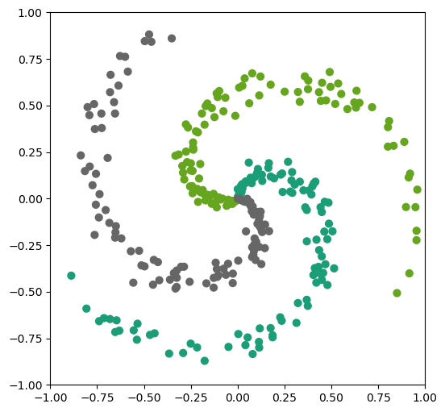
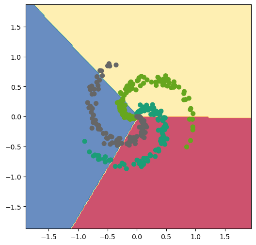
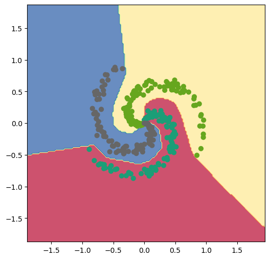

# Модуль 5. Лекція 04. Найпростіша MLP

## Приклад 2. Вирішення задачі багатокласової класифікаці

2.1. Звичайний лінійний класифікатор

2.2. Класифікатор на основі MLP

[Створено на основі](https://cs231n.github.io/neural-networks-case-study/)

## Імпорт бібліотек


```python
import numpy as np
import matplotlib.pyplot as plt

%matplotlib inline
plt.rcParams['figure.figsize'] = (6.0, 6.0) # розмір графиків за замовчуванням
plt.rcParams['image.interpolation'] = 'nearest'
plt.rcParams['image.cmap'] = 'gray'

# для авто-перезавантаження зовнішніх модулів
# Дивись http://stackoverflow.com/questions/1907993/autoreload-of-modules-in-ipython
%load_ext autoreload
%autoreload 2
```

    The autoreload extension is already loaded. To reload it, use:
      %reload_ext autoreload


## Створення датасету


```python
np.random.seed(0)
N = 100 # кількість екземплярів (обєктів, семпілв) на один клас
D = 2 # розмірнисть ознак
K = 3 # кількість класів

X = np.zeros((N*K,D))
y = np.zeros(N*K, dtype='uint8')

for j in range(K):
  ix = range(N*j,N*(j+1))
  r = np.linspace(0.0,1,N) # radius
  t = np.linspace(j*4,(j+1)*4,N) + np.random.randn(N)*0.2 # theta
  X[ix] = np.c_[r*np.sin(t), r*np.cos(t)]
  y[ix] = j

```

### Візуалізація датасету


```python
fig = plt.figure()
# plt.scatter(X[:, 0], X[:, 1], c=y, s=40, cmap=plt.cm.Spectral)
plt.scatter(X[:, 0], X[:, 1], c=y, s=40, cmap=plt.cm.Dark2)
plt.xlim([-1,1])
plt.ylim([-1,1])

```


    (-1.0, 1.0)


​    

​    


## 2.1.Простий лінійний класіфікатор

### Ініціалізації параметрів (ваг та зміщень) моделі (випадкові значення)


```python
W = 0.01 * np.random.randn(D,K)
b = np.zeros((1,K))
```

### Визначення гіперпараметрів


```python
step_size = 1e-0
reg = 1e-3 # regularization strength
```

### Цикл градієнтного спуску


```python
num_examples = X.shape[0]
for i in range(200): # 200 кроків спуску

  # оцінка балів належності класу, форма [N x K]
  scores = np.dot(X, W) + b

  # ненормалізована ймовірність належності до класу
  exp_scores = np.exp(scores)
  # нормалізована ймовірність належності до класу
  probs = exp_scores / np.sum(exp_scores, axis=1, keepdims=True) # [N x K]

  # обчислення похибки (середня крос-ентропія)
  corect_logprobs = -np.log(probs[range(num_examples),y])
  data_loss = np.sum(corect_logprobs)/num_examples
  # регулярізвція
  reg_loss = 0.5*reg*np.sum(W*W)
  # втрати
  cost = data_loss + reg_loss

  if i % 10 == 0:
    print ("iteration %d: loss %f" % (i, cost))

  # обчислення градієнтів
  dscores = probs
  dscores[range(num_examples),y] -= 1
  dscores /= num_examples

  # зворотне розповсюдження компонентів градієнту відносно (W,b)
  dW = np.dot(X.T, dscores)
  db = np.sum(dscores, axis=0, keepdims=True)

  # регулярізація градієнту
  dW += reg*W

  # Оновлення параметрів мережі
  W += -step_size * dW
  b += -step_size * db
```

    iteration 0: loss 1.096919
    iteration 10: loss 0.917310
    iteration 20: loss 0.851535
    iteration 30: loss 0.822352
    iteration 40: loss 0.807594
    iteration 50: loss 0.799452
    iteration 60: loss 0.794683
    iteration 70: loss 0.791765
    iteration 80: loss 0.789921
    iteration 90: loss 0.788726
    iteration 100: loss 0.787937
    iteration 110: loss 0.787408
    iteration 120: loss 0.787049
    iteration 130: loss 0.786803
    iteration 140: loss 0.786633
    iteration 150: loss 0.786514
    iteration 160: loss 0.786431
    iteration 170: loss 0.786373
    iteration 180: loss 0.786331
    iteration 190: loss 0.786302


### Оцінка точності навчання


```python
scores = np.dot(X, W) + b
predicted_class = np.argmax(scores, axis=1)
print ('Точність навчання: %.2f' %(np.mean(predicted_class == y)))
```

    Точність навчання: 0.49


### Відображення отриманих границь розподілу класів


```python
h = 0.02
x_min, x_max = X[:, 0].min() - 1, X[:, 0].max() + 1
y_min, y_max = X[:, 1].min() - 1, X[:, 1].max() + 1
xx, yy = np.meshgrid(np.arange(x_min, x_max, h),
                     np.arange(y_min, y_max, h))
Z = np.dot(np.c_[xx.ravel(), yy.ravel()], W) + b
Z = np.argmax(Z, axis=1)
Z = Z.reshape(xx.shape)
fig = plt.figure()
plt.contourf(xx, yy, Z, cmap=plt.cm.Spectral, alpha=0.8)
plt.scatter(X[:, 0], X[:, 1], c=y, s=40, cmap=plt.cm.Dark2)
plt.xlim(xx.min(), xx.max())
plt.ylim(yy.min(), yy.max())
#fig.savefig('spiral_linear.png')
```


    (-1.8712034092398278, 1.8687965907601756)


​    

​    


## 2.2. MLP

### Ініціалізації параметрів моделі: ваг та зміщень та гіперпараметрів


```python
h = 100 # кількість нейронів у прихованому шарі
W = 0.01 * np.random.randn(D,h)
b = np.zeros((1,h))
# вихідний шар - K нейронів
W2 = 0.01 * np.random.randn(h,K)
b2 = np.zeros((1,K))
```


```python
# гіперпарамтери
step_size = 1e-0
reg = 1e-3 # параметр регуляризації
```

### Цикл навчання


```python
num_examples = X.shape[0]
for i in range(10000):

  # вихід нейронів прихованого шару. !!! Функція активації ReLU
  hidden_layer = np.maximum(0, np.dot(X, W) + b)
  # вихід  нейронів вихідного шару# evaluate class scores, [N x K]
  scores = np.dot(hidden_layer, W2) + b2

  #
  exp_scores = np.exp(scores)
  probs = exp_scores / np.sum(exp_scores, axis=1, keepdims=True) # [N x K]

  # compute the loss: average cross-entropy loss and regularization
  correct_logprobs = -np.log(probs[range(num_examples),y])
  data_loss = np.sum(correct_logprobs)/num_examples
  reg_loss = 0.5*reg*np.sum(W*W) + 0.5*reg*np.sum(W2*W2)
  loss = data_loss + reg_loss
  if i % 1000 == 0:
    print ("iteration %d: loss %f" % (i, loss))

  # compute the gradient on scores
  dscores = probs
  dscores[range(num_examples),y] -= 1
  dscores /= num_examples

  # Зворотне розповюдження градєнту
  # Спочатку розповсюджуємо на  W2 та b2
  dW2 = np.dot(hidden_layer.T, dscores)
  db2 = np.sum(dscores, axis=0, keepdims=True)

  # Зворотне розповюдження на нейрони прихованого шару
  dhidden = np.dot(dscores, W2.T)
  # Урахування ReLU
  dhidden[hidden_layer <= 0] = 0

  # Зворотне розповюдження на W,b
  dW = np.dot(X.T, dhidden)
  db = np.sum(dhidden, axis=0, keepdims=True)

  # Регуляризація градиєнтів
  dW2 += reg * W2
  dW += reg * W

  # Оноволення параметрів мережі
  W += -step_size * dW
  b += -step_size * db
  W2 += -step_size * dW2
  b2 += -step_size * db2
```

    iteration 0: loss 1.098637
    iteration 1000: loss 0.294416
    iteration 2000: loss 0.266441
    iteration 3000: loss 0.251507
    iteration 4000: loss 0.248295
    iteration 5000: loss 0.247107
    iteration 6000: loss 0.246426
    iteration 7000: loss 0.245960
    iteration 8000: loss 0.245350
    iteration 9000: loss 0.244927


### Оцінка точності навчання


```python
hidden_layer = np.maximum(0, np.dot(X, W) + b)
scores = np.dot(hidden_layer, W2) + b2
predicted_class = np.argmax(scores, axis=1)
print ('Точність навчання: %.2f' % (np.mean(predicted_class == y)))
```

    Точність навчання: 0.98


### Відображення отриманих границь розподілу класів


```python
h = 0.02
x_min, x_max = X[:, 0].min() - 1, X[:, 0].max() + 1
y_min, y_max = X[:, 1].min() - 1, X[:, 1].max() + 1
xx, yy = np.meshgrid(np.arange(x_min, x_max, h),
                     np.arange(y_min, y_max, h))
Z = np.dot(np.maximum(0, np.dot(np.c_[xx.ravel(), yy.ravel()], W) + b), W2) + b2
Z = np.argmax(Z, axis=1)
Z = Z.reshape(xx.shape)
fig = plt.figure()
plt.contourf(xx, yy, Z, cmap=plt.cm.Spectral, alpha=0.8)
plt.scatter(X[:, 0], X[:, 1], c=y, s=40, cmap=plt.cm.Dark2)
plt.xlim(xx.min(), xx.max())
plt.ylim(yy.min(), yy.max())
#fig.savefig('spiral_net.png')
```


    (-1.8712034092398278, 1.8687965907601756)


​    

​    

ПОРІВНЯЙТЕ

- лінійний класифікатор   - точність 49%
- нейронна мережа  - точність 98%
