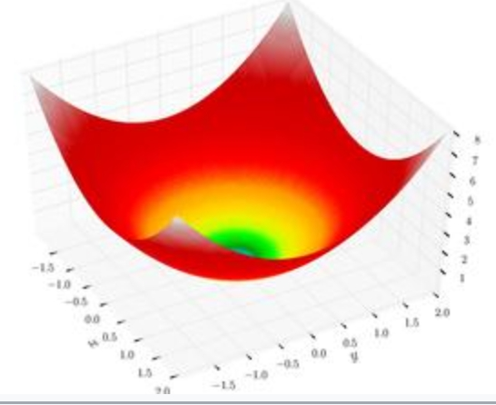

# Модуль 7. TensorFlow
## Лекція 04. Приклад 1. Градієнтний спуск

Завдання мінімізації функції (СФЕРА)

$ y=\sum_{i=0}^{m-1} x_i^2$

Точне рішення $ y=0, x_i=0$




```python
import tensorflow as tf
from pprint import pprint
```


```python
print(tf.executing_eagerly())
```

    True


```python
x1 = tf.Variable(10.0,name="x1")
x2 = tf.Variable(10.0,name="x2")
```


```python
print('x1=', x1.numpy())
print('x2=', x2.numpy())
```

    x1= 10.0
    x2= 10.0


```python
learnig_rate = .1
```

### Функція


```python
def test_function (a, b):
  y = a * a + b * b
  return y
```

### Step By Step


```python
for step in range (3):
  with tf.GradientTape(watch_accessed_variables=True, persistent=True) as gfunc:
    gfunc.watch([x1, x2])
    yout = test_function(x1, x2)

  print ('Iterarion', step)
  print('X', x1.numpy(), x2.numpy())
  print('Y', test_function(x1, x2).numpy())
  gx1 , gx2 = gfunc.gradient(target=yout, sources=[x1, x2])
  print ('Grad', gx1.numpy(), gx2.numpy())
  dx1 = -learnig_rate*gx1
  dx2 = -learnig_rate*gx2
  print('Discent', dx1.numpy(), dx2.numpy())
  x1.assign_add(dx1)
  x2.assign_add(dx2)


```

    Iterarion 0
    X 10.0 10.0
    Y 200.0
    Grad 20.0 20.0
    Discent -2.0 -2.0
    Iterarion 1
    X 8.0 8.0
    Y 128.0
    Grad 16.0 16.0
    Discent -1.6 -1.6
    Iterarion 2
    X 6.4 6.4
    Y 81.920006
    Grad 12.8 12.8
    Discent -1.2800001 -1.2800001


### Loop


```python
x1 = tf.Variable(10.0,name="x1")
x2 = tf.Variable(10.0,name="x2")
```


```python
for step in range (100):
  with tf.GradientTape(watch_accessed_variables=True, persistent=True) as gfunc:
    gfunc.watch([x1, x2])
    yout = test_function(x1, x2)

  gx1 , gx2 = gfunc.gradient(target=yout, sources=[x1, x2])
  dx1 = -learnig_rate*gx1
  dx2 = -learnig_rate*gx2
  x1.assign_add(dx1)
  x2.assign_add(dx2)
  if step % 10 == 0:
    print('Iterarion', step)
    print('X', x1.numpy(), x2.numpy())
    print('Y', test_function(x1, x2).numpy())
  if test_function(x1, x2) < 0.0001:
    print('Iterarion', step)
    print('X', x1.numpy(), x2.numpy())
    print('Y', test_function(x1, x2).numpy())
    break

```

    Iterarion 0
    X 8.0 8.0
    Y 128.0
    Iterarion 10
    X 0.85899335 0.85899335
    Y 1.4757391
    Iterarion 20
    X 0.09223372 0.09223372
    Y 0.017014118
    Iterarion 30
    X 0.00990352 0.00990352
    Y 0.00019615942
    Iterarion 32
    X 0.0063382527 0.0063382527
    Y 8.0346894e-05


### Багатовимірний випадок


```python
X = tf.Variable(tf.random.normal([100], 0, 30, tf.float32),name="X")
print(X.shape)
# print(X.numpy())
```

    (100,)


```python
learn_rate = tf.constant(0.1)
print(learn_rate.shape)
print(learn_rate.numpy())
```

    ()
    0.1


### функція ВТРАТ


```python
def Loss_func (X):
  Y_loss = tf.reduce_sum(tf.pow(X,2))
  return Y_loss
```


```python
print(Loss_func(X).numpy())
```

    73252.62


```python
for step in range (100):
  with tf.GradientTape(watch_accessed_variables=True, persistent=True) as gfunc:
    gfunc.watch(X)
    yout = Loss_func(X)

  G = gfunc.gradient(target=yout, sources=[X])
  # print(G)
  # print(G.numpy())
  dX = G * learn_rate
  #print(dX)
  X.assign_sub(dX[0])
  if step % 10 == 0:
    print('Iterarion', step)
    # print('X', X.numpy())
    print('Y', Loss_func(X).numpy())
  if Loss_func(X) < 0.0001:
    print('Iterarion', step)
    # print('X', X.numpy())
    print('Y', Loss_func(X).numpy())
    break

```

    Iterarion 0
    Y 46881.67
    Iterarion 10
    Y 540.50885
    Iterarion 20
    Y 6.2316437
    Iterarion 30
    Y 0.07184596
    Iterarion 40
    Y 0.0008283275
    Iterarion 45
    Y 8.894099e-05


```python

```
