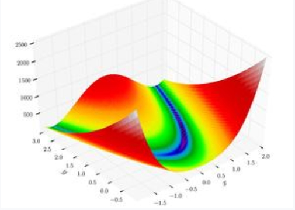

# Модуль 7. TensorFlow
## Лекція 04. Приклад 2. Градієнтний спуск /  Функція Розенброка

Завдання мінімізації функції (Розенброк) 2-і змінних

$ z = 100(y-x^2)^2+ (1-x)^2$

Точне рішення $ z=0, x=1, y = 1 $




```python
import tensorflow as tf
from pprint import pprint
```


```python
print(tf.executing_eagerly())
```

    True


```python
x = tf.Variable(2.0,name="x")
y = tf.Variable(2.0,name="y")
```


```python
print('x=', x.numpy())
print('y=', y.numpy())
```

    x= 2.0
    y= 2.0


```python
learnig_rate = .002
```

### Функція Розенброка


```python
def test_function (a, b):
  y = 100*(a - b*b)*(a - b*b)+(a - 1)*(a - 1)
  return y
```


```python
print(test_function(1,1))
print(test_function(x,y))
```

    0
    tf.Tensor(0.19897306, shape=(), dtype=float32)


### Loop


```python
for step in range (200):
  with tf.GradientTape(watch_accessed_variables=True, persistent=True) as gfunc:
    gfunc.watch([x, y])
    yout = test_function(x, y)

  gx , gy = gfunc.gradient(target=yout, sources=[x, y])
  dx = -learnig_rate*gx
  dy = -learnig_rate*gy
  x.assign_add(dx)
  y.assign_add(dy)

  if step % 20 == 0:
    print('Iterarion', step)
    print('x, y', x.numpy(), y.numpy())
    print('grad', gx.numpy(), gy.numpy())
    print('z', test_function(x, y).numpy())
  if test_function(x, y) < 0.0001:
    print('Iterarion', step)
    print('x, y', x.numpy(), y.numpy())
    print('z', test_function(x, y).numpy())
    break

```

    Iterarion 0
    x, y 0.9648712 0.9822426
    grad -0.05560267 -0.029224534
    z 0.0012345312
    Iterarion 20
    x, y 0.96703684 0.98334616
    grad -0.052391052 -0.027030367
    z 0.001087021
    Iterarion 40
    x, y 0.9690697 0.98438114
    grad -0.04929042 -0.025134524
    z 0.0009570852
    Iterarion 60
    x, y 0.97097796 0.985352
    grad -0.046272516 -0.023561973
    z 0.00084263185
    Iterarion 80
    x, y 0.97276914 0.9862623
    grad -0.043441772 -0.022078963
    z 0.0007418309
    Iterarion 100
    x, y 0.9744504 0.9871161
    grad -0.040771842 -0.02070965
    z 0.0006530542
    Iterarion 120
    x, y 0.97602844 0.98791677
    grad -0.038261414 -0.019431097
    z 0.00057487446
    Iterarion 140
    x, y 0.97750956 0.9886676
    grad -0.035933614 -0.018173091
    z 0.0005060306
    Iterarion 160
    x, y 0.9788995 0.9893716
    grad -0.03377688 -0.016935933
    z 0.00044541978
    Iterarion 180
    x, y 0.9802037 0.99003184
    grad -0.031696677 -0.015885117
    z 0.0003920592


```python

```
