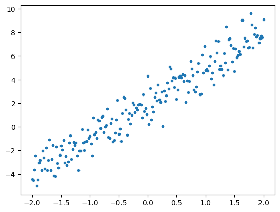
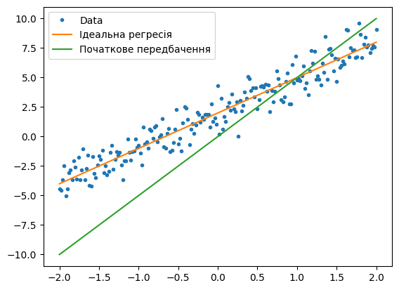
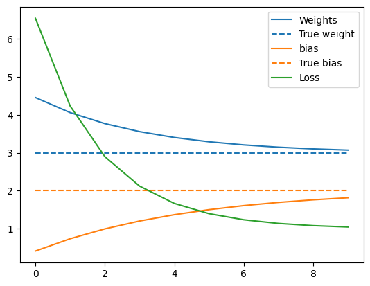
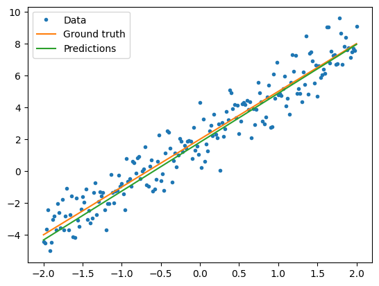

# Модуль 7. TensorFlow
## Лекція 05. Приклад 1. Базовий цикл тренування моделі засобами TensorFlow.

Проста лінійна регресія

Дивись також [Basic training loops](https://www.tensorflow.org/guide/basic_training_loops)

Завантаження бібліотек


```python
import tensorflow as tf
from pprint import pprint
print(tf.__version__)
print(tf.executing_eagerly())
```

    2.15.0
    True


```python
import matplotlib.pyplot as plt
colors = plt.rcParams['axes.prop_cycle'].by_key()['color']
import numpy as np
```

### Типовий процес розв’язування задач машинного навчання

Вирішення проблеми машинного навчання зазвичай складається з наступних кроків:
- Отримати навчальні дані.
- Додати визначення моделі.
- Додати визначення функції втрат.
- Перебрати дані навчання, обчисливши втрати (Loss) від ідеального значення
- Обчислити градієнти для втрати та, за необхідностю, використати оптимізатор, щоб налаштувати змінні відповідно до тренувальних даних.
- Оцініть свої результати.


Тренувальний цикл на прикладі простої лінійної моделі (лінійна регресія), яка має **дві змінні**:

  $W$ вага ,    $b$ зміщення.

### Дані

Навчання з вчитетем (контрольоване навчання, Supervised learning) використовує входи (зазвичай позначаються як x, features) і виходи (позначаються y, часто називаються мітками, labels). Мета полягає в тому, щоб вчитися на парних входах і виходах, щоб можна було передбачити значення виходу на основі входу.

Кожен вхід даних у TensorFlow майже завжди представлений тензором (і часто вектором). Під час навчання з вчителем  результат (або значення, яке бажано б передбачити) також є тензором.

Генеруємо деякі дані шляхом додавання гаусового (нормального) шуму до точок уздовж визначеної прямої лінії .


```python
# The actual line
TRUE_W = 3.0
TRUE_B = 2.0

NUM_EXAMPLES = 201

x = tf.linspace(-2,2, NUM_EXAMPLES)
x = tf.cast(x, tf.float32)

# Ідеальна функція
def f(x):
  return x * TRUE_W + TRUE_B

# Генерація нормального шуму
noise = tf.random.normal(shape=[NUM_EXAMPLES])

# Обчислення функції
y = f(x) + noise
```

Графік даних


```python
# Plot all the data
plt.plot(x, y, '.')
plt.show()
```


​    

​    


На базі супер класу [tf.Module](https://www.tensorflow.org/api_docs/python/tf/Module) визначаємо особистий клас моделі.

Використовуємо tf.Module для інкапсуляції змінних і обчислення.
Використовуємо tf.Variable для представлення всіх ваг у моделі. tf.Variable зберігає значення та за потреби надає його у тензорній формі.

Визначаємо $W$ і $b$ як змінні та визначаємо їх початкові значення.


```python
class MyModel(tf.Module):
  def __init__(self, **kwargs):
    super().__init__(**kwargs)
    # Initialize the weights to `5.0` and the bias to `0.0`
    # In practice, these should be randomly initialized
    self.w = tf.Variable(5.0)
    self.b = tf.Variable(0.0)

  def __call__(self, x):
    return self.w * x + self.b

model = MyModel()

# List the variables tf.modules's built-in variable aggregation.
print("Variables:", model.variables)

# Verify the model works
assert model(3.0).numpy() == 15.0
```

    Variables: (<tf.Variable 'Variable:0' shape=() dtype=float32, numpy=0.0>, <tf.Variable 'Variable:0' shape=() dtype=float32, numpy=5.0>)


### Функція втрат
Функція втрат вимірює, наскільки добре результат моделі для даного входу відповідає цільовому результату. Мета тренуванняч полягає в тому, щоб мінімізувати цю різницю під час навчання. Визначаємо стандартну втрату L2, також відому як «середня квадратична» помилка (MSE)


```python
# This computes a single loss value for an entire batch
def loss(target_y, predicted_y):
  return tf.reduce_mean(tf.square(target_y - predicted_y))
```

Візуалізація значення втрат для початкових значень $W$ і $b$ моделі:


```python
plt.plot(x, y, '.', label="Data")
plt.plot(x, f(x), label="Ідеальна регресія")
plt.plot(x, model(x), label="Початкове передбачення")
plt.legend()
plt.show()

print("Current loss: %1.6f" % loss(y, model(x)).numpy())
```


​    

​    


    Current loss: 10.587563


### Навчальний цикл

Навчальний цикл складається з повторного виконання трьох завдань по порядку:

- FORWARD - пряме розпвосюдження - надсилання пакету вхідних даних через модель для створення виходів
- Розрахунок втрат шляхом порівняння отриманих виходів із "правільним" виходом (міткою)
- BACKWARD Використання градієнтної стрічки для пошуку градієнтів
- Оптимізація змінних за допомогою цих градієнтів

Для пприкладу будемо навчати модель за допомогою градієнтного спуску.

Для наглядності реалізуємо основну математику за допомогою tf.GradientTape для автоматичного диференціювання та tf.assign_sub для зменшення значення (що поєднує tf.assign і tf.sub)


```python
# Given a callable model, inputs, outputs, and a learning rate...
def train(model, x, y, learning_rate):

  with tf.GradientTape() as t:
    # Trainable variables are automatically tracked by GradientTape
    current_loss = loss(y, model(x))

  # Use GradientTape to calculate the gradients with respect to W and b
  dw, db = t.gradient(current_loss, [model.w, model.b])

  # Subtract the gradient scaled by the learning rate
  model.w.assign_sub(learning_rate * dw)
  model.b.assign_sub(learning_rate * db)
```

### Циикл тренування
Для візуалізації процесу навчання, можна Forward ту ж самий пакет x і y через навчальний цикл і побачити, як змінюються $W$ і $b$.


```python
model = MyModel()

# Collect the history of W-values and b-values to plot later
weights = []
biases = []
loses = []

epochs = range(10)

# Define a training loop
def report(model, loss):
  return f"W = {model.w.numpy():1.2f}, b = {model.b.numpy():1.2f}, loss={loss:2.5f}"


def training_loop(model, x, y):

  for epoch in epochs:
    # Update the model with the single giant batch
    train(model, x, y, learning_rate=0.1)
    cur_loss = loss(y, model(x)).numpy()
    # Track this before I update
    weights.append(model.w.numpy())
    biases.append(model.b.numpy())
    loses.append(cur_loss) #my

    print(f"Epoch {epoch:2d}:")
    print("    ", report(model, cur_loss))


```

### Тренування


```python
current_loss = loss(y, model(x))

print(f"Starting:")
print("    ", report(model, current_loss))

training_loop(model, x, y)
```

    Starting:
         W = 5.00, b = 0.00, loss=10.58756
    Epoch  0:
         W = 4.46, b = 0.41, loss=6.54779
    Epoch  1:
         W = 4.06, b = 0.73, loss=4.23360
    Epoch  2:
         W = 3.77, b = 0.99, loss=2.89734
    Epoch  3:
         W = 3.56, b = 1.20, loss=2.11946
    Epoch  4:
         W = 3.40, b = 1.36, loss=1.66289
    Epoch  5:
         W = 3.29, b = 1.50, loss=1.39272
    Epoch  6:
         W = 3.21, b = 1.60, loss=1.23158
    Epoch  7:
         W = 3.15, b = 1.69, loss=1.13473
    Epoch  8:
         W = 3.10, b = 1.76, loss=1.07610
    Epoch  9:
         W = 3.07, b = 1.81, loss=1.04036


```python
plt.plot(epochs, weights, label='Weights', color=colors[0])
plt.plot(epochs, [TRUE_W] * len(epochs), '--',
         label = "True weight", color=colors[0])

plt.plot(epochs, biases, label='bias', color=colors[1])
plt.plot(epochs, [TRUE_B] * len(epochs), "--",
         label="True bias", color=colors[1])

plt.plot(epochs, loses, label='Loss', color=colors[2])


plt.legend()
plt.show()
```


​    

​    


```python
plt.plot(x, y, '.', label="Data")
plt.plot(x, f(x), label="Ground truth")
plt.plot(x, model(x), label="Predictions")
plt.legend()
plt.show()

print("Current loss: %1.6f" % loss(model(x), y).numpy())
```


​    

​    


    Current loss: 1.040362


