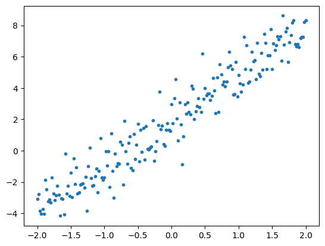

# Модуль 7. TensorFlow
## Лекція 05. Приклад 2. Базовий цикл тренування моделі засобами KERAS

Проста лінійна регресія

Дивись також [Basic training loops](https://www.tensorflow.org/guide/basic_training_loops)

Завантаження бібліотек


```python
import tensorflow as tf
from pprint import pprint
print(tf.__version__)
print(tf.executing_eagerly())
```

    2.15.0
    True


```python
import matplotlib.pyplot as plt
colors = plt.rcParams['axes.prop_cycle'].by_key()['color']
import numpy as np
```

### Типовий процес розв’язування задач машинного навчання

Вирішення проблеми машинного навчання зазвичай складається з наступних кроків:
- Отримати навчальні дані.
- Додати визначення моделі.
- Додати визначення функції втрат.
- Перебрати дані навчання, обчисливши втрати (Loss) від ідеального значення
- Обчислити градієнти для втрати та, за необхідностю, використати оптимізатор, щоб налаштувати змінні відповідно до тренувальних даних.
- Оцініть свої результати.


Як приклад: проста лінійна модель (лінійна регресія), який має дві змінні:

  $W$ вага ,    $b$ зміщення.

### Попередні кроки як в у 05.1

Генеруємо деякі дані шляхом додавання гаусового (нормального) шуму до точок уздовж визначеної прямої лінії .


```python
# The actual line
TRUE_W = 3.0
TRUE_B = 2.0

NUM_EXAMPLES = 201

x = tf.linspace(-2,2, NUM_EXAMPLES)
x = tf.cast(x, tf.float32)

# Ідеальна функція
def f(x):
  return x * TRUE_W + TRUE_B

# Генерація нормального шуму
noise = tf.random.normal(shape=[NUM_EXAMPLES])

# Обчислення функції
y = f(x) + noise
```

Графік даних


```python
# Plot all the data
plt.plot(x, y, '.')
plt.show()
```


​    

​    


```python
# This computes a single loss value for an entire batch
def loss(target_y, predicted_y):
  return tf.reduce_mean(tf.square(target_y - predicted_y))
```

## Використання KERAS
На базі супер класу [tf.keras.Module](https://www.tensorflow.org/api_docs/python/tf/keras/Model) визначаємо особистий клас моделі.

Аналогічно tf.Module з 05.1 .

Відмінність, моделі **Keras** остаточно успадковують модуль.


```python
class MyModelKeras(tf.keras.Model):
  def __init__(self, **kwargs):
    super().__init__(**kwargs)
    # Initialize the weights to `5.0` and the bias to `0.0`
    # In practice, these should be randomly initialized
    self.w = tf.Variable(5.0)
    self.b = tf.Variable(0.0)

  def call(self, x):
    return self.w * x + self.b

keras_model = MyModelKeras()


```


```python
# Given a callable model, inputs, outputs, and a learning rate...
def train(model, x, y, learning_rate):

  with tf.GradientTape() as t:
    # Trainable variables are automatically tracked by GradientTape
    current_loss = loss(y, model(x))

  # Use GradientTape to calculate the gradients with respect to W and b
  dw, db = t.gradient(current_loss, [model.w, model.b])

  # Subtract the gradient scaled by the learning rate
  model.w.assign_sub(learning_rate * dw)
  model.b.assign_sub(learning_rate * db)
```


```python
# Collect the history of W-values and b-values to plot later
weights = []
biases = []
loses = []

epochs = range(10)

# Define a training loop
def report(model, loss):
  return f"W = {model.w.numpy():1.2f}, b = {model.b.numpy():1.2f}, loss={loss:2.5f}"

def training_loop(model, x, y):

  for epoch in epochs:
    # Update the model with the single giant batch
    train(model, x, y, learning_rate=0.1)
    cur_loss = loss(y, model(x)).numpy()
    # Track this before I update
    weights.append(model.w.numpy())
    biases.append(model.b.numpy())
    loses.append(cur_loss) #my

    print(f"Epoch {epoch:2d}:")
    print("    ", report(model, cur_loss))
```


```python
# Reuse the training loop with a Keras model
training_loop(keras_model, x, y)

# You can also save a checkpoint using Keras's built-in support
keras_model.save_weights("my_checkpoint")
```

    Epoch  0:
         W = 4.44, b = 0.39, loss=6.50642
    Epoch  1:
         W = 4.03, b = 0.70, loss=4.18397
    Epoch  2:
         W = 3.73, b = 0.95, loss=2.85159
    Epoch  3:
         W = 3.51, b = 1.15, loss=2.08107
    Epoch  4:
         W = 3.35, b = 1.31, loss=1.63183
    Epoch  5:
         W = 3.24, b = 1.44, loss=1.36775
    Epoch  6:
         W = 3.15, b = 1.54, loss=1.21125
    Epoch  7:
         W = 3.09, b = 1.62, loss=1.11777
    Epoch  8:
         W = 3.04, b = 1.68, loss=1.06151
    Epoch  9:
         W = 3.01, b = 1.74, loss=1.02740


### KERAS !!! АЛЕ ПРОСТІШЕ
Замість того, щоб писати навчальні цикли кожного разу, коли створюється нова модель, можна використовувати вбудовані функції Keras як shortcut. Це вкрай корисно, коли не бажано писати або налагоджувати навчальні цикли Python.

Якщо так, потрібно використовувати model.compile() для встановлення параметрів і model.fit() для навчання. Аналогічно, при використанні loss L2 і градієнтного  спуску Keras використовує менше коду.


```python
#keras_model = MyModelKeras()

# compile sets the training parameters
keras_model.compile(
    # By default, fit() uses tf.function().  You can
    # turn that off for debugging, but it is on now.
    run_eagerly=False,

    # Using a built-in optimizer, configuring as an object
    optimizer=tf.keras.optimizers.SGD(learning_rate=0.1),

    # Keras comes with built-in MSE error
    # However, you could use the loss function
    # defined above
    loss=tf.keras.losses.mean_squared_error,
)
```

Keras fit передбачає пакетні дані (batch data) або повний набір даних у вигляді масиву NumPy. Масиви NumPy поділяються на пакети (batces) та за замовчуванням розмір пакета становить 32.

У прикладі, щоб відповідати поведінці попередньго випадку (повний Python тренувальний цикл) , необхідно  передати $x$ як один пакет розміром 1000.


```python
pprint(x.shape[0])
keras_model.fit(x, y, epochs=10, batch_size=1000)
```

    201
    Epoch 1/10
    1/1 [==============================] - 0s 445ms/step - loss: 1.0274
    Epoch 2/10
    1/1 [==============================] - 0s 12ms/step - loss: 1.0066
    Epoch 3/10
    1/1 [==============================] - 0s 17ms/step - loss: 0.9938
    Epoch 4/10
    1/1 [==============================] - 0s 16ms/step - loss: 0.9859
    Epoch 5/10
    1/1 [==============================] - 0s 11ms/step - loss: 0.9810
    Epoch 6/10
    1/1 [==============================] - 0s 12ms/step - loss: 0.9780
    Epoch 7/10
    1/1 [==============================] - 0s 9ms/step - loss: 0.9761
    Epoch 8/10
    1/1 [==============================] - 0s 9ms/step - loss: 0.9749
    Epoch 9/10
    1/1 [==============================] - 0s 10ms/step - loss: 0.9741
    Epoch 10/10
    1/1 [==============================] - 0s 8ms/step - loss: 0.9736


    <keras.src.callbacks.History at 0x7af9b4266860>


### Поглиблення (Next steps)

Щоб отримати більш практичниі знання, перегляньте [Custom training: walkthrough](https://www.tensorflow.org/tutorials/customization/custom_training_walkthrough).

Щоб дізнатися більше про тренувальні петлі та Keras, перегляньте цей посібник [Writing a training loop from scratch](https://www.tensorflow.org/guide/keras/writing_a_training_loop_from_scratch) . Щоб написати власні розподілені цикли навчання, дивись [Distributed training with TensorFlow ](https://www.tensorflow.org/guide/distributed_training#using_tfdistributestrategy_with_basic_training_loops_loops)

