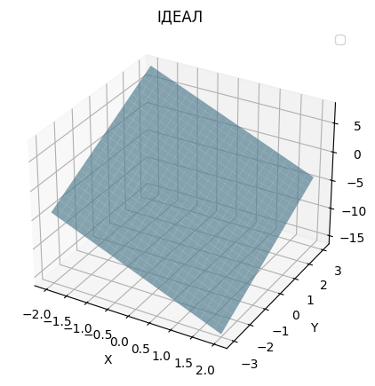
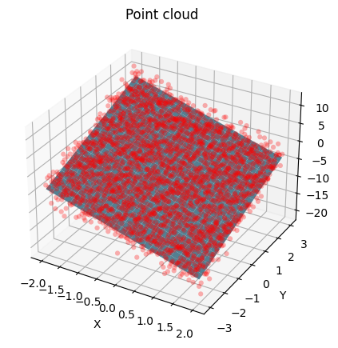
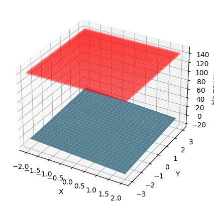
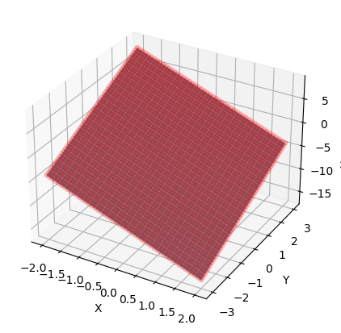

# Модуль 7. TensorFlow
## Лекція 05. Приклад 3. Базовий цикл тренування моделі.

MLR - множинна лінійна регрессія (дві незалежні змінні)

Завантаження бібліотек


```python
import tensorflow as tf
from pprint import pprint
print(tf.__version__)
print(tf.executing_eagerly())
```

    2.15.0
    True


```python
import matplotlib.pyplot as plt
colors = plt.rcParams['axes.prop_cycle'].by_key()['color']
import numpy as np
```

### Типовий процес розв’язування задач машинного навчання

Вирішення проблеми машинного навчання зазвичай складається з наступних кроків:
- Отримати навчальні дані.
- Додати визначення моделі.
- Додати визначення функції втрат.
- Перебрати дані навчання, обчисливши втрати (Loss) від ідеального значення
- Обчислити градієнти для втрати та, за необхідностю, використати оптимізатор, щоб налаштувати змінні відповідно до тренувальних даних.
- Оцініть свої результати.


Як приклад: проста лінійна модель (лінійна регресія), який має дві змінні:

  $W$ вага ,    $b$ зміщеність.

### Дані

Навчання з вчитетем (контрольоване навчання, Supervised learning) використовує входи (зазвичай позначаються як x, features) і виходи (позначаються y, часто називаються мітками, labels). Мета полягає в тому, щоб вчитися на парних входах і виходах, щоб можна було передбачити значення виходу на основі входу.

Кожен вхід даних у TensorFlow майже завжди представлений тензором і часто вектором. Під час навчання з вчителем  результат (або значення, яке бажано б передбачити) також є тензором.

Генеруємо деякі дані шляхом додавання гаусового (нормального) шуму до точок уздовж визначеної прямої лінії .


```python
# Ідеальна функція
def f(x, y):
  return x * TRUE_W1 + y * TRUE_W2 + TRUE_B
```


```python
# The actual surface
TRUE_W1 = -3.0
TRUE_W2 = 2.0
TRUE_B  = -4.0

NUM_EXAMPLES_1 = 51
NUM_EXAMPLES_2 = 51

x = tf.linspace(-2,2, NUM_EXAMPLES_1)
x = tf.cast(x, tf.float32)
y = tf.linspace(-3,3, NUM_EXAMPLES_2)
y = tf.cast(y, tf.float32)
#print(np.min(x),np.max(x))
#print(np.min(y),np.max(y))
```


```python
X, Y = np.meshgrid(x, y)

fig = plt.figure(figsize=(5, 5))
ax = fig.add_subplot(111, projection="3d")
ax.plot_surface(X, Y, f(X,Y), color="skyblue", alpha=0.7, edgecolor='none')
ax.set_title("ІДЕАЛ")
ax.set_xlabel("X")
ax.set_ylabel("Y")
ax.set_zlabel("Z")
plt.legend()
plt.show()
```

    WARNING:matplotlib.legend:No artists with labels found to put in legend.  Note that artists whose label start with an underscore are ignored when legend() is called with no argument.



    


```python
noise = tf.random.normal(shape=[NUM_EXAMPLES_2,NUM_EXAMPLES_1], mean=0.0, stddev=2.0,)
# Обчислення функції
Z = f(X,Y) + noise
```


```python
fig = plt.figure(figsize=(5, 5))
ax = fig.add_subplot(111, projection="3d")
ax.plot_surface(X, Y, f(X,Y), color="skyblue", alpha=1., edgecolor='none')
ax.scatter(X, Y, Z, color="red", alpha=.3, edgecolor='none')

ax.set_title("Point cloud")
ax.set_xlabel("X")
ax.set_ylabel("Y")
ax.set_zlabel("Z")
plt.show()

```


​    

​    


На базі супер класу [tf.Module](https://www.tensorflow.org/api_docs/python/tf/Module) визначаємо особистий клас моделі.

Використовуємо tf.Module для інкапсуляції змінних і обчислення.
Використовуємо tf.Variable для представлення всіх ваг у моделі. tf.Variable зберігає значення та за потреби надає його у тензорній формі.

Визначаємо $W$ і $b$ як змінні та визначаємо їх початкові значення.


```python
class MyModel(tf.Module):
  def __init__(self, **kwargs):
    super().__init__(**kwargs)
    # Initialize the weights to `5.0` and the bias to `0.0`
    # In practice, these should be randomly initialized
    self.w1 = tf.Variable(5.0)
    self.w2 = tf.Variable(5.0)
    self.b =  tf.Variable(1.0)
  def __call__(self, x, y):
    return self.w1 * x + self.w2 * y + self.b

model = MyModel()

# List the variables tf.modules's built-in variable aggregation.
print("Variables:", model.variables)

# Verify the model works
assert model(3.0, 2.0).numpy() == 26.0
```

    Variables: (<tf.Variable 'Variable:0' shape=() dtype=float32, numpy=1.0>, <tf.Variable 'Variable:0' shape=() dtype=float32, numpy=5.0>, <tf.Variable 'Variable:0' shape=() dtype=float32, numpy=5.0>)


### Функція втрат
Функція втрат вимірює, наскільки добре результат моделі для даного входу відповідає цільовому результату. Мета тренуванняч полягає в тому, щоб мінімізувати цю різницю під час навчання. Визначаємо стандартну втрату L2, також відому як «середня квадратична» помилка (MSE)


```python
# This computes a single loss value for an entire batch
def loss(target_y, predicted_y):
  return tf.reduce_mean(tf.square(target_y - predicted_y))
```

Візуалізація регресійної площини  для початкових значень $W$ і $b$ моделі:


```python
fig = plt.figure(figsize=(5, 5))
ax = fig.add_subplot(111, projection="3d")
ax.plot_surface(X, Y, f(X,Y), color="skyblue", alpha=1., edgecolor='none')
ax.scatter(X, Y, loss(f(X,Y), model(X,Y)), color="red", alpha=.3, edgecolor='none')

ax.set_xlabel("X")
ax.set_ylabel("Y")
ax.set_zlabel("На початок")
plt.show()
print("Current loss: %1.6f" % loss(f(X,Y), model(X,Y)).numpy())
```


​    

​    


    Current loss: 141.826660


### Навчальний цикл

Навчальний цикл складається з повторного виконання трьох завдань по порядку:

- FORWARD - пряме розпвосюдження - надсилання пакету вхідних даних через модель для створення виходів
- Розрахунок втрат шляхом порівняння отриманих виходів із "правільним" виходом (міткою)
- BACKWARD Використання градієнтної стрічки для пошуку градієнтів
- Оптимізація змінних за допомогою цих градієнтів

Для пприкладу будемо навчати модель за допомогою градієнтного спуску.

Для наглядності реалізуємо основну математику за допомогою tf.GradientTape для автоматичного диференціювання та tf.assign_sub для зменшення значення (що поєднує tf.assign і tf.sub)


```python
# Given a callable model, inputs, outputs, and a learning rate...
def train(model, x, y, z,  learning_rate):

  with tf.GradientTape() as t:
    # Trainable variables are automatically tracked by GradientTape
    current_loss = loss(model(x,y), z)
  # Use GradientTape to calculate the gradients with respect to W and b
  dw1, dw2, db = t.gradient(current_loss, [model.w1, model.w2, model.b])

  # Subtract the gradient scaled by the learning rate
  model.w1.assign_sub(learning_rate * dw1)
  model.w2.assign_sub(learning_rate * dw2)
  model.b.assign_sub(learning_rate * db)
```

### Цикл тренування
Для візуалізації процесу навчання, можна Forward ту ж самий пакет x і y через навчальний цикл і побачити, як змінюються $W$ і $b$.


```python
model = MyModel()

# Collect the history of W-values and b-values to plot later
weight1 = []
weight2 = []
biases = []
loses = []

epochs = range(20)

# Define a training loop
def report(model, loss):
  return f"W1 = {model.w1.numpy():1.2f}, W2 = {model.w2.numpy():1.2f}, \
          b = {model.b.numpy():1.2f}, loss={loss:2.5f}"


def training_loop(model, x, y, z):

  for epoch in epochs:
    # Update the model with the single giant batch
    train(model, x, y, z, learning_rate=0.1)
    cur_loss = loss(model(x,y), z).numpy()
    # Track this before I update
    weight1.append(model.w1.numpy())
    weight2.append(model.w2.numpy())
    biases.append(model.b.numpy())
    loses.append(cur_loss) #my

    print(f"Epoch {epoch:2d}:")
    print("    ", report(model, cur_loss))

```


```python
current_loss = loss(f(X,Y), model(X,Y))

print(f"Starting:")
print("    ", report(model, current_loss))

```

    Starting:
         W1 = 5.00, W2 = 5.00,           b = 1.00, loss=141.82666


### Тренування


```python
training_loop(model, X, Y, f(X,Y))
```

    Epoch  0:
         W1 = 2.78, W2 = 3.13,           b = 0.00, loss=66.31752
    Epoch  1:
         W1 = 1.18, W2 = 2.42,           b = -0.80, loss=35.00619
    Epoch  2:
         W1 = 0.02, W2 = 2.16,           b = -1.44, loss=19.27391
    Epoch  3:
         W1 = -0.82, W2 = 2.06,           b = -1.95, loss=10.80723
    Epoch  4:
         W1 = -1.42, W2 = 2.02,           b = -2.36, loss=6.13366
    Epoch  5:
         W1 = -1.86, W2 = 2.01,           b = -2.69, loss=3.51877
    Epoch  6:
         W1 = -2.18, W2 = 2.00,           b = -2.95, loss=2.03988
    Epoch  7:
         W1 = -2.40, W2 = 2.00,           b = -3.16, loss=1.19478
    Epoch  8:
         W1 = -2.57, W2 = 2.00,           b = -3.33, loss=0.70683
    Epoch  9:
         W1 = -2.69, W2 = 2.00,           b = -3.46, loss=0.42217
    Epoch 10:
         W1 = -2.78, W2 = 2.00,           b = -3.57, loss=0.25442
    Epoch 11:
         W1 = -2.84, W2 = 2.00,           b = -3.66, loss=0.15459
    Epoch 12:
         W1 = -2.88, W2 = 2.00,           b = -3.73, loss=0.09464
    Epoch 13:
         W1 = -2.92, W2 = 2.00,           b = -3.78, loss=0.05832
    Epoch 14:
         W1 = -2.94, W2 = 2.00,           b = -3.82, loss=0.03615
    Epoch 15:
         W1 = -2.96, W2 = 2.00,           b = -3.86, loss=0.02252
    Epoch 16:
         W1 = -2.97, W2 = 2.00,           b = -3.89, loss=0.01410
    Epoch 17:
         W1 = -2.98, W2 = 2.00,           b = -3.91, loss=0.00885
    Epoch 18:
         W1 = -2.98, W2 = 2.00,           b = -3.93, loss=0.00558
    Epoch 19:
         W1 = -2.99, W2 = 2.00,           b = -3.94, loss=0.00353


```python
fig = plt.figure(figsize=(5, 5))
ax = fig.add_subplot(111, projection="3d")
ax.plot_surface(X, Y, f(X,Y), color="skyblue", alpha=1., edgecolor='none')
ax.scatter(X, Y, model(X,Y), color="red", alpha=.3, edgecolor='none')

ax.set_xlabel("X")
ax.set_ylabel("Y")
ax.set_zlabel("На початок")
plt.show()
print("Current loss: %1.6f" % loss(f(X,Y), model(X,Y)).numpy())
```


​    

​    


    Current loss: 0.003525


